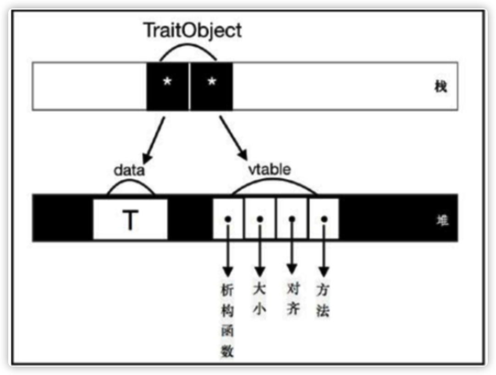
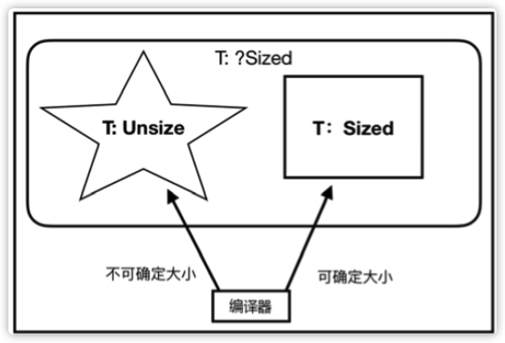

- [1. 新时代的语言](#1-新时代的语言)
- [2. 语言精要](#2-语言精要)
  - [2.1. Rust 语言的基本构成](#21-rust-语言的基本构成)
    - [2.1.1. 语言规范](#211-语言规范)
    - [2.1.2. 编译器](#212-编译器)
    - [2.1.3. 核心库](#213-核心库)
    - [2.1.4. 标准库](#214-标准库)
    - [2.1.5. 包管理器](#215-包管理器)
  - [2.2. 语句与表达式](#22-语句与表达式)
  - [2.3. 变量与绑定](#23-变量与绑定)
    - [2.3.1. 位置表达式和值表达式](#231-位置表达式和值表达式)
    - [2.3.2. 不可变绑定与可变绑定](#232-不可变绑定与可变绑定)
    - [2.3.3. 所有权与引用](#233-所有权与引用)
  - [2.4. 函数与闭包](#24-函数与闭包)
    - [2.4.1. 函数定义](#241-函数定义)
    - [2.4.2. 作用域与生命周期](#242-作用域与生命周期)
    - [2.4.3. 函数指针](#243-函数指针)
    - [2.4.4. CTFE机制](#244-ctfe机制)
    - [2.4.5. 闭包](#245-闭包)
  - [2.5. 流程控制](#25-流程控制)
    - [2.5.1. 条件表达式](#251-条件表达式)
    - [2.5.2. 循环表达式](#252-循环表达式)
    - [2.5.3. match表达式与模式匹配](#253-match表达式与模式匹配)
    - [2.5.4. if let 和 while let 表达式](#254-if-let-和-while-let-表达式)
  - [2.6. 基本数据类型](#26-基本数据类型)
    - [2.6.1. 布尔类型](#261-布尔类型)
    - [2.6.2. 基本数字类型](#262-基本数字类型)
    - [2.6.3. 字符类型](#263-字符类型)
    - [2.6.4. 数组类型](#264-数组类型)
    - [2.6.5. 范围类型](#265-范围类型)
    - [2.6.6. 切片类型](#266-切片类型)
    - [2.6.7. str 字符串类型](#267-str-字符串类型)
    - [2.6.8. 原生指针](#268-原生指针)
    - [2.6.9. never 类型](#269-never-类型)
  - [2.7. 复合数据类型](#27-复合数据类型)
    - [2.7.1. 元组](#271-元组)
    - [2.7.2. 结构体](#272-结构体)
    - [2.7.3. 枚举体](#273-枚举体)
  - [2.8. 常用集合类型](#28-常用集合类型)
    - [2.8.1. 线性序列：Vec](#281-线性序列vec)
    - [2.8.2. 线性序列：双端队列](#282-线性序列双端队列)
    - [2.8.3. 线性序列：链表](#283-线性序列链表)
    - [2.8.4. Key-Value映射表：HashMap和BTreeMap](#284-key-value映射表hashmap和btreemap)
    - [2.8.5. 集合：HashSet和BTreeSet](#285-集合hashset和btreeset)
    - [2.8.6. 优先队列：BinaryHeap](#286-优先队列binaryheap)
  - [2.9. 智能指针](#29-智能指针)
  - [2.10. 泛型和 trait](#210-泛型和-trait)
    - [2.10.1. 泛型](#2101-泛型)
    - [2.10.2. trait](#2102-trait)
  - [2.11. 错误处理](#211-错误处理)
  - [2.12. 表达式优先级](#212-表达式优先级)
  - [2.13. 注释与打印](#213-注释与打印)
- [3. 类型系统](#3-类型系统)
  - [3.1. 通用概念](#31-通用概念)
    - [3.1.1. 类型系统的作用](#311-类型系统的作用)
    - [3.1.2. 类型系统的分类](#312-类型系统的分类)
    - [3.1.3. 类型系统与多态性](#313-类型系统与多态性)
  - [3.2. Rust类型系统概述](#32-rust类型系统概述)
    - [3.2.1. 类型大小](#321-类型大小)
      - [3.2.1.1. 零大小类型](#3211-零大小类型)
      - [3.2.1.2. 底类型](#3212-底类型)
    - [3.2.2. 类型推导](#322-类型推导)
  - [3.3. 泛型](#33-泛型)
    - [3.3.1. 泛型返回值自动推导](#331-泛型返回值自动推导)
  - [3.4. 深入triat](#34-深入triat)
    - [3.4.1. 接口抽象](#341-接口抽象)
      - [3.4.1.1. 关联类型 type](#3411-关联类型-type)
      - [3.4.1.2. trait一致性](#3412-trait一致性)
      - [3.4.1.3. trait继承](#3413-trait继承)
    - [3.4.2. 泛型约束](#342-泛型约束)
    - [3.4.3. 类型抽象](#343-类型抽象)
      - [3.4.3.1. trait object ？](#3431-trait-object-)
      - [3.4.3.2. impl Trait](#3432-impl-trait)
    - [3.4.4. 标签trait](#344-标签trait)
      - [3.4.4.1. Sized trait](#3441-sized-trait)
      - [3.4.4.2. Copy trait](#3442-copy-trait)
      - [3.4.4.3. Send trait 和 Sync trait](#3443-send-trait-和-sync-trait)
  - [3.5. 类型转换](#35-类型转换)
    - [3.5.1. Deref 解引用](#351-deref-解引用)
      - [3.5.1.1. 自动解引用](#3511-自动解引用)
      - [3.5.1.2. 手动解引用](#3512-手动解引用)
    - [3.5.2. as 操作符](#352-as-操作符)
      - [3.5.2.1. 无歧义限定语法](#3521-无歧义限定语法)
      - [3.5.2.2. 类型和子类型相互转换](#3522-类型和子类型相互转换)
    - [3.5.3. From 和 Into](#353-from-和-into)
# 1. 新时代的语言
# 2. 语言精要
## 2.1. Rust 语言的基本构成
1. 语言规范
2. 编译器
3. 核心库
4. 标准库
5. 包管理器
### 2.1.1. 语言规范
Rust语言规范主要由Rust语言参考（The Rust Reference）和RFC文档共同构成。
### 2.1.2. 编译器
Rust官方的编译器叫rustc，负责将Rust源代码编译为可执行文件或其他库文件（.a、.so、.lib、.dll等）
- rustc有如下特点：
    - 跨平台
    - 支持交叉编译
    - 使用 LLVM 作为编译器后端，具有很好的代码生成和优化技术，支持多个目标平台
    - rustc是用Rust语言开发的，包含在Rust语言源码中。
### 2.1.3. 核心库
核心库中定义的是Rust语言的核心，不依赖于操作系统和网络等相关的库，甚至不知道堆分配，也不提供并发和I/O。
- 可以通过在模块顶部引入`＃![no_std]`来使用核心库，`#[no_std]`来明确不需要标准库。
- Rust会为每个crate都自动引入标准库模块，除非使用＃[no_std]属性明确指定了不需要标准库
- 核心库和标准库的功能有一些重复，包括如下部分：
    - 基础的trait，如Copy、Debug、Display、Option等。
    - 基本原始类型，如bool、char、i8/u8、i16/u16、i32/u32、i64/u64、isize/usize、f32/f64、str、array、slice、tuple、pointer等
    - 常用功能型数据类型，满足常见的功能性需求，如String、Vec、HashMap、Rc、Arc、Box等
    - 常用的宏定义，如println！、assert！、panic！、vec！等
- 做嵌入式应用开发的时候，核心库是必需的。
### 2.1.4. 标准库
Rust标准库提供应用程序开发所需要的基础和跨平台支持
- 标准库包含的内容大概如下：
    - 与核心库一样的基本trait、原始数据类型、功能型数据类型和常用宏等，以及与核心库几乎完全一致的API
    - 并发、I/O和运行时。例如线程模块、用于消息传递的通道类型、Sync trait等并发模块，文件、TCP、UDP、管道、套接字等常见I/O。
    - 平台抽象。底层操作接口，比如 std：：mem、std：：ptr、std：：intrinsics 等，操作内存、指针、调用编译器固有函数。
    - 可选和错误处理类型Option和Result，以及各种迭代器等。
### 2.1.5. 包管理器
把按一定规则组织的多个rs文件编译后就得到一个包（crate）。包是Rust代码的基本编译单元，也是程序员之间共享代码的基本单元。
- Rust提供了非常方便的包管理器Cargo
    - `cargo new` 命令默认可以创建一个用于编写可执行二进制文件的项目
        - `cargo new --lib lib_crate` 添加--lib参数，则可以创建用于编写库的项目
    - `cargo build` 对项目进行编译
    - `cargo run` 运行
## 2.2. 语句与表达式
Rust 中的语法可以分成两大类：`语句（Statement）和表达式（Expression）`。语句是指要执行的一些操作和产生副作用的表达式。表达式主要用于计算求值。
- 语句
  - 声明语句（ Declaration statement）
    - 声明各种语言项（Item），包括声明变量、静态变量、常量、结构体、函数等，以及通过extern和use关键字引入包和模块等
  - 表达式语句（ Expressionstatement）
    - 特指以分号结尾的表达式。`此类表达式求值结果将会被舍弃，并总是返回单元类型（）`
- 以叹号结尾，并且可以像函数一样被调用的语句，在Rust中叫作宏，如：`println!()` `assert_eq!`
- Rust编译器在解析代码的时候，如果碰到分号，就会继续往后面执行；如果碰到语句，则执行语句；如果碰到表达式，则会对表达式求值，如果分号后面什么都没有，就会补上单元值（）。
- 当遇到函数的时候，会将函数体的花括号识别为块表达式（Block Expression）。块表达式是由一对花括号和一系列表达式组成的，它总是返回块中最后一个表达式的值。
- **可以将Rust看作一切皆表达式。由于当分号后面什么都没有时自动补单元值（）的特点，我们可以将 Rust 中的语句看作计算结果均为（）的特殊表达式。而对于普通的表达式来说，则会得到正常的求值结果。**
```rust
fn main() {
    pub fn anwser() -> () { // 返回值是 单元 类型，单元类型拥有唯一的值，就是它本身，它表示“没有什么特殊的价值”
        let a = 40; // 语句
        let b = 2; // 语句 
        assert_eq!(sum(a, b), 42); // 宏语句
    }
    pub fn sum(a: i32, b: i32) -> i32 {
        a + b // 表达式，返回表达式的结果
    }
    answer(); // 最后一个语句，分号后面什么都没有，会补上单元值
    // main 返回 单元值 ()
}
```
## 2.3. 变量与绑定
通过let关键字来创建变量，这是Rust语言从函数式语言中借鉴的语法形式。let创建的变量一般称为绑定（Binding），它表明了标识符（Identifier）和值（Value）之间建立的一种关联关系.
### 2.3.1. 位置表达式和值表达式
- 位置表达式（ Place Expression）-> 左值
  - **位置表达式就是表示内存位置的表达式**。
  - 分别有以下几类
    - 本地变量
    - 静态变量
    - 解引用（*expr）
    - 数组索引（expr[expr]）
    - 字段引用（expr.field）
    - 位置表达式组合
  - **通过位置表达式可以对某个数据单元的内存进行读写。主要是进行写操作，这也是位置表达式可以被赋值的原因。**
- 值表达式（ ValueExpression）-> 右值
  - 不是位置表达式的就是值表达式。
  - 值表达式一般只**引用**了某个存储单元地址中的数据。它相当于数据值，**只能进行读操作**。
- `所以，能进行写的是位置表达式，只能进行读的是值表达式？`
- 从语义角度来说，**位置表达式代表了持久性数据，值表达式代表了临时数据**。位置表达式一般有持久的状态，值表达式要么是字面量，要么是表达式求值过程中创建的临时值。
- 表达式的求值过程在不同的上下文中会有不同的结果。`什么是上下文？`
  - 位置上下文
    - 赋值或者复合赋值语句左侧的**操作数**
      - `许多表达式包含子表达式，称为表达式的操作数。`
      - 操作数可以出现在位置上下文或值上下文中。表达式的计算取决于它自己的类别和它出现的上下文。
    - 一元引用表达式的独立操作数，eg: 
      - `let x = &a` x 是位置上下文，&a 把赋值语句的右侧变成了位置上下文，只是共享内存地址
    - 包含隐式借用（引用）的操作数
    -  match判别式或let绑定右侧在使用ref模式匹配的时候也是位置上下文
  - 值上下文
    - 不是位置上下文的，就是值上下文，如 函数、常量
    - 值表达式不能出现在位置上下文中
### 2.3.2. 不可变绑定与可变绑定
- 使用let关键字声明的位置表达式默认不可变，为不可变绑定，可读不可写
- 而 let mut声明的可变绑定则是可以对相应的存储单元进行写入的
```rust
fn main() {
    let a = 1;
    // a = 2; // immutabel and error
    let mut b = 2;
    b = 3; // mutable
}
```
### 2.3.3. 所有权与引用
当**位置表达式**出现在**值上下文中**时，该位置表达式将会把内存地址转移给另外一个位置表达式，这其实是所有权的转移
- 在语义上，每个变量绑定实际上都拥有该存储单元的所有权，这种转移内存地址的行为就是所有权（OwnerShip）的转移，在 Rust 中称为`移动（Move）语义`，**那种不转移的情况实际上是一种复制（Copy）语义**
- Rust没有GC，所以完全依靠所有权来进行内存管理
- Rust提供引用操作符（&），可以**直接获取表达式的存储单元地址，即内存位置**。可以通过该内存位置对存储进行读取
```rust
    let a = [1,2,3];
    let b = &a; // 引用操作符&取得a的内存地址，使用引用操作符已经将赋值表达式右侧变成了位置上下文，它只是共享内存地址；读借用
    println!("{:p}", b);
    let mut c = vec![1, 2, 3];
    let d = &mut c; // 通过&mut获取c的可变引用，赋值给d; 写借用
    d.push(4); // 改变可变数组，末尾push4
    println!("{:?}", d); // [1, 2, 3, 4]
    println!("{:?}", c); // [1, 2, 3, 4]
    let e = &42;
    assert_eq!(42, *e);
```
- 从语义上来说，不管是&a还是&mut c，都相当于对a和c所有权的借用，因为a和c还依旧保留它们的所有权，所以引用也被称为`借用`
## 2.4. 函数与闭包
### 2.4.1. 函数定义
- 函数是通过关键字`fn`定义的
- 参数与返回值类型需要严格遵守
- 函数体是由花括号括起来的，它实际上是一个块表达式，最终只返回块中最后一个表达式的求值结果。如果想提前返回，则需要使用return关键字
### 2.4.2. 作用域与生命周期
Rust 语言的作用域是静态作用域，即词法作用域（Lexical Scope）。由一对花括号来开辟作用域，其作用域在词法分析阶段就已经确定了，不会动态改变
- 生命周期（LifeTime）。变量绑定的生命周期总是遵循这样的规律：从使用 let 声明创建变量绑定开始，到超出词法作用域的范围时结束。

### 2.4.3. 函数指针
- 函数为一等公民。这意味着，函数自身就可以作为函数的参数和返回值使用

### 2.4.4. CTFE机制
CTFE 编译时函数执行
```rust
// #![feature(const_fn)] // Rust 2018 版本后不需要加该特性
const fn init_len() -> usize() {
    return 5;
}
fn main() {
    len arr = [0; init_len()];
}
```
- Rust 中固定长度的数组必须在编译期就知道长度，否则会编译出错
- 使用const fn定义的函数，必须可以确定值，不能存在歧义
- Rust中的CTFE是由miri来执行的。miri是一个MIR解释器，目前已经被集成到了Rust编译器 rustc中
### 2.4.5. 闭包
闭包也叫匿名函数
- 闭包有以下几个特点：
  - 可以像函数一样被调用
  - 可以捕获上下文环境中的自由变量
  - 可以自动推断输入和返回的类型
```rust
fn main() {
    let out = 42;
    // fn add(i: i32, j: i32) -> i32 {i + j + out}; // can't capture dynamic environment in a fn item
    fn add(i: i32, j: i32) -> i32 {i + j};
    
    // 闭包，可以捕获上下文环境中的自由变量
    let closure_annotated = |i: i32, j: i32| -> i32 {i + j + out}; 
    // 自动推断输入和返回的类型
    let closure_inferred = |i, j| i + j + out;
    let i = 1;
    let j = 2;
    assert_eq!(3, add(i, j));
    assert_eq!(45, closure_annotated(i, j));
    assert_eq!(45, closure_inferred(i, j));
}
```
- **闭包和函数有一个重要的区别，那就是闭包可以捕获外部变量，而函数不可以**，其他语言函数可以捕获外部变量。
- `Rust中闭包实际上就是由一个匿名结构体和trait来组合实现的，但编译器帮我们自动转换了`
```rust
// 闭包作为参数的情况
fn main() {
    let a = 2;
    let b = 3;
    assert_eq!(closure_math(|| a + b), 5);
    assert_eq!(closure_math(||a * b), 6);
}

fn closure_math<F: Fn() -> i32>(op: F) -> i32 { // Fn() -> i32 是 闭包类型
    op()
}
```
- 闭包捕获借用要保证借用唯一
```Rust
#![allow(unused)]
fn main() {
let mut b = false;
let x = &mut b; // &&mut
{
    let mut c = || { *x = true; }; // 闭包捕获了 x，要保证x唯一被借用，x不能被借用了
    // The following line is an error:
    // let y = &x; // 仍在 闭包的生命周期中，x 不能被 借用
    c();
}
let z = &x; // 闭包生命周期外，x 又可以被借用了
}
```
- 闭包做返回值
```rust
// 在函数定义时并不知道具体的返回类型，但是在函数调用时，编译器会推断出来。这个过程也是零成本抽象的，一切都发生在编译期
fn two_times_impl() -> impl Fn(i32) -> i32 { // 使用了impl Fn（i32）-＞i32作为函数的返回值，它表示实现Fn（i32）-＞i32 的类型
    let i = 2;
    move |j| j * i // 闭包的捕获会优先使用借用，使用 move 关键字 将捕获变量i的所有权转移到闭包中，就不会按引用进行捕获变量，这样闭包才可以安全地返回
}

fn main() {
    let result = two_times_impl();
    assert_eq!(result(2), 4)
}
```
## 2.5. 流程控制
### 2.5.1. 条件表达式
### 2.5.2. 循环表达式
- `while true` 与 `if true` 有缺陷，无限循环请使用`loop`
  ```rust
  // 编译器会报错，编译器只知道while true循环返回的是单元值
  fn while_true(x: i32) -> i32 {
      while true {
          return x + 1
      }
  }
  fn main() {
      let y = while_true(5);
      assert_eq!(y, 6);
  }
  ```
  - Rust编译器在对while循环做流分析（Flow Sensitive）的时候，不会检查循环条件，编译器会认为 while 循环条件可真可假，所以循环体里的表达式也会被忽略，此时编译器只知道while true循环返回的是单元值，而函数返回的是i32，其他情况一概不知。这一切都是因为 CTFE 功能的限制，while 条件表达式无法作为编译器常量来使用。只有等将来CTFE功能完善了，才可以正常使用。同理，if true在只有一条分支的情况下，也会发生类似情况。

### 2.5.3. match表达式与模式匹配
```rust
fn main() {
    let number = 42;
    match number {
        0 => println!("origin"),
        // 1...3 => println!("all"),
        | 5 | 7 | 13 => println!("bad luck"),
        n @ 42 => println!("answer is {}", n),
        _ => println!("common"), // match 需要全覆盖，如果覆盖不了，需要缺省
    }
}
```
- 使用操作符@可以将模式中的值绑定给一个变量，供分支右侧的代码使用，这类匹配叫**绑定模式（BindingMode）**
- match表达式必须穷尽每一种可能，所以一般情况下，会使用通配符_来处理剩余的情况
- match分支左边就是模式，右边就是执行代码
- 所有分支必须返回同一个类型，但是左侧的模式可以是不同的。

### 2.5.4. if let 和 while let 表达式
```rust
fn main() {
    let boolean = true;
    let mut binary = 0;
    if let true = boolean {
        binary = 1;
    }

    assert_eq!(binary, 1)
}
```
- if let左侧为模式，右侧为要匹配的值
```rust
fn main() {
   let mut v = vec![1, 2, 3, 4, 5];
   while let Some(x) = v.pop() { // 调用v的pop方法会返回Option类型; 左侧Some（x）为匹配模式，它会匹配右侧pop方法调用返回的Option类型结果，并自动创建x绑定
       println!("{}", x);
   }
}
```

## 2.6. 基本数据类型
### 2.6.1. 布尔类型
### 2.6.2. 基本数字类型
- 基本数字类型分为三类：
  - 固定大小的类型
    - 无符号整数
    - 符号整数
  - 动态大小的类型
    - usize 数值范围为0～232-1或0～264-1，占用4个或8个字节，具体取决于机器的字长。
    - isize 数值范围为-231～231-1或-263～263-1，占用4个或8个字节，同样取决于机器的字长
  - 浮点数
    - f32
    - f64
```rust
fn main() {
    let num = 42u32;
    let num = 0x2A; // 十六进制
    let num = 0o106; // 八进制
    let num = 0b1101_1011; // 二进制
    let num = 0b11011111;
    assert_eq!(b'*', 42u8); //  字节字面量
    assert_eq!(b'\'', 39u8);
    println!("{:?}", std::f32::INFINITY);
    println!("{:?}", std::f32::NEG_INFINITY);
    println!("{:?}", std::f32::NAN);
    println!("{:?}", std::f32::MIN);
    println!("{:?}", std::f32::MAX);
}
```
- 数字字面量后面可以直接使用**类型后缀**，比如42u32，代表这是一个u32类型
- 不加后缀或者没有指定类型，**Rust编译器会默认推断数字为i32类型**
- 支持**字节字面量**

### 2.6.3. 字符类型
- 使用单引号来定义字符（Char）类型，是一个Unicode标量值，每个字符占4个字节
- 可以使用as操作符将字符转为数字类型 `assert_eq!('%' as i8, 37)`

### 2.6.4. 数组类型
- 数组（Array）是Rust内建的原始集合类型，数组的特点为
  - 数组大小固定
  - 元素均为同类型
  - 默认不可变
- 数组的类型签名为[T；N]。T是一个泛型标记，代表具体类型；N 代表数组的长度
- 对于原始固定长度数组，只有实现Copy trait的类型才能作为其元素
  - 只有可以在栈上存放的元素才可以存放在该类型的数组中

### 2.6.5. 范围类型
- Rust 内置了范围（Range）类型，包括左闭右开和全闭两种区间
  ```rust
  fn main() {
      assert_eq!((1..5), std::ops::Range{start: 1, end: 5});
      assert_eq!((1..=5), std::ops::RangeInclusive::new(1, 5));
      assert_eq!(3+4+5, (3..6).sum());
      assert_eq!(3+4+5+6, (3..=6).sum());
      for i in 1..5 {
          print!("{} ", i);
      }
      println!("");
      for i in 1..=5 {
          print!("{} ", i);
      }
  }
  ```
  - (1..5）表示左闭右开区间，（1..=5）则表示全闭区间。它们分别是std::ops::Range 和 std::ops::RangeInclusive 的实例
  - 范围自带了一些方法，比如 sum，可以为范围中的元素进行求和
  - 并且每个范围都是一个迭代器，可以直接使用 for 循环进行打印

### 2.6.6. 切片类型
切片（Slice）类型是对一个数组（包括固定大小数组和动态数组）的引用片段，有利于安全有效地访问数组的一部分，而不需要拷贝。因为理论上讲，切片引用的是已经存在的变量。在底层，切片代表一个指向数组起始位置的指针和数组长度。用[T]类型表示连续序列，那么切片类型就是&[T]和&mut[T]。
```rust
fn main() {
    let arr: [i32; 5] = [1, 2, 3, 4, 5];

    assert_eq!(&arr, &[1, 2, 3, 4, 5]);
    assert_eq!(arr[1..], [2, 3, 4, 5]);
    assert_eq!((&arr).len(), 5);
    assert_eq!((&arr).is_empty(), false);
    let arr = &mut [1, 2, 3];
    arr[1] = 7;
    assert_eq!(arr, &[1, 7, 3]);
    let vec = vec![1,2,3];
    assert_eq!(&vec[..], [1, 2, 3]);
}
```
- 可以理解为：对数组内容的引用就是切片？

### 2.6.7. str 字符串类型
- Rust提供了原始的字符串类型str，也叫作字符串切片。它通常以不可变借用的形式存在，即&str
- 出于内存安全的考虑，Rust将字符串分为两种类型：
  - 一种是固定长度字符串，不可随便更改其长度，就是str字符串；
  - 另一种是可增长字符串，可以随意改变其长度，就是String字符串。
```rust
fn main() {
    let trust: &'static str = "Rust 是一门优雅的语言"; // 5 + 3 * 8  定义了字符串字面量trust 本质上，字符串字面量也属于str类型，只不过它是静态生命周期字符串&＇static str
    let ptr = trust.as_ptr();
    let len = trust.len();
    assert_eq!(29, len);
    let s = unsafe {
        let slice = std::slice::from_raw_parts(ptr, len);
        std::str::from_utf8(slice)
    };
    assert_eq!(s, Ok(trust));
}
```
- str字符串类型由两部分组成：指向字符串序列的指针和记录长度的值。可以通过str模块提供的as_ptr和len方法分别求得指针和长度
- Rust中的字符串本质上是一段有效的UTF8字节序列。所以，可以将一段字节序列转换为str字符串

### 2.6.8. 原生指针
- 将可以表示内存地址的类型称为指针
  - 引用（Reference）
    - 引用，它本质上是一种非空指针
    - 引用主要应用于Safe Rust中，在Safe Rust中，编译器会对引用进行借用检查，以保证内存安全和类型安全
  - 原生指针（Raw Pointer）
    - 主要用于Unsafe Rust中，直接使用原生指针是不安全的，比如原生指针可能指向一个Null，或者一个已经被释放的内存区域
    - Rust支持两种原生指针
      - 不可变原生指针*const T
      - 可变原生指针*mut T
      ```rust
      fn main() {
          let mut x = 10;
          let ptr_x = &mut x as *mut i32; // 通过 as 操作符将&mut x 可变引用转换为*mut i32 可变原生指针ptr_x
          let y = Box::new(20);
          let ptr_y = &*y as *const i32;
          unsafe {
              *ptr_x += *ptr_y; // 对ptr_x和ptr_y指针解引用，并将两个指针指向的值求和
          }
          assert_eq!(x, 30);
      }
      ```
  - 函数指针（fn Pointer）
  - 智能指针（Smart Pointer）

### 2.6.9. never 类型
- Rust中提供了一种特殊数据类型，never类型，即!
  - 该类型用于表示永远不可能有返回值的计算类型
- never类型是可以强制转换为其他任何类型的。

## 2.7. 复合数据类型
- 元组（Tuple）
- 结构体（Struct）
- 枚举体（Enum）
- 联合体（Union）

### 2.7.1. 元组
- 元组用一对 `( )` 包括的一组数据，**可以包含不同种类的数据**
```rust
fn move_coords( x: (i32, i32) ) -> (i32, i32) {
    (x.0 + 1, x.1 + 1)
}

fn main() {
    let tuple: (&'static str, i32, char) = ("hello", 5, 'c');
    assert_eq!(tuple.0, "hello");
    let coords = (0, 1);
    let result = move_coords(coords);
    assert_eq!(result, (1, 2));
    let (x, y) = move_coords(coords); // let支持模式匹配，可以用来解构元组
    assert_eq!(x, 1);
    assert_eq!(y, 2);
}
```
- 可以通过索引来获取元组内元素的值
- 因为let支持模式匹配，所以可以用来解构元组
- 利用元组也可以让函数返回多个值
- 当元组中只有一个值的时候，需要加逗号，即 （0，），这是为了和括号中的其他值进行区分
- `()` 空元组

### 2.7.2. 结构体
- Rust 提供三种结构体
  - 具名结构体
  - 元组结构体
    - 特点是，字段没有名称，只有类型 `struct Color(i32, i32, i32`
    - 当一个元组结构体只有一个字段的时候，我们称之为`New Type模式`，`struct Integer(u32)`
  - 单元结构体 
    - 没有任何字段的结构体 `struct Empty`
    - 单元结构体实例就是其本身
      - 在 Release 编译模式下，单元结构体实例会被优化为同一个对象；而在 Debug模式下，则不会进行这样的优化
-  构体名称要遵从驼峰式命名规则。虽然不按驼峰式命名也可以通过编译，但是编译器会警告你
-  结构体上方的＃[derive（Debug，PartialEq）]是属性，可以让结构体自动实现Debug trait和PartialEq trait，它们的功能是允许对结构体实例进行打印和比较
-  在impl块中定义的函数被称为方法，这和面向对象有点渊源

### 2.7.3. 枚举体
- 枚举体（Enum，也可称为枚举类型或枚举），顾名思义，该类型包含了全部可能的情况，可以有效地防止用户提供无效值
- 三类
  - 无参数枚举体
  - 类C枚举体
  - 携带类型参数的枚举体
    - 这样的枚举值本质上属于函数指针类型
```rust
// 无参数枚举
enum Number {
    Zero,
    One,
    Two,
}
fn test1 () {
    let a = Number::One;
    match a {
        Number::Zero => println!("0"),
        Number::One => println!("1"),
        Number::Two => println!("2"),
    }
}

// 类C枚举类型
enum Color {
    Red = 0xff0000,
    Green = 0x00ff00,
    Blue = 0x0000ff,
}
fn test2 () {
    println!("roses are #{:06x}", Color::Red as i32);
}

// 带参数枚举体
enum IpAddr {
    V4(u8, u8, u8, u8),
    V6(String),
}

fn test3 () {
    let x : fn(u8, u8, u8, u8) -> IpAddr = IpAddr::V4;
    let home = IpAddr::V4(127, 0, 0, 1);
}
```
## 2.8. 常用集合类型
- 在Rust标准库std::collections模块下有4种通用集合类型
  - 线性序列：向量（Vec）、双端队列（VecDeque）、链表（LinkedList）
  - Key-Value映射表：无序哈希表（HashMap）、有序哈希表（BTreeMap）
  - 集合类型：无序集合（HashSet）、有序集合（BTreeSet）
  - 优先队列：二叉堆（BinaryHeap）

### 2.8.1. 线性序列：Vec
- 向量也是一种数组，和基本数据类型中的数组的区别在于，**向量可动态增长**
  ```rsut
  fn main() {
      let mut v1 = vec![]; // 初始化方式一
      v1.push(1);
      v1.push(2);
      v1.push(3);
      assert_eq!(v1, [1, 2, 3]);
      assert_eq!(v1[1], 2);

      let mut v2 = vec![0; 10]; // 初始化方式二
      println!("v2 is: {:?}", v2); // v2 is: [0, 0, 0, 0, 0, 0, 0, 0, 0, 0]
      
      let mut v3 = Vec::new(); // 初始化方式三
      v3.push(4);
      v3.push(5);
      v3.push(6);
      // v3[4]; // error: index out of bounds
  }
  ```
- vec！是一个宏，用来创建向量字面量。
  - 宏语句可以使用圆括号，也可以使用中括号和花括号，一般使用中括号来表示数组。
- Rust对向量和数组都会做越界检查，以保证安全

### 2.8.2. 线性序列：双端队列
- Rust中的VecDeque是基于可增长的RingBuffer算法实现的双端队列
- 需要通过 use 关键字引入 std::collections::VecDeque，因为VecDeque＜T＞并不会像Vec＜T＞那样被自动引入
```rust
use std::collections::VecDeque;

fn main() {
    let mut buf = VecDeque::new();
    buf.push_front(1);
    buf.push_front(2);
    assert_eq!(buf.get(0), Some(&2));
    assert_eq!(buf.get(1), Some(&1));
    buf.push_back(3);
    buf.push_back(4);
    buf.push_back(5);
    println!("buf is:{:?}", buf); // buf is:[2, 1, 3, 4, 5]
}
```
### 2.8.3. 线性序列：链表
- Rust提供的链表是双向链表，允许在任意一端插入或弹出元素
- **通常最好使用Vec或VecDeque类型，因为它们比链表更加快速，内存访问效率更高，并且可以更好地利用CPU缓存**
- use 显示引入 std::collections::LinkedList;
```rust
use std::collections::LinkedList;
fn main() {
    let mut l1 = LinkedList::new();
    l1.push_back('a');
    let mut l2 = LinkedList::new();
    l2.push_back('b');
    l2.push_back('c');
    l1.append(&mut l2);
    println!("l1: {:?}", l1); // l1: ['a', 'b', 'c']
    println!("l2: {:?}", l2); // l2: [] 
    let a = l1.pop_front();
    match a {
        Some(x) => println!("a is: {}", x), // a is: a
        None => println!("get nill"),
    }
    println!("after pop_front: {:?}", l1); // after pop_front: ['b', 'c']
}
```
- append 的时候注意所有权的转移

### 2.8.4. Key-Value映射表：HashMap和BTreeMap
- Key必须是可哈希的类型，Value必须是在编译期已知大小的类型
- HashMap是无序的，BTreeMap是有序的
- 需要引入 包
```rust
use std::collections::BTreeMap;
use std::collections::HashMap;

fn main() {
    let mut hmap = HashMap::new();
    let mut bmap = BTreeMap::new();

    hmap.insert(3, "c");
    hmap.insert(1, "a");
    hmap.insert(2, "b");
    hmap.insert(5, "e");
    hmap.insert(4, "d");

    bmap.insert(3, "c");
    bmap.insert(1, "a");
    bmap.insert(2, "b");
    bmap.insert(5, "e");
    bmap.insert(4, "d");

    println!("hmap: {:?}", hmap); // hmap: {5: "e", 3: "c", 4: "d", 2: "b", 1: "a"}
    println!("bmap: {:?}", bmap); // bmap: {1: "a", 2: "b", 3: "c", 4: "d", 5: "e"}
}
```
### 2.8.5. 集合：HashSet和BTreeSet
HashSet＜K＞和BTreeSet＜K＞其实就是HashMap＜K，V＞和BTreeMap＜K，V＞把Value设置为空元组的特定类型，等价于`HashSet<K, ()>` 和 `BTreeSet<K，（）>`
- 集合中的元素应该是唯一的，因为是Key-Value映射表的Key
- 集合中的元素应该都是可哈希的类型
- HashSet应该是无序的，BTreeSet应该是有序

### 2.8.6. 优先队列：BinaryHeap
Rust提供的优先队列是基于二叉最大堆（Binary Heap）实现的

## 2.9. 智能指针
- Rust 中的值默认被分配到栈内存
- 可以通过 Box ＜T＞将值装箱（在堆内存中分配）；
  - Box＜T＞是指向类型为T的堆内存分配值的智能指针
  - 当Box＜T＞超出作用域范围时，将调用其析构函数，销毁内部对象，并自动释放堆中的内存
  - 可以通过解引用操作符来获取Box＜T＞中的T
  - Box＜T＞的行为像引用，并且可以自动释放内存，所以我们称其为智能指针
```rust
fn main() {
    #[derive(PartialEq, Debug)]
    struct Point {
        x: f64,
        y: f64,
    }
    let box_point = Box::new(Point {x: 0.0, y: 0.0});
    let unboxed_point: Point = *box_point;
    assert_eq!(unboxed_point, Point {x: 0.0, y: 0.0});
}
```
## 2.10. 泛型和 trait
- 泛型允许开发者编写一些在使用时才指定类型的代码
- trait是Rust实现零成本抽象的基石
  - trait是Rust唯一的接口抽象方式
  - 可以静态生成，也可以动态调用
  - 可以当作标记类型拥有某些特定行为的“标签”来使用
  - trait是对类型行为的抽象

### 2.10.1. 泛型
- 只有实现了Debug trait的类型才拥有使用＂{：？}＂格式化打印的行为

### 2.10.2. trait
```rust
struct Duck;
struct Pig;

trait Fly { // 定义 triat
    fn fly(&self) -> bool;
}
impl Fly for Duck { // 为类型实现一个 trait
    fn fly(&self) -> bool {
        return true;
    }
}
impl Fly for Pig {
    fn fly(&self) -> bool {
        return false;
    }
}
fn fly_static<T: Fly> (s: &T) -> bool { // 静态分发
    s.fly()
}
fn fly_dyn (s: &dyn Fly) -> bool { // 动态分发
    s.fly()
}
fn main() {
   let pig = Pig;
   assert_eq!(fly_static::<Pig>(&pig), false);
   assert_eq!(fly_dyn(&pig), false);
   let duck = Duck;
   assert_eq!(fly_static::<Duck>(&duck), true);
   assert_eq!(fly_dyn(&duck), true); 
}
```
- trait中也可以定义函数的默认实现
- 使用＃[derive（Debug）]属性帮助开发者自动实现Debug trait
- 静态分发
  - 在编译阶段，泛型已经被展开为具体类型的代码
- 动态分发
  - 在运行时查找相应类型的方法，会带来一定的运行时开销，不过这种开销很小

## 2.11. 错误处理
Rust 中的错误处理是通过返回 Result＜T，E＞类型的方式进行的。Result＜T，E＞类型是Option＜T＞类型的升级版本，同样定义于标准库中。
```rust
enum Result<T, E> {
  Ok(T),
  Err(E),
}
```
- 如果返回类型是 Result＜T，E＞，那么开发者就不得不处理正常和错误这两种情况，这就为程序的健壮性提供了保证。
- 在Rust 2018版本中，允许main函数返回Result＜T，E＞

## 2.12. 表达式优先级
## 2.13. 注释与打印
Rust文档的哲学是：代码即文档，文档即代码
- 不同的注释
  - 使用//对整行注释
  - 使用/*…*/ 对区块注释
- 文档注释 内部支持Markdown标记，也支持对文档中的示例代码进行测试，可以用rustdoc工具生成HTML文档
  - 使用///注释可以生成库文档，一般用于函数或结构体的说明，置于说明对象的上方
  - 使用//！也可以生成库文档，一般用于说明整个模块的功能，置于模块文件的头部
- 打印
  - nothing代表Display，比如println！（＂{}＂，2）
  - ？代表Debug，比如println！（＂{：？}＂，2）
  - o代表八进制，比如println！（＂{：o}＂，2）
  - x代表十六进制小写，比如println！（＂{：x}＂，2）
  - X代表十六进制大写，比如println！（＂{：X}＂，2）
  - p代表指针，比如println！（＂{：p}＂，2）
  - b代表二进制，比如println！（＂{：b}＂，2）
  - e代表指数小写，比如println！（＂{：e}＂，2）
  - E代表指数大写，比如println！（＂{：E}＂，2）

# 3. 类型系统
## 3.1. 通用概念
- 在类型系统中，一切皆类型。基于类型定义的一系列组合、运算和转换等方法，可以看作类型的行为。
### 3.1.1. 类型系统的作用
- 排查错误
- 抽象
- 文档
- 优化效率
- 类型安全
- 类型安全的语言可以避免类型间的无效计算
- 类型安全的语言还可以保证内存安全，避免诸如空指针、悬垂指针和缓存区溢出等导致的内存安全问题
- 类型安全的语言也可以避免语义上的逻辑错误

### 3.1.2. 类型系统的分类
- 在编译期进行类型检查的语言属于**静态类型**，在运行期进行类型检查的语言属于**动态类型**
- 如果一门语言不允许类型的自动隐式转换，在强制转换前不同类型无法进行计算，则该语言属于**强类型**，反之则属于**弱类型**
- Rust语言在编译期就能检查出数组是否越界访问，并给出警告，让开发者及时修改，如果开发者没有修改，那么在运行时也会抛出错误并退出线程，而不会因此去访问非法的内存，从而保证了运行时的内存安全，所以 Rust 是类型安全的语言
- 强大的类型系统也可以对类型进行自动推导，在Rust中大部分地方还是需要显式地指定类型的，类型是Rust语法的一部分，因此Rust属于显式静态类型
- 动态类型的语言只能在运行时进行类型检查，但是当有数组越界访问时，就会抛出异常，执行线程退出操作，而不是给出奇怪的结果。所以一些动态语言也是类型安全的，比如Ruby和Python语言

### 3.1.3. 类型系统与多态性
- 如果一个类型系统允许一段代码在不同的上下文中具有不同的类型，这样的类型系统就叫作多态类型系统
- 现代编程语言包含了三种多态形式：
  - 参数化多态（Parametric polymorphism）
    - 参数化多态实际就是指**泛型**
  - Ad-hoc多态（Ad-hoc polymorphism），也叫特定多态
    - 同一种行为定义，在不同的上下文中会响应不同的行为实现
    - Rust受Haskell启发，使用trait来支持Ad-hoc多态。所以，Rust的trait系统的概念类似于Haskell中的Typeclass。
  - 子类型多态（Subtype polymorphism）。
    - 一般用在面向对象语言中
- 按多态发生的时间来划分，又可分为：
  - 静多态（Static Polymorphism）
    - 静多态发生在编译期，动多态发生在运行时。参数化多态和 Ad-hoc 多态一般是静多态
    - 静多态牺牲灵活性获取性能
    - 静多态就是一种零成本抽象。
  - 动多态（Dynamic Polymorphism）。
    - 子类型多态一般是动多态。
    - 动多态牺牲性能获取灵活性。动多态在运行时需要查表，占用较多空间，所以一般情况下都使用静多态。Rust语言同时支持静多态和动多态
- Rust中的类型系统目前只支持参数化多态和Ad-hoc多态，也就是，泛型和trait。

## 3.2. Rust类型系统概述
- Rust是一门强类型且类型安全的静态语言。Rust中一切皆表达式，表达式皆有值，值皆有类型。所以可以说，Rust中一切皆类型。
- 除了一些基本的原生类型和复合类型，Rust把作用域（生命周期）也纳入了类型系统
- 一些根本无法返回值的情况，比如线程崩溃、break或continue等行为，也都被纳入了类型系统，这种类型叫作never类型

### 3.2.1. 类型大小
- 编程语言中不同的类型本质上是内存占用空间和编码方式的不同，Rust也不例外
- Rust中没有GC，内存首先由编译器来分配，Rust代码被编译为LLVM IR，其中携带了内存分配的信息。**所以编译器需要事先知道类型的大小，才能分配合理的内存**
- Rust中绝大部分类型都是在编译期可确定大小的类型（Sized Type）
- Rust也有少量的动态大小的类型（Dynamic Sized Type，DST），比如str类型的字符串字面量，编译器不可能事先知道程序中会出现什么样的字符串，所以对于编译器来说，str类型的大小是无法确定的。
  - 对于这种情况，Rust提供了引用类型，因为引用总会有固定的且在编译期已知的大小。字符串切片&str就是一种引用类型，它由指针和长度信息组成，&str存储于栈上，str字符串序列存储于堆上
    - 这种包含了动态大小类型地址信息和携带了长度信息的指针，叫作胖指针（Fat Pointer），所以&str是一种胖指针
#### 3.2.1.1. 零大小类型
  - 单元类型
  - 单元结构体
  - 单元类型和单元结构体大小为零，由单元类型组成的数组大小也为零。ZST类型的特点是，它们的值就是其本身，运行时并不占用内存空间。ZST类型代表的意义正是“空”。
  ```rust
  enum Void {}
  struct Foo;
  struct Baz {
      foo: Foo,
      qux: (),
      baz: [u8; 0],
  }
  fn main() {
      assert_eq!(std::mem::size_of::<()>(), 0);
      assert_eq!(std::mem::size_of::<Foo>(), 0);
      assert_eq!(std::mem::size_of::<Baz>(), 0);
      assert_eq!(std::mem::size_of::<[(); 10]>(), 0);
      assert_eq!(std::mem::size_of::<Void>(), 0);
  }
  ```
- 使用Vec＜（）＞迭代类型
  ```rust
  fn main() {
    // 使用了Vec＜（）＞类型，使用单元类型制造了一个长度为10的向量
    // 在一些只需要迭代次数的场合中，使用这种方式能获得较高的性能
    // Vec内部迭代器中会针对ZST类型做一些优化
    let v: Vec<()> = vec![(); 10];
    for i in v {
      println!("{:?}", i)
    }
  }
  ```
#### 3.2.1.2. 底类型
  - 其实是never类型
  - 没有值
  - 是其他任意类型的子类型
  - 如果说ZST类型表示“空”的话，那么底类型就表示“无”。底类型无值，而且它可以等价于任意类型，有点无中生有之意。
  - Rust中的底类型用叹号（！）表示。此类型也被称为Bang Type
  - Rust中有很多种情况确实没有值，但为了类型安全，必须把这些情况纳入类型系统进行统一处理：
    - 发散函数（Diverging Function）
    - continue和break关键字
    - loop循环
    - 空枚举，比如enum Void{}
      - 完全没有任何成员，因而无法对其进行变量绑定，不知道如何初始化并使用它，所以它也是底类型

### 3.2.2. 类型推导
- Rust只能在局部范围内进行类型推导
- Turbofish操作符
  - `::<>` 称为 Turbofish 操作符
  - 一种标注类型的方法，用于方便地在值表达式中直接标注类型
  ```rust
  fn main() {
    let x = "1";
    // println!("{:?}", x.parse().unwrap()); // Rust编译器无法确定到底要转换成哪种类型的整数
    println!("{:?}", x.parse::<i32>().unwrap()); // Turbolish 标注类型
    let int_x: i32 = x.parse().unwrap(); // parse 自动推导 确定类型为 i32
    assert_eq!(int_x, 1);
  }
  ```
- 用Rust编程的时候，应尽量显式声明类型，这样可以避免一些麻烦

## 3.3. 泛型
- 泛型（Generic）是一种参数化多态。使用泛型可以编写更为抽象的代码，减少工作量
- 结构体、函数名称旁边的＜T＞叫作泛型声明。泛型只有被声明之后才可以被使用
- 泛型函数
  ```rust
  fn foo<T>(x: T) -> T {
    return x;
  }
  ```
- 泛型结构体
  ```rust
  struct Point<T> {x: T, y: T}
  ```
  - 泛型方法
  ```rust
  impl<T> Point<T> {
    fn new(x: T, y: T) -> Self {
      Point{x: x, y: y}
    }
  }
  ```
- Rust中的泛型属于静多态，它是一种编译期多态
  - 在编译期，不管是泛型枚举，还是泛型函数和泛型结构体，都会被单态化（Monomorphization），意味着编译器要将一个泛型函数生成两个具体类型对应的函数
    - 单态化静态分发的好处是性能好，没有运行时开销；
    - 缺点是容易造成编译后生成的二进制文件膨胀

### 3.3.1. 泛型返回值自动推导
- 变量申明了类型，可以让泛型不标注类型

## 3.4. 深入triat
- 接口抽象。接口是对类型行为的统一约束
- 泛型约束。泛型的行为被trait限定在更有限的范围内
- 抽象类型。在运行时作为一种间接的抽象类型去使用，动态地分发给具体的类型
- 标签trait。对类型的约束，可以直接作为一种“标签”使用

### 3.4.1. 接口抽象
- 接口中可以定义方法，并支持默认实现
- 接口中不能实现另一个接口，但是接口之间可以继承
- 同一个接口可以同时被多个类型实现，但不能被同一个类型实现多次
- 使用impl关键字为类型实现接口方法
- 使用trait关键字来定义接口
#### 3.4.1.1. 关联类型 type
  ```rust
  pub trait Add<RHS = Self> { // 类型参数RHS指定了默认值Self
    type Output; // 关联类型
    fn add(self, rhs: RHS) -> Self::Output;
  }
  ```
  - `Self`是每个trait都带有的**隐式类型参数**，**代表实现当前trait的具体类型**
  - 使用关联类型能够使代码变得更加精简，同时也对方法的输入和输出进行了很好的隔离，使得代码的可读性大大增强。
  - 在语义层面上，使用关联类型也增强了trait表示行为的这种语义，因为它表示了和某个行为（trait）相关联的类型。在工程上，也体现出了**高内聚**的特点。
  - 实现的时候 关联类型Output必须指定具体类型
#### 3.4.1.2. trait一致性
  - 孤儿规则（Orphan Rule）
    - 如果要实现某个trait，那么该trait和要实现该trait的那个类型至少有一个要在当前crate中定义，防止被破坏性地改写
#### 3.4.1.3. trait继承
  - Rust不支持传统面向对象的继承，但是支持trait继承
### 3.4.2. 泛型约束
- trait限定(trait Bound)
  - 类型可以看作具有相同属性值的集合
- Rust提供了where关键字，用来对复杂约束情况进行重构

### 3.4.3. 类型抽象
trait还可以用作抽象类型（Abstract Type）。抽象类型属于类型系统的一种，也叫作存在类型（Existential Type）。相对于具体类型而言，抽象类型无法直接实例化，它的每个实例都是具体类型的实例。
-  Rust目前有两种方法来处理抽象类型：trait对象和impl Trait
#### 3.4.3.1. trait object ？
将共同拥有相同行为的类型集合抽象为一个类型，这就是trait对象（traitObject）
```rust
#[derive(Debug)]
struct Foo;
trait Bar {
    fn baz(&self);
}
impl Bar for Foo {
    fn baz(&self) {println!("{:?}", self)}
}
/// 带trait限定的泛型函数，静态分发
fn static_dispatch<T>(t: &T) where T:Bar {
    t.baz();
}

/// 使用trait对象，动态分发
fn dynamic_dispatch(t: &dyn Bar) { // trait本身也是一种类型，但它的类型大小在编译期是无法确定的，所以trait对象必须使用指针
    t.baz(); 
}
fn main() {
   let foo = Foo;
   static_dispatch(&foo);
   dynamic_dispatch(&foo);
}
```
- trait 对象的实现
  ```rust
  // 等价于trait对象的结构体
  // TraitObject来自Rust标准库，但它并不能代表真正的trait对象，它仅仅用于操作底层的一些 Unsafe 代码，此处用于理解
  pub struct TraitObject {
    pub data: *mut (),
    pub vtable: *mut (),
  }
  ```
  
  - `TraitObject`包括两个指针：data指针和vtable指针
- 并不是每个 trait 都可以作为 trait 对象被使用，这依旧和类型大小是否确定有关系。
  - 每个 `trait` 都包含一个隐式的类型参数`Self`，代表实现该`trait`的类型。`Self`默认有一个隐式的`trait`限定`?Sized`，形如`<Self: ?Sized>`，`?Sized trait` 包括了所有的动态大小类型和所有可确定大小的类型
  - **当`trait object`在运行期进行动态分发时，也必须确定大小，否则无法为其正确分配内存空间**。所以**必须同时满足**以下两条规则的trait才可以作为trait对象使用。
    - `trait`的`Self类型参数`不能被限定为`Sized`
      - `trait`的`Self类型参数`绝大部分情况默认是`?Sized`，但也有可能出现被限定为`Sized`的情况
        ```rust
        trait Foo: Sized {
          fn some_method(&self);
        }
        ```
        - Foo继承自Sized，这表明，要为某类型实现Foo，必须先实现Sized。所以，Foo中的隐式Self也必然是Sized的，因为Self代表的是那些要实现Foo的类型
        - trait对象本身是动态分发的，编译期根本无法确定Self具体是哪个类型，因为不知道给哪些类型实现过该trait，更无法确定其大小，现在又要求Self是可确定大小的，这就造就了薛定谔的类型：既能确定大小又不确定大小
        - **反过来，当不希望trait作为trait对象时，可以使用Self：Sized进行限定**
    - `trait`中所有的方法都必须是**对象安全**的
      - 对象安全的方法必须满足以下三点之一
        - 方法受`Self：Sized`约束
        - **没有额外Self类型参数的非泛型成员方法**，分解为以下三点： 
          - 必须不包含任何泛型参数。如果包含泛型，trait对象在虚表（Vtable）中查找方法时将不确定该调用哪个方法
          - 第一个参数必须为 Self 类型或可以解引用为 Self 的类型（也就是说，必须有接收者，比如self、&self、&mut self和self：Box＜Self＞，没有接收者的方法对trait对象来说毫无意义）
          - Self不能出现在除第一个参数之外的地方，包括返回值中。这是因为如果出现Self，那就意味着Self和self、&self或&mut self的类型相匹配。但是对于trait对象来说，根本无法做到保证类型匹配，因此，这种情况下的方法是对象不安全的
        - trait中不能包含关联常量（Associated Constant）
      - 标准的对象安全的trait
      ```rust
      trait Bar {
        fn bax(self, x: u32);
        fn bay(&self);
        fn baz(&mut self);
      }
      ``` 
#### 3.4.3.2. impl Trait
- 如果说trait对象是装箱抽象类型（Boxed Abstract Type）的话，那么impl Trait就是拆箱抽象类型（Unboxed Abstract Type）
- 其中“装箱”代表将值托管到堆内存，而“拆箱”则是在栈内存中生成新的值
- 目前impl Trait只可以在输入的参数和返回值这两个位置使用
  ```rust
  use std::fmt::Debug;
  pub trait Fly {
      fn fly(&self) -> bool;
  }
  #[derive(Debug)]
  struct Duck;
  #[derive(Debug)]
  struct Pig;

  impl Fly for Duck {
      fn fly(&self) -> bool {
          return true;
      }
  }
  impl Fly for Pig {
      fn fly(&self) -> bool {
          return false;
      }
  }

  fn fly_statict(s: impl Fly + Debug) -> bool {
      s.fly()
  }

  // impl trait 做参数 和 返回值
  fn can_fly(s: impl Fly + Debug) -> impl Fly {
      if s.fly() {
          println!("{:?} can fly", s);
      } else {
          println!("{:?} can't fly", s);
      }
      s
  }
  fn main() {
      let pig = Pig;
      assert_eq!(fly_statict(pig), false);
      let duck = Duck;
      assert_eq!(fly_statict(duck), true);
      let pig = Pig;
      let _ = can_fly(pig);
      let duck = Duck;
      let _ = can_fly(duck);
  }
  ```
- impl Trait只能用于为单个参数指定抽象类型，如果对多个参数使用impl Trait语法，编译器将报错
- 参数中`impl trait + ‘static`中，`'static`是一种生命周期参数，它限定该`impl trait`参数不能是引用类型
  ```rust
  fn dyn_can_fly(s: impl Fly + Debug + 'static) -> Box<dyn Fly> {
      if s.fly() {
          println!("{:?} can fly", s);
      } else {
          println!("{:?} can't fly", s);
      }
      Box::new(s)
  }
  ```
### 3.4.4. 标签trait
- trait 这种对行为约束的特性也非常适合作为类型的标签。
- Rust一共提供了5个重要的**标签trait**，都被定义在标准库`std::marker`模块中:
  - Sized trait，用来标识编译期可确定大小的类型
  - Unsize trait，目前该trait为实验特性，用于标识动态大小类型（DST）
  - Copy trait，用来标识可以按位复制其值的类型
  - Send trait，用来标识可以跨线程安全通信的类型
  - Sync trait，用来标识可以在线程间安全共享引用的类型

#### 3.4.4.1. Sized trait
- Sized trait 非常重要，编译器用它来识别可以在编译期确定大小的类型
- 内部实现
  ```rust 
  #[lang = "sized"] // 这里真正起“打标签”作用
  pub trait Sized {
    // 代码为空，无具体实现方式
  }
  ```
  - Sized trait是一个空trait，因为仅仅作为标签trait供编译器使用;
  - 属性＃[lang=＂sized＂],该属性`lang`表示`Sized trait`供 Rust 语言本身使用，声明为`sized`，称为语言项（Lang Item）
- Rust语言中大部分类型都是默认Sized的，所以在写泛型结构体的时候，没有显式地加上Sized trait限定
  ```rust
  struct Foo<T>(T); // Foo是一个泛型结构体，等价于Foo＜T：Sized＞
  struct Bar<T: ?Sized>(T); // 如果需要在结构体中使用动态大小类型，则需要改为＜T：？Sized＞限定
  ```
- `Sized`、`Unsize`和`？Sized`的关系
  
- Sized标识的是在编译期可确定大小的类型，而Unsize标识的是动态大小类型，在编译期无法确定其大小
- 目前Rust中的动态类型有trait和`[T]`，其中`[T]`代表一定数量的T在内存中依次排列，但不知道具体的数量，所以它的大小是未知的，用Unsize来标记。比如str字符串和`定长数组[T；N]`。`[T]`其实是`[T；N]`的特例，当N的大小未知时就是`[T]`
- `<T: ?Sized>`支持编译期可确定大小类型和动态大小类型两种类型
- **动态大小类型不能随意使用，还需要遵循如下三条限制规则**
  - 只可以通过胖指针来操作Unsize类型，比如&[T]或&Trait
  - 变量、参数和枚举变量不能使用动态大小类型
  - 结构体中只有最后一个字段可以使用动态大小类型，其他字段不可以使用

#### 3.4.4.2. Copy trait
- Copy trait用来标记可以**按位复制**其值的类型，按位复制等价于C语言中的`memcpy`
- Copy trait内部实现
  ```rust
  #[lang = "copy"]
  pub trait Copy : Clone {
    // 代码为空，无具体实现
  }
  ```
  - Copy trait继承自Clone trait，意味着，要实现Copy trait的类型，必须实现Clone trait中定义的方法
  ```rust
  // std::clone 模块中 Clone trait 内部实现
  pub trait Clone : Sized {
    fn clone(&self) -> Self;
    fn clone_from(&mut self, source: &Self) {
      *self = source.clone()
    }
  }
  ``` 
  - 如果想让一个类型实现Copy trait，就必须同时实现Clone trait
    ```rust
    struct MyStruct;
    impl Copy for MyStruct{}
    impl Clone for MyStruct {
      fn clone(&self) -> MyStruct {
        *self
      }
    }
    ``` 
  - 如果每次都这样实现一遍，会比较麻烦。所以Rust提供了更方便的derive属性供我们完成这项重复的工作
    ```rust
    #[derive(Copy, Clone)]
    struct MyStruct;
    ```
- Copy是一个标签trait，编译器做类型检查时会检测类型所带的标签，以验证它是否“合格”
- **Copy的行为是一个隐式的行为**，开发者不能重载Copy行为，它永远都是一个简单的位复制
  - Copy隐式行为发生在执行变量绑定、函数参数传递、函数返回等场景中，因为这些场景是开发者无法控制的，所以需要编译器来保证
- **Clone trait是一个显式的行为**，任何类型都可以实现Clone trait，开发者可以自由地按需实现Copy行为。比如，String类型并没有实现Copy trait，但是它实现了Clone trait，如果代码里有需要，只需要调用String 类型的clone 方法即可
  - 但需要记住一点，如果一个类型是Copy的，它的clone方法仅仅需要返回*self即可
- **并非所有类型都可以实现Copy trait**
  - 如果是数组类型，且其内部元素都是Copy类型，则数组**本身**就是Copy类型
  - 如果是元组类型，且其内部元素都是Copy类型，则该元组会**自动实现**Copy
  - 如果是结构体或枚举类型，只有当每个内部成员都实现Copy时，它才**可以实现**Copy，并不会像元组那样自动实现Copy
  - Rust为很多基本数据类型实现了Copy trait
    - 数字类型、字符（Char）、布尔类型、单元值、不可变引用

#### 3.4.4.3. Send trait 和 Sync trait
- Rust对并发的支持和其他语言有所不同。Rust在标准库中提供了很多并发相关的**基础设施**，比如线程、Channel、锁和Arc等，这些都是**独立于语言核心之外的库**，意味着基于Rust的并发方案不受标准库和语言的限制，开发人员可以编写自己所需的并发模型
- 多线程编程之所以有这么严重的问题，是因为系统级的线程是不可控的，编写好的代码不一定会按期望的顺序执行，会带来**竞态条件（Race Condition）**
- 不同的线程同时访问一块共享变量也会造成**数据竞争（Data Race）**。**竞态条件**是不可能被消除的，**数据竞争**是有可能被消除的，而**数据竞争**是线程安全最大的“隐患”
- Rust提供了Send和Sync两个标签trait，它们是Rust无数据竞争并发的基石。
  - 实现了Send的类型，可以跨线程安全地传递值，也就是说可以跨线程传递所有权，一传一
  - 实现了Sync的类型，可以跨线程安全地传递共享（不可变）引用，一传多
- 有了这两个标签trait，就可以把Rust中所有的类型归为两类
  - 可以安全跨线程传递的值和引用
  - 不可以跨线程传递的值和引用
- 再配合所有权机制，带来的效果就是，Rust能够在编译期就检查出数据竞争的隐患，而不需要等到运行时再排查
- Send 和 Sync 的内部实现
  ```rust
  #[lang = "send"]
  pub unsafe trait Send {
    // 代码为空，无具体实现
  }

  #[lang = "sync"]
  pub unsafe trait Sync {
    // 代码为空，无具体实现
  }
  ```
- Rust 为所有的类型实现了 Send 和 Sync
  ```rust
  unsafe impl Send for .. {}
  impl<T: ?Sized> !Send for *const T {}
  impl<T: ?Sized> !Send for *mut T {}
  ```
  - 第1行使用了特殊的语法`for..`，表示为所有类型实现Send，Sync也同理。
  - 同时，第2行和第3行也对两个原生指针实现了 `!Send`，代表它们不是线程安全的类型，将它们排除出去
- 对于自定义的数据类型，如果其成员类型全部实现Send和Sync，此类型才会被**自动实现**Send和Sync。Rust也提供了类似Copy和Clone那样的derive属性来自动导入Send和 Sync 的实现，但并不建议开发者使用该属性，因为它可能引起编译器检查不到的线程安全问题

## 3.5. 类型转换
- 隐式类型转换（Implicit Type Conversion）
  - 隐式类型转换是由编译器或解释器来完成的，开发者并未参与，所以又称之为强制类型转换（Type Coercion）
  - Rust中的隐式类型转换基本上只有自动解引用
- 显式类型转换（ExplicitType Conversion）
  - 由开发者指定的，就是一般意义上的类型转换（Type Cast）
- Rust语言，只要不乱用unsafe块来跳过编译器检查，就不会因为类型转换出现安全问题

### 3.5.1. Deref 解引用
#### 3.5.1.1. 自动解引用
自动解引用虽然是编译器来做的，但是自动解引用的行为可以由开发者来定义
- 一般来说，引用使用`&`操作符，而解引用使用`*`操作符
- 可以通过实现`Deref trait`来自定义解引用操作
  - 如果一个类型 T 实现了`Deref<Target=U>`，`则该类型 T 的引用（或智能指针）**在应用的时候**会被自动转换为类型 U
  ```rust
  // Deref trait内部实现
  pub trait Deref {
    type Target: ?Sized;
    fn deref(&self) -> &Self::Target;
  }

  pub trait DerefMut: Deref {
    fn deref_mut(&mut self) -> &mut Self::Target;
  }
  ```
  - String类型实现了Deref
    ```rust
    fn main() {
      let a = "hello".to_string();
      let b = " world".to_string(); // str -> String
      let c = a + &b; // String类型实现的add方法的右值参数必须是 &str 类型，这里 &String -> &str
      println!("{:?}", c); // "hello world"
    }
    ```
  - `Vec<T>`实现了`Deref<Target=[T]>`，所以`&Vec<T>`会被自动转换为`&[T]类型`
  - `Rc<T>`实现了`Deref<Target<T>>`，所以`&RC<T>`会被自动转化为`&T 类型`
  ```rust
  use std::rc::Rc;
  fn foo(s: &[i32]) {
      println!("{:?}", s[0]);
  }
  fn main() {
      let v = vec![1, 2, 3];
      foo(&v); // &v 自动解引用为 &[]

      let x = Rc::new("Hello");
      println!("{:?}", x.chars()); // &x 自动解引用为 &str, println! 会自动的给参数加引用& 
  }
  ``` 
#### 3.5.1.2. 手动解引用
- 但在有些情况下，就算实现了 Deref，编译器也不会自动解引用
  - 如果`x.fna()`, `引用x`没有实现方法`fna`，会尝试进行自动解引用后 `Deref x -> &T`，调用`&T.fna()`
  - 如果`x.fna()`, `引用x`有实现方法`fna`，则直接调用`x.fna()`，不会进行自动解引用
    ```rust
    use std::rc::Rc;
    fn main() {

        let x = Rc::new("Hello");
        println!("{:?}", x.chars()); // x 是智能指针，Rc 并没有 chars 方法，尝试自动解引用，为 &str,

        let x = Rc::new("hello");
        let y = x.clone(); // Rc 有 clone 方法，直接调用 Rc.Clone 得到 Rc<&str>
        let z = (*x).clone(); // （*x) 手动解引用，&str 类型，调用 &str 的 clone 方法，得到 &str
    }
    ```
  - match 引用时需要手动解引用
    ```rust
    fn main() {
      let x = "hello".to_string();
      match &x { // 只能通过手动解引用把&String类型转换成&str类型
        "hello" => {println!("hello")},
        _ => {}
      }
    }
    ```
    - `match x.deref()`, 直接调用deref方法，需要`use std::ops::Deref`
    - `match x.as_ref()`, `String`类型提供了`as_ref`方法类返回一个`&str`，该方法定于于`AsRef trait`中
    - `match x.borrow()`,该方法定于于`Borrow trait`中，行为和`AsRef`一样，需要`use std::borrow::Borrow`
    - `match &*x`
    - `match &x[..]` 这是因为String类型的index操作可以返回&str类型

### 3.5.2. as 操作符
- as 操作符最常用的场景就是转换 Rust 中的基本数据类型。需要注意的是，as 关键字不支持重载
  - `let b = a as u64`
  - 需要注意的是，短（大小）类型转换为长（大小）类型的时候是没有问题的，但是如果反过来，则会被截断处理
  - 当从**有符号类型**向**无符号类型**转换的时候，最好使用标准库中提供的专门的方法，而不要直接使用as操作符

#### 3.5.2.1. 无歧义限定语法
- 为结构体实现多个trait时，可能会出现同名的方法，此时使用as操作符可以帮助避免歧义
```rust
struct S(i32);
trait A {
    fn test(&self, i: i32);
}
trait B {
    fn test(&self, i: i32);
}
impl A for S {
    fn test(&self, i: i32) {
        println!("From A: {:?}", i);
    }
}
impl B for S {
    fn test(&self, i: i32) {
        println!("From B: {:?}", i);
    }
}
fn main() {
    let s = S(1);
    // 对trait行为的转换
    
    // 遗漏了S结构体这一信息，可读性相对差一些
    A::test(&s, 1);
    B::test(&s, 1);

    // 无歧义完全限定语法 or 通用函数调用语法
    <S as A>::test(&s, 1);
    <S as B>::test(&s, 1);
}
```
#### 3.5.2.2. 类型和子类型相互转换
- as转换还可以用于类型和子类型之间的转换。
- Rust中没有标准定义中的子类型, 但是生命周期标记可看作子类型
  - 比如&＇static str类型是&＇a str类型的子类型
  - 通过as操作符转换可以将&＇static str类型转为&＇a str类型
    ```rust
    fn main() {
        let a: &'static str = "hello"; // &'static str
        let b: &str = a as &str; //&str
        let c: &'static str = b as &'static str; // &'static str
    }
    ```
### 3.5.3. From 和 Into
From和Into是定义于`std::convert`模块中的两个trait。它们定义了from和into两个方法，这两个方法互为反操作
```rust
pub trait From<T> {
  fn from(T) -> Self;
}
pub trait Into<T> {
  fn into(self) -> T;
}
```
- 对于类型T，如果它实现了From＜U＞，则可以通过T::from（u）来生成T类型的实例，此处u为U的类型实例
- 对于类型T，如果它实现了Into＜U＞，则可以通过into方法来消耗自身转换为类型U的新实例
  - 关于Into有一条默认的规则：如果类型U实现了From＜T＞，则T类型实例调用into方法就可以转换为类型U。这是因为Rust标准库内部有一个默认的实现
    - `impl <T, U> Into<U> for T where U: From<T>`
      - 一般情况下，只需要实现From即可，除非From不容易实现，才需要考虑实现Into
  - 在标准库中，还包含了TryFrom和TryInto两种trait，是From和Into的错误处理版本，因为类型转换是有可能发生错误的，所以在需要进行错误处理的时候可以使用 TryFrom 和TryInto