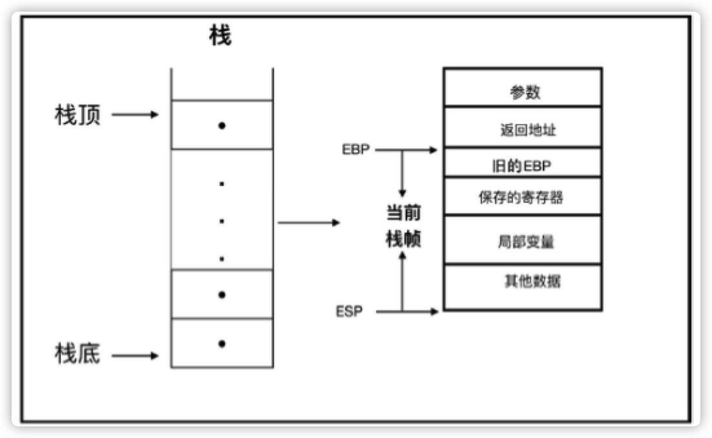

- [1. 新时代的语言](#1-新时代的语言)
- [2. 语言精要](#2-语言精要)
  - [2.1. Rust 语言的基本构成](#21-rust-语言的基本构成)
    - [2.1.1. 语言规范](#211-语言规范)
    - [2.1.2. 编译器](#212-编译器)
    - [2.1.3. 核心库](#213-核心库)
    - [2.1.4. 标准库](#214-标准库)
    - [2.1.5. 包管理器](#215-包管理器)
  - [2.2. 语句与表达式](#22-语句与表达式)
  - [2.3. 变量与绑定](#23-变量与绑定)
    - [2.3.1. 位置表达式和值表达式](#231-位置表达式和值表达式)
    - [2.3.2. 不可变绑定与可变绑定](#232-不可变绑定与可变绑定)
    - [2.3.3. 所有权与引用](#233-所有权与引用)
  - [2.4. 函数与闭包](#24-函数与闭包)
    - [2.4.1. 函数定义](#241-函数定义)
    - [2.4.2. 作用域与生命周期](#242-作用域与生命周期)
    - [2.4.3. 函数指针](#243-函数指针)
    - [2.4.4. CTFE机制](#244-ctfe机制)
    - [2.4.5. 闭包](#245-闭包)
  - [2.5. 流程控制](#25-流程控制)
    - [2.5.1. 条件表达式](#251-条件表达式)
    - [2.5.2. 循环表达式](#252-循环表达式)
    - [2.5.3. match表达式与模式匹配](#253-match表达式与模式匹配)
    - [2.5.4. if let 和 while let 表达式](#254-if-let-和-while-let-表达式)
  - [2.6. 基本数据类型](#26-基本数据类型)
    - [2.6.1. 布尔类型](#261-布尔类型)
    - [2.6.2. 基本数字类型](#262-基本数字类型)
    - [2.6.3. 字符类型](#263-字符类型)
    - [2.6.4. 数组类型](#264-数组类型)
    - [2.6.5. 范围类型](#265-范围类型)
    - [2.6.6. 切片类型](#266-切片类型)
    - [2.6.7. str 字符串类型](#267-str-字符串类型)
    - [2.6.8. 原生指针](#268-原生指针)
    - [2.6.9. never 类型](#269-never-类型)
  - [2.7. 复合数据类型](#27-复合数据类型)
    - [2.7.1. 元组](#271-元组)
    - [2.7.2. 结构体](#272-结构体)
    - [2.7.3. 枚举体](#273-枚举体)
  - [2.8. 常用集合类型](#28-常用集合类型)
    - [2.8.1. 线性序列：Vec](#281-线性序列vec)
    - [2.8.2. 线性序列：双端队列](#282-线性序列双端队列)
    - [2.8.3. 线性序列：链表](#283-线性序列链表)
    - [2.8.4. Key-Value映射表：HashMap和BTreeMap](#284-key-value映射表hashmap和btreemap)
    - [2.8.5. 集合：HashSet和BTreeSet](#285-集合hashset和btreeset)
    - [2.8.6. 优先队列：BinaryHeap](#286-优先队列binaryheap)
  - [2.9. 智能指针](#29-智能指针)
  - [2.10. 泛型和 trait](#210-泛型和-trait)
    - [2.10.1. 泛型](#2101-泛型)
    - [2.10.2. trait](#2102-trait)
  - [2.11. 错误处理](#211-错误处理)
  - [2.12. 表达式优先级](#212-表达式优先级)
  - [2.13. 注释与打印](#213-注释与打印)
    - [2.13.1. 不同的注释](#2131-不同的注释)
    - [2.13.2. 文档注释 内部支持 Markdown 标记，也支持对文档中的示例代码进行测试，可以用 rustdoc 工具生成 HTML 文档](#2132-文档注释-内部支持-markdown-标记也支持对文档中的示例代码进行测试可以用-rustdoc-工具生成-html-文档)
    - [2.13.3. 打印](#2133-打印)
- [3. 类型系统](#3-类型系统)
  - [3.1. 通用概念](#31-通用概念)
    - [3.1.1. 类型系统的作用](#311-类型系统的作用)
    - [3.1.2. 类型系统的分类](#312-类型系统的分类)
    - [3.1.3. 类型系统与多态性](#313-类型系统与多态性)
  - [3.2. Rust类型系统概述](#32-rust类型系统概述)
    - [3.2.1. 类型大小](#321-类型大小)
      - [3.2.1.1. 零大小类型](#3211-零大小类型)
      - [3.2.1.2. 底类型](#3212-底类型)
    - [3.2.2. 类型推导](#322-类型推导)
  - [3.3. 泛型](#33-泛型)
    - [3.3.1. 泛型返回值自动推导](#331-泛型返回值自动推导)
  - [3.4. 深入triat](#34-深入triat)
    - [3.4.1. 接口抽象](#341-接口抽象)
      - [3.4.1.1. 关联类型 type](#3411-关联类型-type)
      - [3.4.1.2. trait一致性](#3412-trait一致性)
      - [3.4.1.3. trait继承](#3413-trait继承)
    - [3.4.2. 泛型约束](#342-泛型约束)
    - [3.4.3. 类型抽象](#343-类型抽象)
      - [3.4.3.1. trait object ？](#3431-trait-object-)
      - [3.4.3.2. impl Trait ?](#3432-impl-trait-)
    - [3.4.4. 标签 trait](#344-标签-trait)
      - [3.4.4.1. Sized trait](#3441-sized-trait)
      - [3.4.4.2. Copy trait](#3442-copy-trait)
      - [3.4.4.3. Send trait 和 Sync trait](#3443-send-trait-和-sync-trait)
  - [3.5. 类型转换](#35-类型转换)
    - [3.5.1. Deref 解引用](#351-deref-解引用)
      - [3.5.1.1. 自动解引用](#3511-自动解引用)
      - [3.5.1.2. 手动解引用](#3512-手动解引用)
    - [3.5.2. as 操作符](#352-as-操作符)
      - [3.5.2.1. 无歧义限定语法](#3521-无歧义限定语法)
      - [3.5.2.2. 类型和子类型相互转换](#3522-类型和子类型相互转换)
    - [3.5.3. From 和 Into](#353-from-和-into)
  - [3.6. 当前 trait 系统的不足](#36-当前-trait-系统的不足)
    - [3.6.1. 孤儿规则的局限性](#361-孤儿规则的局限性)
    - [3.6.2. 代码复用的效率不高](#362-代码复用的效率不高)
    - [3.6.3. 抽象表达能力有待改进](#363-抽象表达能力有待改进)
  - [3.7. 小结](#37-小结)
- [4. 内存管理](#4-内存管理)
  - [4.1. 通用概念](#41-通用概念)
    - [4.1.1. 栈](#411-栈)
    - [4.1.2. 堆](#412-堆)
    - [4.1.3. 内存布局](#413-内存布局)
  - [4.2. Rust 中的资源管理](#42-rust-中的资源管理)
    - [4.2.1. 变量和函数](#421-变量和函数)
    - [4.2.2. 智能指针与RALL](#422-智能指针与rall)
      - [4.2.2.1. 智能指针](#4221-智能指针)
      - [4.2.2.2. 确定性析构](#4222-确定性析构)
    - [4.2.3. 内存泄漏与内存安全](#423-内存泄漏与内存安全)
      - [4.2.3.1. 制造内存泄漏](#4231-制造内存泄漏)
      - [4.2.3.2. 内存安全的含义](#4232-内存安全的含义)
      - [4.2.3.3. 内存泄露的原因](#4233-内存泄露的原因)
    - [4.2.4. 复合类型的内存分配和布局](#424-复合类型的内存分配和布局)
  - [4.3. 小结](#43-小结)
- [5. 所有权系统](#5-所有权系统)
  - [5.1. 通用概念](#51-通用概念)
  - [5.2. 所有权机制](#52-所有权机制)
      - [5.2.0.1. 所有权的类型系统理论](#5201-所有权的类型系统理论)
      - [5.2.0.2. 所有权特点](#5202-所有权特点)
  - [5.3. 绑定、作用域和声明周期](#53-绑定作用域和声明周期)
    - [5.3.1. 不可变与可变](#531-不可变与可变)
    - [5.3.2. 绑定的时间属性--声明周期](#532-绑定的时间属性--声明周期)
      - [5.3.2.1. let默认创建词法作用域](#5321-let默认创建词法作用域)
      - [5.3.2.2. 花括号创建词法作用域](#5322-花括号创建词法作用域)
      - [5.3.2.3. match 匹配](#5323-match-匹配)
      - [5.3.2.4. 循环语句](#5324-循环语句)
      - [5.3.2.5. 函数创建新词法作用域](#5325-函数创建新词法作用域)
      - [5.3.2.6. 闭包创建新词法作用域](#5326-闭包创建新词法作用域)
  - [5.4. 所有权借用](#54-所有权借用)
    - [5.4.1. 函数签名支持模式匹配](#541-函数签名支持模式匹配)
    - [5.4.2. 引用与借用](#542-引用与借用)
      - [5.4.2.1. 借用规则](#5421-借用规则)
      - [5.4.2.2. 解引用操作会获得所有权](#5422-解引用操作会获得所有权)
  - [5.5. 生命周期参数](#55-生命周期参数)
    - [5.5.1. 显式生命周期参数](#551-显式生命周期参数)
      - [5.5.1.1. 函数签名中的生命周期参数](#5511-函数签名中的生命周期参数)
      - [5.5.1.2. 结构体定义中的生命周期参数](#5512-结构体定义中的生命周期参数)
      - [5.5.1.3. 方法定义中的生命周期参数](#5513-方法定义中的生命周期参数)
      - [5.5.1.4. 静态生命周期参数](#5514-静态生命周期参数)
    - [5.5.2. 省略生命周期参数](#552-省略生命周期参数)
    - [5.5.3. 生命周期限定](#553-生命周期限定)
    - [5.5.4. trait object 的生命周期](#554-trait-object-的生命周期)
  - [5.6. 智能指针与所有权](#56-智能指针与所有权)
    - [5.6.1. 共享所有权`Rc<T>`和`Weak<T>`](#561-共享所有权rct和weakt)
    - [5.6.2. 内部可变性Cell＜T＞和RefCell＜T＞](#562-内部可变性cellt和refcellt)
      - [5.6.2.1. Cell＜T＞](#5621-cellt)
      - [5.6.2.2. RefCell＜T＞](#5622-refcellt)
    - [5.6.3. 写时复制Cow＜T＞ ？](#563-写时复制cowt-)
  - [5.7. 并发安全与所有权](#57-并发安全与所有权)
  - [5.8. 非词法作用域生命周期](#58-非词法作用域生命周期)
  - [5.9. 小结](#59-小结)
- [6. 函数、闭包与迭代器](#6-函数闭包与迭代器)
  - [6.1. 函数](#61-函数)
    - [6.1.1. 函数屏蔽](#611-函数屏蔽)
    - [6.1.2. 函数参数模式匹配](#612-函数参数模式匹配)
    - [6.1.3. 函数返回值](#613-函数返回值)
    - [6.1.4. 泛型函数](#614-泛型函数)
    - [6.1.5. 方法与函数](#615-方法与函数)
    - [6.1.6. 高级函数](#616-高级函数)
      - [6.1.6.1. 函数本身作为参数--函数指针](#6161-函数本身作为参数--函数指针)
      - [6.1.6.2. 使用type关键字定义函数指针类型别名](#6162-使用type关键字定义函数指针类型别名)
      - [6.1.6.3. 函数作为返回值](#6163-函数作为返回值)
  - [6.2. 闭包](#62-闭包)
    - [6.2.1. 闭包的基本语法](#621-闭包的基本语法)
    - [6.2.2. 闭包的实现 ？](#622-闭包的实现-)
      - [6.2.2.1. 显式指定闭包类型](#6221-显式指定闭包类型)
    - [6.2.3. 闭包与所有权](#623-闭包与所有权)
      - [6.2.3.1. 复制语义类型自动实现Fn](#6231-复制语义类型自动实现fn)
      - [6.2.3.2. 移动语义类型自动实现FnOnce](#6232-移动语义类型自动实现fnonce)
      - [6.2.3.3. 使用 move 关键字自动实现 Fn](#6233-使用-move-关键字自动实现-fn)
      - [6.2.3.4. move 关键字影响闭包本身](#6234-move-关键字影响闭包本身)
      - [6.2.3.5. 修改环境变量以自动实现FnMut](#6235-修改环境变量以自动实现fnmut)
      - [6.2.3.6. 未捕获任何环境变量的闭包会自动实现Fn](#6236-未捕获任何环境变量的闭包会自动实现fn)
      - [6.2.3.7. 规则总结](#6237-规则总结)
    - [6.2.4. 闭包作为函数参数和返回值](#624-闭包作为函数参数和返回值)
      - [6.2.4.1. 把闭包作为 trait 对象](#6241-把闭包作为-trait-对象)
      - [6.2.4.2. 闭包作为函数参数 ？](#6242-闭包作为函数参数-)
    - [6.2.5. 高阶生命周期 ？](#625-高阶生命周期-)
  - [6.3. 迭代器](#63-迭代器)
    - [6.3.1. 外部迭代器和内部迭代器 ?](#631-外部迭代器和内部迭代器-)
      - [6.3.1.1. 外部迭代器](#6311-外部迭代器)
      - [6.3.1.2. 内部迭代器](#6312-内部迭代器)
- [7. 结构化编程](#7-结构化编程)
- [8. 字符串与集合类型](#8-字符串与集合类型)
- [9. 构建健壮的程序](#9-构建健壮的程序)
- [10. 模块化编程](#10-模块化编程)
- [11. 并发安全](#11-并发安全)
  - [11.1. 通用概念](#111-通用概念)
    - [11.1.1. 多进程和多线程](#1111-多进程和多线程)
    - [11.1.2. 事件驱动、异步回调和协程](#1112-事件驱动异步回调和协程)
      - [11.1.2.1. 事件驱动、异步回调](#11121-事件驱动异步回调)
      - [11.1.2.2. 协程](#11122-协程)
    - [11.1.3. 线程安全](#1113-线程安全)
      - [11.1.3.1. 竞态条件与临界区](#11131-竞态条件与临界区)
      - [11.1.3.2. 同步、互斥和原子类型](#11132-同步互斥和原子类型)
      - [11.1.3.3. 原子类型与多线程内存模型](#11133-原子类型与多线程内存模型)
      - [11.1.3.4. 为什么多线程编程这么难](#11134-为什么多线程编程这么难)
  - [11.2. 多线程并发编程](#112-多线程并发编程)
    - [11.2.1. 线程管理](#1121-线程管理)
      - [11.2.1.1. 定制线程](#11211-定制线程)
      - [11.2.1.2. 线程本地存储 ?](#11212-线程本地存储-)
      - [11.2.1.3. 底层同步原语 ?](#11213-底层同步原语-)
    - [11.2.2. Send 和 Sync](#1122-send-和-sync)
    - [11.2.3. 使用锁进行线程同步](#1123-使用锁进行线程同步)
      - [11.2.3.1. 互斥锁（Mutex）](#11231-互斥锁mutex)
      - [11.2.3.2. 跨线程恐慌和错误处理](#11232-跨线程恐慌和错误处理)
      - [11.2.3.3. 死锁 ？](#11233-死锁-)
      - [11.2.3.4. 读写锁（RwLock）？](#11234-读写锁rwlock)
    - [11.2.4. 屏障和条件变量](#1124-屏障和条件变量)
    - [11.2.5. 原子类型](#1125-原子类型)
      - [11.2.5.1. Rust标准库中提供的原子类型](#11251-rust标准库中提供的原子类型)
- [12. 元编程](#12-元编程)
- [13. 超越安全的边界](#13-超越安全的边界)
# 1. 新时代的语言
# 2. 语言精要
## 2.1. Rust 语言的基本构成
1. 语言规范
2. 编译器
3. 核心库
4. 标准库
5. 包管理器
### 2.1.1. 语言规范
Rust语言规范主要由Rust语言参考（The Rust Reference）和RFC文档共同构成。
### 2.1.2. 编译器
Rust官方的编译器叫rustc，负责将Rust源代码编译为可执行文件或其他库文件（.a、.so、.lib、.dll等）
- rustc有如下特点：
    - 跨平台
    - 支持交叉编译
    - 使用 LLVM 作为编译器后端，具有很好的代码生成和优化技术，支持多个目标平台
    - rustc是用Rust语言开发的，包含在Rust语言源码中。
### 2.1.3. 核心库
核心库中定义的是Rust语言的核心，不依赖于操作系统和网络等相关的库，甚至不知道堆分配，也不提供并发和I/O。
- 可以通过在模块顶部引入`＃![no_std]`来使用核心库，`#[no_std]`来明确不需要标准库。
- Rust会为每个crate都自动引入标准库模块，除非使用＃[no_std]属性明确指定了不需要标准库
- 核心库和标准库的功能有一些重复，包括如下部分：
    - 基础的trait，如Copy、Debug、Display、Option等。
    - 基本原始类型，如bool、char、i8/u8、i16/u16、i32/u32、i64/u64、isize/usize、f32/f64、str、array、slice、tuple、pointer等
    - 常用功能型数据类型，满足常见的功能性需求，如String、Vec、HashMap、Rc、Arc、Box等
    - 常用的宏定义，如println！、assert！、panic！、vec！等
- 做嵌入式应用开发的时候，核心库是必需的。
### 2.1.4. 标准库
Rust标准库提供应用程序开发所需要的基础和跨平台支持
- 标准库包含的内容大概如下：
    - 与核心库一样的基本trait、原始数据类型、功能型数据类型和常用宏等，以及与核心库几乎完全一致的API
    - 并发、I/O和运行时。例如线程模块、用于消息传递的通道类型、Sync trait等并发模块，文件、TCP、UDP、管道、套接字等常见I/O。
    - 平台抽象。底层操作接口，比如 std::mem、std::ptr、std::intrinsics 等，操作内存、指针、调用编译器固有函数。
    - 可选和错误处理类型Option和Result，以及各种迭代器等。
### 2.1.5. 包管理器
把按一定规则组织的多个rs文件编译后就得到一个包（crate）。包是Rust代码的基本编译单元，也是程序员之间共享代码的基本单元。
- Rust提供了非常方便的包管理器Cargo
    - `cargo new` 命令默认可以创建一个用于编写可执行二进制文件的项目
        - `cargo new --lib lib_crate` 添加--lib参数，则可以创建用于编写库的项目
    - `cargo build` 对项目进行编译
    - `cargo run` 运行
## 2.2. 语句与表达式
Rust 中的语法可以分成两大类：`语句（Statement）和表达式（Expression）`。语句是指要执行的一些操作和产生副作用的表达式。表达式主要用于计算求值。
- 语句
  - 声明语句（ Declaration statement）
    - 声明各种语言项（Item），包括声明变量、静态变量、常量、结构体、函数等，以及通过extern和use关键字引入包和模块等
  - 表达式语句（ Expressionstatement）
    - 特指以分号结尾的表达式。`此类表达式求值结果将会被舍弃，并总是返回单元类型（）`
- 以叹号结尾，并且可以像函数一样被调用的语句，在Rust中叫作宏，如：`println!()` `assert_eq!`
- Rust编译器在解析代码的时候，如果碰到分号，就会继续往后面执行；如果碰到语句，则执行语句；如果碰到表达式，则会对表达式求值，如果分号后面什么都没有，就会补上单元值（）。
- 当遇到函数的时候，会将函数体的花括号识别为块表达式（Block Expression）。块表达式是由一对花括号和一系列表达式组成的，它总是返回块中最后一个表达式的值。
- **可以将Rust看作一切皆表达式。由于当分号后面什么都没有时自动补单元值（）的特点，我们可以将 Rust 中的语句看作计算结果均为（）的特殊表达式。而对于普通的表达式来说，则会得到正常的求值结果。**
```rust
fn main() {
    pub fn anwser() -> () { // 返回值是 单元 类型，单元类型拥有唯一的值，就是它本身，它表示“没有什么特殊的价值”
        let a = 40; // 语句
        let b = 2; // 语句 
        assert_eq!(sum(a, b), 42); // 宏语句
    }
    pub fn sum(a: i32, b: i32) -> i32 {
        a + b // 表达式，返回表达式的结果
    }
    answer(); // 最后一个语句，分号后面什么都没有，会补上单元值
    // main 返回 单元值 ()
}
```
## 2.3. 变量与绑定
通过let关键字来创建变量，这是Rust语言从函数式语言中借鉴的语法形式。let创建的变量一般称为绑定（Binding），它表明了标识符（Identifier）和值（Value）之间建立的一种关联关系.
### 2.3.1. 位置表达式和值表达式
- 位置表达式（ Place Expression）-> 左值
  - **位置表达式就是表示内存位置的表达式**。
  - 分别有以下几类
    - 本地变量
    - 静态变量
    - 解引用（*expr）
    - 数组索引（expr[expr]）
    - 字段引用（expr.field）
    - 位置表达式组合
  - **通过位置表达式可以对某个数据单元的内存进行读写。主要是进行写操作，这也是位置表达式可以被赋值的原因。**
- 值表达式（ ValueExpression）-> 右值
  - 不是位置表达式的就是值表达式。
  - 值表达式一般只**引用**了某个存储单元地址中的数据。它相当于数据值，**只能进行读操作**。
- `所以，能进行写的是位置表达式，只能进行读的是值表达式？`
- 从语义角度来说，**位置表达式代表了持久性数据，值表达式代表了临时数据**。位置表达式一般有持久的状态，值表达式要么是字面量，要么是表达式求值过程中创建的临时值。
- 表达式的求值过程在不同的上下文中会有不同的结果。`什么是上下文？`
  - 位置上下文
    - 赋值或者复合赋值语句左侧的**操作数**
      - `许多表达式包含子表达式，称为表达式的操作数。`
      - 操作数可以出现在位置上下文或值上下文中。表达式的计算取决于它自己的类别和它出现的上下文。
    - 一元引用表达式的独立操作数，eg: 
      - `let x = &a` x 是位置上下文，&a 把赋值语句的右侧变成了位置上下文，只是共享内存地址
    - 包含隐式借用（引用）的操作数
    -  match判别式或let绑定右侧在使用ref模式匹配的时候也是位置上下文
  - 值上下文
    - 不是位置上下文的，就是值上下文，如 函数、常量
    - 值表达式不能出现在位置上下文中
### 2.3.2. 不可变绑定与可变绑定
- 使用let关键字声明的位置表达式默认不可变，为不可变绑定，可读不可写
- 而 let mut声明的可变绑定则是可以对相应的存储单元进行写入的
```rust
fn main() {
    let a = 1;
    // a = 2; // immutabel and error
    let mut b = 2;
    b = 3; // mutable
}
```
### 2.3.3. 所有权与引用
- 当**位置表达式**出现在**值上下文中**时，该位置表达式将会把内存地址转移给另外一个位置表达式，这其实是所有权的转移
  - review：转不转移，还得看有无实现 copy，有则复制一份，无则转移所有权
- 在语义上，每个变量绑定实际上都拥有该存储单元的所有权，这种转移内存地址的行为就是所有权（OwnerShip）的转移，在 Rust 中称为`移动（Move）语义`，**那种不转移的情况实际上是一种复制（Copy）语义**
- Rust没有GC，所以完全依靠所有权来进行内存管理
- Rust提供引用操作符（&），可以**直接获取表达式的存储单元地址，即内存位置**。可以通过该内存位置对存储进行读取
```rust
    let a = [1,2,3];
    let b = &a; // 引用操作符&取得a的内存地址，使用引用操作符已经将赋值表达式右侧变成了位置上下文，它只是共享内存地址；读借用; review: 读指针 copy 了一份;
    println!("{:p}", b);
    let mut c = vec![1, 2, 3];
    let d = &mut c; // 通过&mut获取c的可变引用，赋值给d; 写借用
    d.push(4); // 改变可变数组，末尾push4
    println!("{:?}", d); // [1, 2, 3, 4]
    println!("{:?}", c); // [1, 2, 3, 4]
    let e = &42;
    assert_eq!(42, *e);
```
- 从语义上来说，不管是&a还是&mut c，都相当于对a和c所有权的借用，因为a和c还依旧保留它们的所有权，所以引用也被称为`借用`
## 2.4. 函数与闭包
### 2.4.1. 函数定义
- 函数是通过关键字`fn`定义的
- 参数与返回值类型需要严格遵守
- 函数体是由花括号括起来的，它实际上是一个块表达式，最终只返回块中最后一个表达式的求值结果。如果想提前返回，则需要使用`return`关键字
### 2.4.2. 作用域与生命周期
Rust 语言的作用域是静态作用域，即词法作用域（Lexical Scope）。由一对花括号来开辟作用域，其作用域在词法分析阶段就已经确定了，不会动态改变
- 生命周期（LifeTime）。变量绑定的生命周期总是遵循这样的规律：从使用 let 声明创建变量绑定开始，到超出词法作用域的范围时结束。

### 2.4.3. 函数指针
- 函数为一等公民。这意味着，函数自身就可以作为函数的参数和返回值使用

### 2.4.4. CTFE机制
CTFE 编译时函数执行
```rust
// #![feature(const_fn)] // Rust 2018 版本后不需要加该特性
const fn init_len() -> usize() {
    return 5;
}
fn main() {
    len arr = [0; init_len()];
}
```
- Rust 中固定长度的数组必须在编译期就知道长度，否则会编译出错
- 使用`const fn`定义的函数，必须可以确定值，不能存在歧义
- Rust 中的 CTFE 是由 miri 来执行的。miri 是一个 MIR 解释器，目前已经被集成到了 Rust 编译器 rustc 中
### 2.4.5. 闭包
闭包也叫匿名函数
- 闭包有以下几个特点：
  - 可以像函数一样被调用
  - 可以捕获上下文环境中的自由变量
  - 可以自动推断输入和返回的类型
```rust
fn main() {
    let out = 42;
    // fn add(i: i32, j: i32) -> i32 {i + j + out}; // can't capture dynamic environment in a fn item
    fn add(i: i32, j: i32) -> i32 {i + j};
    
    // 闭包，可以捕获上下文环境中的自由变量
    let closure_annotated = |i: i32, j: i32| -> i32 {i + j + out}; 
    // 自动推断输入和返回的类型
    let closure_inferred = |i, j| i + j + out;
    let i = 1;
    let j = 2;
    assert_eq!(3, add(i, j));
    assert_eq!(45, closure_annotated(i, j));
    assert_eq!(45, closure_inferred(i, j));
}
```
- **闭包和函数有一个重要的区别，那就是闭包可以捕获外部变量，而函数不可以**，其他语言函数可以捕获外部变量。
- `Rust 中闭包实际上就是由一个匿名结构体和 trait 来组合实现的，但编译器帮我们自动转换了`
```rust
// 闭包作为参数的情况
fn main() {
    let a = 2;
    let b = 3;
    assert_eq!(closure_math(|| a + b), 5);
    assert_eq!(closure_math(||a * b), 6);
}

fn closure_math<F: Fn() -> i32>(op: F) -> i32 { // Fn() -> i32 是 闭包类型
    op()
}
```
- 闭包捕获借用要保证借用唯一
```Rust
#![allow(unused)]
fn main() {
let mut b = false;
let x = &mut b; // &&mut
{
    let mut c = || { *x = true; }; // 闭包捕获了 x，要保证x唯一被借用，x不能被借用了
    // The following line is an error:
    // let y = &x; // 仍在 闭包的生命周期中，x 不能被 借用
    c();
}
let z = &x; // 闭包生命周期外，x 又可以被借用了
}
```
- 闭包做返回值
```rust
// 在函数定义时并不知道具体的返回类型，但是在函数调用时，编译器会推断出来。这个过程也是零成本抽象的，一切都发生在编译期
fn two_times_impl() -> impl Fn(i32) -> i32 { // 使用了impl Fn（i32）-＞i32作为函数的返回值，它表示实现Fn（i32）-＞i32 的类型
    let i = 2;
    move |j| j * i // 闭包的捕获会优先使用借用，使用 move 关键字 将捕获变量i的所有权转移到闭包中，就不会按引用进行捕获变量，这样闭包才可以安全地返回
}

fn main() {
    let result = two_times_impl();
    assert_eq!(result(2), 4)
}
```
## 2.5. 流程控制
### 2.5.1. 条件表达式
### 2.5.2. 循环表达式
- `while true` 与 `if true` 有缺陷，无限循环请使用`loop`
  ```rust
  // 编译器会报错，编译器只知道while true循环返回的是单元值
  fn while_true(x: i32) -> i32 {
      while true {
          return x + 1
      }
  }
  fn main() {
      let y = while_true(5);
      assert_eq!(y, 6);
  }
  ```
  - Rust编译器在对while循环做流分析（Flow Sensitive）的时候，不会检查循环条件，编译器会认为 while 循环条件可真可假，所以循环体里的表达式也会被忽略，此时编译器只知道while true循环返回的是单元值，而函数返回的是i32，其他情况一概不知。这一切都是因为 CTFE 功能的限制，while 条件表达式无法作为编译器常量来使用。只有等将来CTFE功能完善了，才可以正常使用。同理，if true在只有一条分支的情况下，也会发生类似情况。

### 2.5.3. match表达式与模式匹配
```rust
fn main() {
    let number = 42;
    match number {
        0 => println!("origin"),
        // 1...3 => println!("all"),
        | 5 | 7 | 13 => println!("bad luck"),
        n @ 42 => println!("answer is {}", n),
        _ => println!("common"), // match 需要全覆盖，如果覆盖不了，需要缺省
    }
}
```
- 使用操作符`@`可以将模式中的值绑定给一个变量，供分支右侧的代码使用，这类匹配叫**绑定模式（BindingMode）**
- match 表达式必须穷尽每一种可能，所以一般情况下，会使用通配符`_`来处理剩余的情况
- match 分支左边就是模式，右边就是执行代码
- 所有分支必须返回同一个类型，但是左侧的模式可以是不同的。

### 2.5.4. if let 和 while let 表达式
```rust
fn main() {
    let boolean = true;
    let mut binary = 0;
    if let true = boolean {
        binary = 1;
    }

    assert_eq!(binary, 1)
}
```
- if let左侧为模式，右侧为要匹配的值
- if let 获取通过等号分隔的一个模式和一个表达式。它的工作方式与 match 相同，这里的表达式对应 match 而模式则对应第一个分支。
  - 然而，这样会失去 match 强制要求的穷尽性检查。match 和 if let 之间的选择依赖特定的环境以及增加简洁度和失去穷尽性检查的权衡取舍。
  - 可以在 if let 中包含一个 else。else 块中的代码与 match 表达式中的 _ 分支块中的代码相同，这样的 match 表达式就等同于 if let 和 else
  ```rust
  if let true = boolean {
    binary = 1;
  } else {
    binary = 0;
  }
  ``` 
```rust
fn main() {
   let mut v = vec![1, 2, 3, 4, 5];
   while let Some(x) = v.pop() { // 调用v的pop方法会返回Option类型; 左侧Some（x）为匹配模式，它会匹配右侧pop方法调用返回的Option类型结果，并自动创建x绑定
       println!("{}", x);
   }
}
```

## 2.6. 基本数据类型
### 2.6.1. 布尔类型
### 2.6.2. 基本数字类型
- 基本数字类型分为三类：
  - 固定大小的类型
    - 无符号整数
    - 符号整数
  - 动态大小的类型
    - usize 数值范围为0～232-1或0～264-1，占用4个或8个字节，具体取决于机器的字长。
    - isize 数值范围为-231～231-1或-263～263-1，占用4个或8个字节，同样取决于机器的字长
  - 浮点数
    - f32
    - f64
```rust
fn main() {
    let num = 42u32;
    let num = 0x2A; // 十六进制
    let num = 0o106; // 八进制
    let num = 0b1101_1011; // 二进制
    let num = 0b11011111;
    assert_eq!(b'*', 42u8); //  字节字面量
    assert_eq!(b'\'', 39u8);
    println!("{:?}", std::f32::INFINITY);
    println!("{:?}", std::f32::NEG_INFINITY);
    println!("{:?}", std::f32::NAN);
    println!("{:?}", std::f32::MIN);
    println!("{:?}", std::f32::MAX);
}
```
- 数字字面量后面可以直接使用**类型后缀**，比如 42u32，代表这是一个u32类型
- 不加后缀或者没有指定类型，**Rust编译器会默认推断数字为 i32 类型**
- 支持**字节字面量**

### 2.6.3. 字符类型
- 使用单引号来定义字符（Char）类型，是一个 Unicode 标量值，每个字符占4个字节
- 可以使用`as`操作符将字符转为数字类型 `assert_eq!('%' as i8, 37)`

### 2.6.4. 数组类型
- 数组（Array）是 Rust 内建的原始集合类型，数组的特点为
  - 数组大小固定
  - 元素均为同类型
  - 默认不可变
- 数组的类型签名为`[T；N]`。T 是一个泛型标记，代表具体类型；N 代表数组的长度
- **对于原始固定长度数组，只有实现 Copy trait 的类型才能作为其元素**
  - 只有可以在栈上存放的元素才可以存放在该类型的数组中

### 2.6.5. 范围类型
- Rust 内置了范围（Range）类型，包括左闭右开和全闭两种区间
  ```rust
  fn main() {
      assert_eq!((1..5), std::ops::Range{start: 1, end: 5});
      assert_eq!((1..=5), std::ops::RangeInclusive::new(1, 5));
      assert_eq!(3+4+5, (3..6).sum());
      assert_eq!(3+4+5+6, (3..=6).sum());
      for i in 1..5 {
          print!("{} ", i);
      }
      println!("");
      for i in 1..=5 {
          print!("{} ", i);
      }
  }
  ```
  - (1..5）表示左闭右开区间，（1..=5）则表示全闭区间。它们分别是std::ops::Range 和 std::ops::RangeInclusive 的实例
  - 范围自带了一些方法，比如 sum，可以为范围中的元素进行求和
  - 并且每个范围都是一个迭代器，可以直接使用 for 循环进行打印

### 2.6.6. 切片类型
切片（Slice）类型是对一个数组（包括固定大小数组和动态数组）的引用片段，有利于安全有效地访问数组的一部分，而不需要拷贝。因为理论上讲，切片引用的是已经存在的变量。在底层，切片代表一个指向数组起始位置的指针和数组长度。用[T]类型表示连续序列，那么切片类型就是&[T]和&mut[T]。
```rust
fn main() {
    let arr: [i32; 5] = [1, 2, 3, 4, 5];

    assert_eq!(&arr, &[1, 2, 3, 4, 5]);
    assert_eq!(arr[1..], [2, 3, 4, 5]);
    assert_eq!((&arr).len(), 5);
    assert_eq!((&arr).is_empty(), false);
    let arr = &mut [1, 2, 3];
    arr[1] = 7;
    assert_eq!(arr, &[1, 7, 3]);
    let vec = vec![1,2,3];
    assert_eq!(&vec[..], [1, 2, 3]);
}
```
- 可以理解为：对数组内容的引用就是切片？

### 2.6.7. str 字符串类型
- Rust提供了原始的字符串类型 str，也叫作**字符串切片**。它通常以不可变借用的形式存在，即 &str
- 出于内存安全的考虑，Rust 将字符串分为两种类型：
  - 一种是固定长度字符串，不可随便更改其长度，就是 str 字符串；
  - 另一种是可增长字符串，可以随意改变其长度，就是 String 字符串。
```rust
fn main() {
    let trust: &'static str = "Rust 是一门优雅的语言"; // 5 + 3 * 8  定义了字符串字面量trust 本质上，字符串字面量也属于str类型，只不过它是静态生命周期字符串&＇static str
    let ptr = trust.as_ptr();
    let len = trust.len();
    assert_eq!(29, len);
    let s = unsafe {
        let slice = std::slice::from_raw_parts(ptr, len);
        std::str::from_utf8(slice)
    };
    assert_eq!(s, Ok(trust));
}
```
- str 字符串类型由两部分组成：指向字符串序列的指针和记录长度的值。可以通过 str 模块提供的 as_ptr 和 len 方法分别求得指针和长度
- Rust 中的字符串本质上是一段有效的 UTF8 字节序列。所以，可以将一段字节序列转换为 str 字符串

### 2.6.8. 原生指针
- 将可以表示内存地址的类型称为指针
  - 引用（Reference）
    - 引用，它本质上是一种非空指针
    - 引用主要应用于 Safe Rust 中，在 Safe Rust 中，编译器会对引用进行借用检查，以保证内存安全和类型安全
  - 原生指针（Raw Pointer）
    - 主要用于 Unsafe Rust 中，直接使用原生指针是不安全的，比如原生指针可能指向一个 Null，或者一个已经被释放的内存区域
    - Rust支持两种原生指针
      - 不可变原生指针 *const T
      - 可变原生指针 *mut T
      ```rust
      fn main() {
          let mut x = 10;
          let ptr_x = &mut x as *mut i32; // 通过 as 操作符将&mut x 可变引用转换为*mut i32 可变原生指针ptr_x
          let y = Box::new(20);
          let ptr_y = &*y as *const i32;
          unsafe {
              *ptr_x += *ptr_y; // 对ptr_x和ptr_y指针解引用，并将两个指针指向的值求和
          }
          assert_eq!(x, 30);
      }
      ```
  - 函数指针（fn Pointer）
  - 智能指针（Smart Pointer）

### 2.6.9. never 类型
- Rust 中提供了一种特殊数据类型，never 类型，即`!`
  - 该类型用于表示永远不可能有返回值的计算类型
- never 类型是可以强制转换为其他任何类型的。

## 2.7. 复合数据类型
- 元组（Tuple）
- 结构体（Struct）
- 枚举体（Enum）
- 联合体（Union）

### 2.7.1. 元组
- 元组用一对 `( )` 包括的一组数据，**可以包含不同种类的数据**
```rust
fn move_coords( x: (i32, i32) ) -> (i32, i32) {
    (x.0 + 1, x.1 + 1)
}

fn main() {
    let tuple: (&'static str, i32, char) = ("hello", 5, 'c');
    assert_eq!(tuple.0, "hello"); // 通过 .0 .1 的方式，获取 tuple 第1 2 个成员
    let coords = (0, 1);
    let result = move_coords(coords);
    assert_eq!(result, (1, 2));
    let (x, y) = move_coords(coords); // let支持模式匹配，可以用来解构元组
    assert_eq!(x, 1);
    assert_eq!(y, 2);
}
```
- 可以通过索引来获取元组内元素的值
- 因为let支持模式匹配，所以可以用来解构元组
- 利用元组也可以让函数返回多个值
- **当元组中只有一个值的时候，需要加逗号，即 （0，），这是为了和括号中的其他值进行区分**
- `()` 空元组

### 2.7.2. 结构体
- Rust 提供三种结构体
  - 具名结构体
  - 元组结构体
    - 特点是，字段没有名称，只有类型 `struct Color(i32, i32, i32)`
    - 当一个元组结构体只有一个字段的时候，我们称之为`New Type模式`，eg:`struct Integer(u32)`
  - 单元结构体 
    - 没有任何字段的结构体 `struct Empty`
    - 单元结构体实例就是其本身
      - 在 Release 编译模式下，单元结构体实例会被优化为同一个对象；而在 Debug 模式下，则不会进行这样的优化
-  构体名称要遵从驼峰式命名规则。虽然不按驼峰式命名也可以通过编译，但是编译器会警告你
-  结构体上方的`＃[derive（Debug，PartialEq）]`是属性，可以让结构体自动实现`Debug trait`和`PartialEq trait`，它们的功能是允许对结构体实例进行打印和比较
-  在`impl`块中定义的函数被称为方法，这和面向对象有点渊源

### 2.7.3. 枚举体
- 枚举体（Enum，也可称为枚举类型或枚举），顾名思义，该类型包含了全部可能的情况，可以有效地防止用户提供无效值
- 三类
  - 无参数枚举体
  - 类C枚举体
  - 携带类型参数的枚举体
    - **这样的枚举值本质上属于函数指针类型**
```rust
// 无参数枚举
enum Number {
    Zero,
    One,
    Two,
}
fn test1 () {
    let a = Number::One;
    match a {
        Number::Zero => println!("0"),
        Number::One => println!("1"),
        Number::Two => println!("2"),
    }
}

// 类C枚举类型
enum Color {
    Red = 0xff0000,
    Green = 0x00ff00,
    Blue = 0x0000ff,
}
fn test2 () {
    println!("roses are #{:06x}", Color::Red as i32);
}

// 带参数枚举体
enum IpAddr {
    V4(u8, u8, u8, u8),
    V6(String),
}

fn test3 () {
    let x : fn(u8, u8, u8, u8) -> IpAddr = IpAddr::V4;
    let home = IpAddr::V4(127, 0, 0, 1);
}
```
## 2.8. 常用集合类型
- 在Rust标准库`std::collections`模块下有4种通用集合类型
  - 线性序列：向量（Vec）、双端队列（VecDeque）、链表（LinkedList）
  - Key-Value映射表：无序哈希表（HashMap）、有序哈希表（BTreeMap）
  - 集合类型：无序集合（HashSet）、有序集合（BTreeSet）
  - 优先队列：二叉堆（BinaryHeap）

### 2.8.1. 线性序列：Vec
- 向量也是一种数组，和基本数据类型中的数组的区别在于，**向量可动态增长**
  ```rust
  fn main() {
      let mut v1 = vec![]; // 初始化方式一
      v1.push(1);
      v1.push(2);
      v1.push(3);
      assert_eq!(v1, [1, 2, 3]);
      assert_eq!(v1[1], 2);

      let mut v2 = vec![0; 10]; // 初始化方式二
      println!("v2 is: {:?}", v2); // v2 is: [0, 0, 0, 0, 0, 0, 0, 0, 0, 0]
      
      let mut v3 = Vec::new(); // 初始化方式三
      v3.push(4);
      v3.push(5);
      v3.push(6);
      // v3[4]; // error: index out of bounds
  }
  ```
- vec！是一个宏，用来创建向量字面量。
  - 宏语句可以使用圆括号，也可以使用中括号和花括号，一般使用中括号来表示数组。
- Rust对向量和数组都会做越界检查，以保证安全

### 2.8.2. 线性序列：双端队列
- **Rust 中的 VecDeque 是基于可增长的 RingBuffer 算法实现的双端队列**
- 需要通过 use 关键字引入 std::collections::VecDeque，因为VecDeque＜T＞并不会像Vec＜T＞那样被自动引入
```rust
use std::collections::VecDeque;

fn main() {
    let mut buf = VecDeque::new();
    buf.push_front(1);
    buf.push_front(2);
    assert_eq!(buf.get(0), Some(&2));
    assert_eq!(buf.get(1), Some(&1));
    buf.push_back(3);
    buf.push_back(4);
    buf.push_back(5);
    println!("buf is:{:?}", buf); // buf is:[2, 1, 3, 4, 5]
}
```
### 2.8.3. 线性序列：链表
- Rust提供的链表是双向链表，允许在任意一端插入或弹出元素
- **通常最好使用Vec或VecDeque类型，因为它们比链表更加快速，内存访问效率更高，并且可以更好地利用CPU缓存**
- use 显示引入 std::collections::LinkedList;
```rust
use std::collections::LinkedList;
fn main() {
    let mut l1 = LinkedList::new();
    l1.push_back('a');
    let mut l2 = LinkedList::new();
    l2.push_back('b');
    l2.push_back('c');
    l1.append(&mut l2);
    println!("l1: {:?}", l1); // l1: ['a', 'b', 'c']
    println!("l2: {:?}", l2); // l2: [] 
    let a = l1.pop_front();
    match a {
        Some(x) => println!("a is: {}", x), // a is: a
        None => println!("get nill"),
    }
    println!("after pop_front: {:?}", l1); // after pop_front: ['b', 'c']
}
```
- append 的时候注意所有权的转移

### 2.8.4. Key-Value映射表：HashMap和BTreeMap
- **Key 必须是可哈希的类型，Value 必须是在编译期已知大小的类型**
- HashMap 是无序的，BTreeMap 是有序的
- 需要引入包
```rust
use std::collections::BTreeMap;
use std::collections::HashMap;

fn main() {
    let mut hmap = HashMap::new();
    let mut bmap = BTreeMap::new();

    hmap.insert(3, "c");
    hmap.insert(1, "a");
    hmap.insert(2, "b");
    hmap.insert(5, "e");
    hmap.insert(4, "d");

    bmap.insert(3, "c");
    bmap.insert(1, "a");
    bmap.insert(2, "b");
    bmap.insert(5, "e");
    bmap.insert(4, "d");

    println!("hmap: {:?}", hmap); // hmap: {5: "e", 3: "c", 4: "d", 2: "b", 1: "a"}
    println!("bmap: {:?}", bmap); // bmap: {1: "a", 2: "b", 3: "c", 4: "d", 5: "e"}
}
```
### 2.8.5. 集合：HashSet和BTreeSet
HashSet＜K＞ 和 BTreeSet＜K＞其实就是 HashMap＜K，V＞ 和 BTreeMap＜K，V＞ 把 Value 设置为空元组的特定类型，等价于`HashSet<K, ()>` 和 `BTreeSet<K，（）>`
- 集合中的元素应该是唯一的，因为是 Key-Value 映射表的 Key
- 集合中的元素应该都是可哈希的类型
- HashSet应该是无序的，BTreeSet 应该是有序

### 2.8.6. 优先队列：BinaryHeap
Rust提供的优先队列是基于二叉最大堆（Binary Heap）实现的

## 2.9. 智能指针
- **Rust 中的值默认被分配到栈内存**
- **可以通过 Box ＜T＞将值装箱（在堆内存中分配）**；
  - Box＜T＞ 是指向类型为T的堆内存分配值的智能指针
  - 当Box＜T＞ 超出作用域范围时，将调用其析构函数，销毁内部对象，并自动释放堆中的内存
  - 可以通过解引用操作符来获取 Box＜T＞ 中的 T
  - Box＜T＞ 的行为像引用，并且可以自动释放内存，所以我们称其为智能指针
```rust
fn main() {
    #[derive(PartialEq, Debug)]
    struct Point {
        x: f64,
        y: f64,
    }
    let box_point = Box::new(Point {x: 0.0, y: 0.0});
    let unboxed_point: Point = *box_point;
    assert_eq!(unboxed_point, Point {x: 0.0, y: 0.0});
}
```
## 2.10. 泛型和 trait
- 泛型允许开发者编写一些在使用时才指定类型的代码
- trait 是Rust 实现零成本抽象的基石
  - trait 是 Rust 唯一的接口抽象方式
  - **可以静态生成，也可以动态调用**
  - **可以当作标记类型拥有某些特定行为的“标签”来使用**
  - trait 是对类型行为的抽象

### 2.10.1. 泛型
- 只有实现了 Debug trait 的类型才拥有使用`"{:?}"`格式化打印的行为

### 2.10.2. trait
```rust
struct Duck;
struct Pig;

trait Fly { // 定义 triat
    fn fly(&self) -> bool;
}
impl Fly for Duck { // 为类型实现一个 trait
    fn fly(&self) -> bool {
        return true;
    }
}
impl Fly for Pig {
    fn fly(&self) -> bool {
        return false;
    }
}
fn fly_static<T: Fly> (s: &T) -> bool { // 静态分发
    s.fly()
}
fn fly_dyn (s: &dyn Fly) -> bool { // 动态分发
    s.fly()
}
fn main() {
   let pig = Pig;
   assert_eq!(fly_static::<Pig>(&pig), false);
   assert_eq!(fly_dyn(&pig), false);
   let duck = Duck;
   assert_eq!(fly_static::<Duck>(&duck), true);
   assert_eq!(fly_dyn(&duck), true); 
}
```
- trait 中也可以定义函数的默认实现
- 使用`#[derive(Debug)]`属性帮助开发者自动实现 Debug trait
- 静态分发
  - 在编译阶段，泛型已经被展开为具体类型的代码
- 动态分发
  - **在运行时查找相应类型的方法，会带来一定的运行时开销，不过这种开销很小**

## 2.11. 错误处理
Rust 中的错误处理是通过返回 Result＜T，E＞类型的方式进行的。Result＜T，E＞ 类型是 Option＜T＞ 类型的升级版本，同样定义于标准库中。
```rust
enum Result<T, E> {
  Ok(T),
  Err(E),
}
```
- **如果返回类型是 Result＜T，E＞，那么开发者就不得不处理正常和错误这两种情况，这就为程序的健壮性提供了保证。**
- 在Rust 2018版本中，允许 main 函数返回 Result＜T，E＞

## 2.12. 表达式优先级
## 2.13. 注释与打印
Rust文档的哲学是：代码即文档，文档即代码
### 2.13.1. 不同的注释
  - 使用`//`对整行注释
  - 使用`/*…*/`对区块注释
### 2.13.2. 文档注释 内部支持 Markdown 标记，也支持对文档中的示例代码进行测试，可以用 rustdoc 工具生成 HTML 文档
  - 使用`///`注释可以生成库文档，一般用于函数或结构体的说明，置于说明对象的上方
  - 使用`//!`也可以生成库文档，一般用于说明整个模块的功能，置于模块文件的头部
### 2.13.3. 打印
  - nothing 代表 Display，比如`println!(＂{}＂，2)`
  - `？`代表Debug，比如:`println!(＂{:?}＂，2)`
  - o 代表八进制，比如:`println！（＂{:o}＂，2`
  - x 代表十六进制小写，比如:`println!(＂{:x}＂，2)`
  - X 代表十六进制大写，比如:`println!(＂{:X}＂，2)`
  - p 代表指针，比如:`println!(＂{:p}＂，2)`
  - b 代表二进制，比如:`println!(＂{:b}＂，2)`
  - e 代表指数小写，比如:`println!(＂{:e}＂，2)`
  - E 代表指数大写，比如:`println!(＂{:E}＂，2)`

# 3. 类型系统
## 3.1. 通用概念
- 在类型系统中，一切皆类型。基于类型定义的一系列组合、运算和转换等方法，可以看作类型的行为。
### 3.1.1. 类型系统的作用
- 排查错误
- 抽象
- 文档
- 优化效率
- 类型安全
- 类型安全的语言可以避免类型间的无效计算
- 类型安全的语言还可以保证内存安全，避免诸如空指针、悬垂指针和缓存区溢出等导致的内存安全问题
- 类型安全的语言也可以避免语义上的逻辑错误

### 3.1.2. 类型系统的分类
- 在编译期进行类型检查的语言属于**静态类型**，在运行期进行类型检查的语言属于**动态类型**
- 如果一门语言不允许类型的自动隐式转换，在强制转换前不同类型无法进行计算，则该语言属于**强类型**，反之则属于**弱类型**
- Rust 语言在编译期就能检查出数组是否越界访问，并给出警告，让开发者及时修改，如果开发者没有修改，那么在运行时也会抛出错误并退出线程，而不会因此去访问非法的内存，从而保证了运行时的内存安全，所以 Rust 是类型安全的语言
- 强大的类型系统也可以对类型进行自动推导，在Rust中大部分地方还是需要显式地指定类型的，类型是Rust语法的一部分，因此Rust属于显式静态类型
- 动态类型的语言只能在运行时进行类型检查，但是当有数组越界访问时，就会抛出异常，执行线程退出操作，而不是给出奇怪的结果。所以一些动态语言也是类型安全的，比如Ruby和Python语言

### 3.1.3. 类型系统与多态性
- 如果一个类型系统允许一段代码在不同的上下文中具有不同的类型，这样的类型系统就叫作多态类型系统
- 现代编程语言包含了三种多态形式：
  - 参数化多态（Parametric polymorphism）
    - 参数化多态实际就是指**泛型**
  - Ad-hoc多态（Ad-hoc polymorphism），也叫特定多态
    - 同一种行为定义，在不同的上下文中会响应不同的行为实现
    - Rust 受 Haskell启发，使用 trait 来支持 Ad-hoc 多态。所以，Rust 的 trait 系统的概念类似于 Haskell 中的 Typeclass。
  - 子类型多态（Subtype polymorphism）。
    - 一般用在面向对象语言中
- 按多态发生的时间来划分，又可分为：
  - 静多态（Static Polymorphism）
    - 静多态发生在编译期，动多态发生在运行时。参数化多态和 Ad-hoc 多态一般是静多态
    - 静多态牺牲灵活性获取性能
    - 静多态就是一种零成本抽象。
  - 动多态（Dynamic Polymorphism）。
    - 子类型多态一般是动多态。
    - 动多态牺牲性能获取灵活性。动多态在运行时需要查表，占用较多空间，所以一般情况下都使用静多态。Rust 语言同时支持静多态和动多态
- Rust中的类型系统目前只支持参数化多态和Ad-hoc多态，也就是，泛型和trait。

## 3.2. Rust类型系统概述
- Rust 是一门强类型且类型安全的静态语言。Rust 中一切皆表达式，表达式皆有值，值皆有类型。所以可以说，Rust中一切皆类型。
- 除了一些基本的原生类型和复合类型，**Rust 把作用域（生命周期）也纳入了类型系统**
- 一些根本无法返回值的情况，比如线程崩溃、break或continue等行为，也都被纳入了类型系统，这种类型叫作never类型

### 3.2.1. 类型大小
- **编程语言中不同的类型本质上是内存占用空间和编码方式的不同，Rust 也不例外**
- Rust 中没有 GC，内存首先由编译器来分配，Rust 代码被编译为 LLVM IR，其中携带了内存分配的信息。**所以编译器需要事先知道类型的大小，才能分配合理的内存**
- Rust 中绝大部分类型都是在编译期可确定大小的类型（Sized Type）
- **Rust 也有少量的动态大小的类型（Dynamic Sized Type，DST），比如 str 类型的字符串字面量，编译器不可能事先知道程序中会出现什么样的字符串，所以对于编译器来说，str 类型的大小是无法确定的**。
  - 对于这种情况，**Rust 提供了引用类型，因为引用总会有固定的且在编译期已知的大小。字符串切片&str就是一种引用类型，它由指针和长度信息组成，&str存储于栈上，str字符串序列存储于堆上**
    - **这种包含了动态大小类型地址信息和携带了长度信息的指针，叫作胖指针（Fat Pointer），所以 &str 是一种胖指针**
#### 3.2.1.1. 零大小类型
  - 单元类型
  - 单元结构体
  - 单元类型和单元结构体大小为零，由单元类型组成的数组大小也为零。ZST类型的特点是，它们的值就是其本身，运行时并不占用内存空间。ZST类型代表的意义正是“空”。
  ```rust
  enum Void {}
  struct Foo;
  struct Baz {
      foo: Foo,
      qux: (),
      baz: [u8; 0],
  }
  fn main() {
      assert_eq!(std::mem::size_of::<()>(), 0);
      assert_eq!(std::mem::size_of::<Foo>(), 0);
      assert_eq!(std::mem::size_of::<Baz>(), 0);
      assert_eq!(std::mem::size_of::<[(); 10]>(), 0);
      assert_eq!(std::mem::size_of::<Void>(), 0);
  }
  ```
- 使用Vec＜（）＞迭代类型
  ```rust
  fn main() {
    // 使用了Vec＜（）＞类型，使用单元类型制造了一个长度为10的向量
    // 在一些只需要迭代次数的场合中，使用这种方式能获得较高的性能
    // Vec内部迭代器中会针对ZST类型做一些优化
    let v: Vec<()> = vec![(); 10];
    for i in v {
      println!("{:?}", i)
    }
  }

  fn main() {
      for i in vec![(); 10] {
          println!("{:?}", i);
      }
  }
  ```
#### 3.2.1.2. 底类型
  - 其实是`never`类型
  - 没有值
  - 是其他任意类型的子类型
  - 如果说 ZST 类型表示“空”的话，那么底类型就表示“无”。底类型无值，而且它可以等价于任意类型，有点无中生有之意。
  - Rust中的底类型用叹号`!`表示。此类型也被称为 Bang Type
  - Rust中有很多种情况确实没有值，但为了类型安全，必须把这些情况纳入类型系统进行统一处理：
    - 发散函数（Diverging Function）
    - continue和break关键字
    - loop循环
    - 空枚举，比如enum Void{}
      - 完全没有任何成员，因而无法对其进行变量绑定，不知道如何初始化并使用它，所以它也是底类型

### 3.2.2. 类型推导
- **Rust 只能在局部范围内进行类型推导**
- Turbofish 操作符
  - `::<>` 称为 Turbofish 操作符
  - 一种标注类型的方法，用于方便地在值表达式中直接标注类型
  ```rust
  fn main() {
    let x = "1";
    // println!("{:?}", x.parse().unwrap()); // Rust编译器无法确定到底要转换成哪种类型的整数
    println!("{:?}", x.parse::<i32>().unwrap()); // Turbolish 标注类型
    let int_x: i32 = x.parse().unwrap(); // parse 自动推导 确定类型为 i32
    assert_eq!(int_x, 1);
  }
  ```
- 用 Rust 编程的时候，应尽量显式声明类型，这样可以避免一些麻烦

## 3.3. 泛型
- 泛型（Generic）是一种参数化多态。使用泛型可以编写更为抽象的代码，减少工作量
- 结构体、函数名称旁边的＜T＞叫作泛型声明。**泛型只有被声明之后才可以被使用**
- 泛型函数
  ```rust
  fn foo<T>(x: T) -> T {
    return x;
  }
  ```
- 泛型结构体
  ```rust
  struct Point<T> {x: T, y: T}
  ```
  - 泛型方法
  ```rust
  impl<T> Point<T> {
    fn new(x: T, y: T) -> Self {
      Point{x: x, y: y}
    }
  }
  ```
- Rust中的泛型属于静多态，它是一种编译期多态
  - **在编译期，不管是泛型枚举，还是泛型函数和泛型结构体，都会被单态化（Monomorphization），意味着编译器要将一个泛型函数生成两个具体类型对应的函数**
    - 单态化静态分发的好处是性能好，没有运行时开销；
    - 缺点是容易造成编译后生成的二进制文件膨胀

### 3.3.1. 泛型返回值自动推导
- 变量申明了类型，可以让泛型不标注类型

## 3.4. 深入triat
- 接口抽象。接口是对类型行为的统一约束
- 泛型约束。泛型的行为被trait限定在更有限的范围内
- 抽象类型。在运行时作为一种间接的抽象类型去使用，动态地分发给具体的类型
- 标签 trait。对类型的约束，可以直接作为一种“标签”使用

### 3.4.1. 接口抽象
- 接口中可以定义方法，并支持默认实现
- **接口中不能实现另一个接口，但是接口之间可以继承**
- **同一个接口可以同时被多个类型实现，但不能被同一个类型实现多次**
- 使用 impl 关键字为类型实现接口方法
- 使用 trait 关键字来定义接口
#### 3.4.1.1. 关联类型 type
  ```rust
  pub trait Add<RHS = Self> { // 类型参数RHS指定了默认值Self
    type Output; // 关联类型
    fn add(self, rhs: RHS) -> Self::Output;
  }
  ```
  - `Self`是每个 trait 都带有的**隐式类型参数**，**代表实现当前 trait 的具体类型**
  - 使用关联类型能够使代码变得更加精简，同时也对方法的输入和输出进行了很好的隔离，使得代码的可读性大大增强。
  - 在语义层面上，使用关联类型也增强了 trait 表示行为的这种语义，因为它表示了和某个行为（trait）相关联的类型。在工程上，也体现出了**高内聚**的特点。
  - 实现的时候 关联类型 Output 必须指定具体类型
#### 3.4.1.2. trait一致性
  - 孤儿规则（Orphan Rule）
    - 如果要实现某个 trait，那么该 trait 和要实现该 trait 的那个类型至少有一个要在当前 crate 中定义，防止被破坏性地改写
#### 3.4.1.3. trait继承
  - Rust 不支持传统面向对象的继承，但是支持 trait 继承
### 3.4.2. 泛型约束
- trait 限定(trait Bound)
  - 类型可以看作具有相同属性值的集合
- Rust 提供了`where`关键字，用来对复杂约束情况进行重构

### 3.4.3. 类型抽象
**trait 还可以用作抽象类型（Abstract Type）。抽象类型属于类型系统的一种，也叫作存在类型（Existential Type）。相对于具体类型而言，抽象类型无法直接实例化，它的每个实例都是具体类型的实例。**
-  Rust 目前有两种方法来处理抽象类型：trait 对象和 impl Trait
#### 3.4.3.1. trait object ？
将共同拥有相同行为的类型集合抽象为一个类型，这就是trait对象（traitObject）
```rust
#[derive(Debug)]
struct Foo;
trait Bar {
    fn baz(&self);
}
impl Bar for Foo {
    fn baz(&self) {println!("{:?}", self)}
}
/// 带trait限定的泛型函数，静态分发
fn static_dispatch<T>(t: &T) where T:Bar {
    t.baz();
}

/// 使用trait对象，动态分发
fn dynamic_dispatch(t: &dyn Bar) { // **trait本身也是一种类型，但它的类型大小在编译期是无法确定的，所以trait对象必须使用指针**
    t.baz(); 
}
fn main() {
   let foo = Foo;
   static_dispatch(&foo);
   dynamic_dispatch(&foo);
}
```
- trait 对象的实现
  ```rust
  // 等价于trait对象的结构体
  // TraitObject来自Rust标准库，但它并不能代表真正的trait对象，它仅仅用于操作底层的一些 Unsafe 代码，此处用于理解
  pub struct TraitObject {
    pub data: *mut (),
    pub vtable: *mut (),
  }
  ```
  
  - `TraitObject`包括两个指针：data指针和vtable指针
- 并不是每个 trait 都可以作为 trait 对象被使用，这依旧和类型大小是否确定有关系。
  - 每个 `trait` 都包含一个隐式的类型参数`Self`，代表实现该`trait`的类型。`Self`默认有一个隐式的`trait`限定`?Sized`，形如`<Self: ?Sized>`，`?Sized trait` 包括了所有的动态大小类型和所有可确定大小的类型
  - **当`trait object`在运行期进行动态分发时，也必须确定大小，否则无法为其正确分配内存空间**。所以**必须同时满足**以下两条规则的trait才可以作为trait对象使用。
    - `trait`的`Self类型参数`不能被限定为`Sized`
      - `trait`的`Self类型参数`绝大部分情况默认是`?Sized`，但也有可能出现被限定为`Sized`的情况
        ```rust
        trait Foo: Sized {
          fn some_method(&self);
        }
        ```
        - Foo 继承自 Sized，这表明，要为某类型实现 Foo，必须先实现 Sized。所以，Foo 中的隐式 Self 也必然是 Sized 的，因为 Self 代表的是那些要实现 Foo 的类型
        - trait 对象本身是动态分发的，编译期根本无法确定 Self 具体是哪个类型，因为不知道给哪些类型实现过该 trait，更无法确定其大小，现在又要求 Self 是可确定大小的，这就造就了薛定谔的类型：既能确定大小又不确定大小
        - **反过来，当不希望trait作为trait对象时，可以使用Self：Sized进行限定**
    - `trait`中所有的方法都必须是**对象安全**的
      - 对象安全的方法必须满足以下三点之一
        - 方法受`Self：Sized`约束
        - **没有额外 Self 类型参数的非泛型成员方法**，分解为以下三点： 
          - 必须不包含任何泛型参数。如果包含泛型，trait 对象在虚表（Vtable）中查找方法时将不确定该调用哪个方法
          - 第一个参数必须为 Self 类型或可以解引用为 Self 的类型（也就是说，必须有接收者，比如self、&self、&mut self和self：Box＜Self＞，没有接收者的方法对 trait 对象来说毫无意义）
          - Self 不能出现在除第一个参数之外的地方，包括返回值中。这是因为如果出现 Self，那就意味着 Self 和 self、&self 或 &mut self 的类型相匹配。但是对于 trait 对象来说，根本无法做到保证类型匹配，因此，这种情况下的方法是对象不安全的
        - trait中不能包含关联常量（Associated Constant）
      - 标准的对象安全的trait
      ```rust
      trait Bar {
        fn bax(self, x: u32);
        fn bay(&self);
        fn baz(&mut self);
      }
      ``` 
#### 3.4.3.2. impl Trait ?
- 如果说 trait 对象是装箱抽象类型（Boxed Abstract Type）的话，那么impl Trait就是拆箱抽象类型（Unboxed Abstract Type）
- 其中“装箱”代表将值托管到堆内存，而“拆箱”则是在栈内存中生成新的值
- 目前impl Trait只可以在输入的参数和返回值这两个位置使用
- **将impl Trait语法用于参数位置的时候，等价于使用trait限定的泛型**
- **将impl Trait语法用于返回值位置的时候，实际上等价于给返回类型增加一种trait限定范围。**
  - 会约束返回值的行为，只能使用 impl trait 限定 trait 的方法
  ```rust
  use std::fmt::Debug;
  pub trait Fly {
      fn fly(&self) -> bool;
  }
  #[derive(Debug)]
  struct Duck;
  #[derive(Debug)]
  struct Pig;

  impl Fly for Duck {
      fn fly(&self) -> bool {
          return true;
      }
  }
  impl Fly for Pig {
      fn fly(&self) -> bool {
          return false;
      }
  }

  fn fly_statict(s: impl Fly + Debug) -> bool {
      s.fly()
  }

  // impl trait 做参数 和 返回值
  fn can_fly(s: impl Fly + Debug) -> impl Fly {
      if s.fly() {
          println!("{:?} can fly", s);
      } else {
          println!("{:?} can't fly", s);
      }
      s
  }
  fn main() {
      let pig = Pig;
      assert_eq!(fly_statict(pig), false);
      let duck = Duck;
      assert_eq!(fly_statict(duck), true);
      let pig = Pig;
      let _ = can_fly(pig);
      let duck = Duck;
      let _ = can_fly(duck);
  }
  ```
- impl Trait只能用于为单个参数指定抽象类型，如果对多个参数使用impl Trait语法，编译器将报错
- 参数中`impl trait + ‘static`中，`'static`是一种生命周期参数，它限定该`impl trait`参数不能是引用类型
  ```rust
  fn dyn_can_fly(s: impl Fly + Debug + 'static) -> Box<dyn Fly> {
      if s.fly() {
          println!("{:?} can fly", s);
      } else {
          println!("{:?} can't fly", s);
      }
      Box::new(s)
  }
  ```
### 3.4.4. 标签 trait
- trait 这种对行为约束的特性也非常适合作为类型的标签。
- Rust一共提供了5个重要的**标签trait**，都被定义在标准库`std::marker`模块中:
  - Sized trait，用来标识编译期可确定大小的类型
  - Unsize trait，目前该trait为实验特性，用于标识动态大小类型（DST）
  - Copy trait，用来标识可以按位复制其值的类型
  - Send trait，用来标识可以跨线程安全通信的类型
  - Sync trait，用来标识可以在线程间安全共享引用的类型

#### 3.4.4.1. Sized trait
- Sized trait 非常重要，编译器用它来识别可以在编译期确定大小的类型
- 内部实现
  ```rust 
  #[lang = "sized"] // 这里真正起“打标签”作用
  pub trait Sized {
    // 代码为空，无具体实现方式
  }
  ```
  - Sized trait 是一个空 trait，因为仅仅作为标签 trait 供编译器使用;
  - 属性`＃[lang=＂sized＂]`,该属性`lang`表示`Sized trait`供 Rust 语言本身使用，声明为`sized`，称为语言项（Lang Item）
- **Rust 语言中大部分类型都是默认 Sized 的，所以在写泛型结构体的时候，没有显式地加上 Sized trait 限定**
  ```rust
  struct Foo<T>(T); // Foo是一个泛型结构体，等价于Foo＜T：Sized＞
  struct Bar<T: ?Sized>(T); // 如果需要在结构体中使用动态大小类型，则需要改为＜T：？Sized＞限定
  ```
- `Sized`、`Unsize`和`？Sized`的关系
  
- Sized 标识的是在编译期可确定大小的类型，而Unsize标识的是动态大小类型，在编译期无法确定其大小
- 目前 Rust 中的动态类型有 trait 和`[T]`，其中`[T]`代表一定数量的T在内存中依次排列，但不知道具体的数量，所以它的大小是未知的，用Unsize来标记。比如 str 字符串和`定长数组[T；N]`。`[T]`其实是`[T；N]`的特例，当 N 的大小未知时就是`[T]`
- `<T: ?Sized>`支持编译期可确定大小类型和动态大小类型两种类型
- **动态大小类型不能随意使用，还需要遵循如下三条限制规则**
  - 只可以通过胖指针来操作 Unsize 类型，比如`&[T]`或`&Trait`
  - 变量、参数和枚举变量不能使用动态大小类型
  - 结构体中只有最后一个字段可以使用动态大小类型，其他字段不可以使用

#### 3.4.4.2. Copy trait
- Copy trait 用来标记可以**按位复制**其值的类型，按位复制等价于C语言中的`memcpy`
- Copy trait 内部实现
  ```rust
  #[lang = "copy"]
  pub trait Copy : Clone {
    // 代码为空，无具体实现
  }
  ```
  - Copy trait继承自 Clone trait，意味着，要实现Copy trait的类型，必须实现Clone trait中定义的方法
  ```rust
  // std::clone 模块中 Clone trait 内部实现
  pub trait Clone : Sized {
    fn clone(&self) -> Self;
    fn clone_from(&mut self, source: &Self) {
      *self = source.clone()
    }
  }
  ``` 
  - 如果想让一个类型实现Copy trait，就必须同时实现Clone trait
    ```rust
    struct MyStruct;
    impl Copy for MyStruct{}
    impl Clone for MyStruct {
      fn clone(&self) -> MyStruct {
        *self
      }
    }
    ``` 
  - **如果每次都这样实现一遍，会比较麻烦。所以 Rust 提供了更方便的 derive 属性供我们完成这项重复的工作**
    ```rust
    #[derive(Copy, Clone)]
    struct MyStruct;
    ```
- Copy 是一个标签 trait，编译器做类型检查时会检测类型所带的标签，以验证它是否“合格”
- **Copy的行为是一个隐式的行为**，开发者不能重载Copy行为，它永远都是一个简单的位复制
  - Copy 隐式行为发生在执行变量绑定、函数参数传递、函数返回等场景中，因为这些场景是开发者无法控制的，所以需要编译器来保证
- **Clone trait是一个显式的行为**，任何类型都可以实现 Clone trait，开发者可以自由地按需实现 Copy 行为。比如，String类型并没有实现 Copy trait，但是它实现了Clone trait，如果代码里有需要，只需要调用String 类型的clone 方法即可
  - **但需要记住一点，如果一个类型是 Copy 的，它的 clone 方法仅仅需要返回*self即可**
- **并非所有类型都可以实现 Copy trait**
  - 如果是数组类型，且其内部元素都是Copy类型，则数组**本身**就是Copy类型
  - 如果是元组类型，且其内部元素都是Copy类型，则该元组会**自动实现**Copy
  - 如果是结构体或枚举类型，只有当每个内部成员都实现Copy时，它才**可以实现**Copy，并不会像元组那样自动实现Copy
  - Rust为很多基本数据类型实现了Copy trait
    - 数字类型、字符（Char）、布尔类型、单元值、不可变引用

#### 3.4.4.3. Send trait 和 Sync trait
- Rust对并发的支持和其他语言有所不同。Rust在标准库中提供了很多并发相关的**基础设施**，比如线程、Channel、锁和 Arc 等，这些都是**独立于语言核心之外的库**，意味着基于Rust的并发方案不受标准库和语言的限制，开发人员可以编写自己所需的并发模型
- 多线程编程之所以有这么严重的问题，是因为系统级的线程是不可控的，编写好的代码不一定会按期望的顺序执行，会带来**竞态条件（Race Condition）**
- 不同的线程同时访问一块共享变量也会造成**数据竞争（Data Race）**。**竞态条件**是不可能被消除的，**数据竞争**是有可能被消除的，而**数据竞争**是线程安全最大的“隐患”
- Rust提供了Send和Sync两个标签trait，它们是Rust无数据竞争并发的基石。
  - 实现了Send的类型，可以跨线程安全地传递值，也就是说可以跨线程传递所有权，一传一
  - 实现了Sync的类型，可以跨线程安全地传递共享（不可变）引用，一传多
- 有了这两个标签trait，就可以把Rust中所有的类型归为两类
  - 可以安全跨线程传递的值和引用
  - 不可以跨线程传递的值和引用
- 再配合所有权机制，带来的效果就是，Rust能够在编译期就检查出数据竞争的隐患，而不需要等到运行时再排查
- Send 和 Sync 的内部实现
  ```rust
  #[lang = "send"]
  pub unsafe trait Send {
    // 代码为空，无具体实现
  }

  #[lang = "sync"]
  pub unsafe trait Sync {
    // 代码为空，无具体实现
  }
  ```
- Rust 为所有的类型实现了 Send 和 Sync
  ```rust
  unsafe impl Send for .. {}
  impl<T: ?Sized> !Send for *const T {}
  impl<T: ?Sized> !Send for *mut T {}
  ```
  - **第1行使用了特殊的语法`for..`，表示为所有类型实现Send，Sync也同理。**
  - **同时，第2行和第3行也对两个原生指针实现了 `!Send`，代表它们不是线程安全的类型，将它们排除出去**
- **对于自定义的数据类型，如果其成员类型全部实现 Send 和 Sync，此类型才会被**自动实现** Send 和 Sync。Rust也提供了类似Copy和Clone那样的derive属性来自动导入Send和 Sync 的实现，但并不建议开发者使用该属性，因为它可能引起编译器检查不到的线程安全问题**

## 3.5. 类型转换
- 隐式类型转换（Implicit Type Conversion）
  - 隐式类型转换是由编译器或解释器来完成的，开发者并未参与，所以又称之为强制类型转换（Type Coercion）
  - Rust中的隐式类型转换基本上只有自动解引用
- 显式类型转换（ExplicitType Conversion）
  - 由开发者指定的，就是一般意义上的类型转换（Type Cast）
- Rust语言，只要不乱用 unsafe 块来跳过编译器检查，就不会因为类型转换出现安全问题

### 3.5.1. Deref 解引用
#### 3.5.1.1. 自动解引用
自动解引用虽然是编译器来做的，但是自动解引用的行为可以由开发者来定义
- 一般来说，引用使用`&`操作符，而解引用使用`*`操作符
- 可以通过实现`Deref trait`来自定义解引用操作
  - **如果一个类型 T 实现了`Deref<Target=U>`，`则该类型 T 的引用（或智能指针）在应用的时候会被自动转换为类型 U**
  ```rust
  // Deref trait内部实现
  pub trait Deref {
    type Target: ?Sized;
    fn deref(&self) -> &Self::Target;
  }

  pub trait DerefMut: Deref {
    fn deref_mut(&mut self) -> &mut Self::Target;
  }
  ```
  - String类型实现了Deref
    ```rust
    fn main() {
      let a = "hello".to_string();
      let b = " world".to_string(); // str -> String
      let c = a + &b; // String类型实现的add方法的右值参数必须是 &str 类型，这里 &String -> &str
      println!("{:?}", c); // "hello world"
    }
    ```
  - **`Vec<T>`实现了`Deref<Target=[T]>`，所以`&Vec<T>`会被自动转换为`&[T]类型`**
  - **`Rc<T>`实现了`Deref<Target<T>>`，所以`&RC<T>`会被自动转化为`&T 类型`**
  ```rust
  use std::rc::Rc;
  fn foo(s: &[i32]) {
      println!("{:?}", s[0]);
  }
  fn main() {
      let v = vec![1, 2, 3];
      foo(&v); // &v 自动解引用为 &[]

      let x = Rc::new("Hello");
      println!("{:?}", x.chars()); // &x 自动解引用为 &str, println! 会自动的给参数加引用& 
  }
  ``` 
#### 3.5.1.2. 手动解引用
- **但在有些情况下，就算实现了 Deref，编译器也不会自动解引用**
  - 如果`x.fna()`, `引用x`没有实现方法`fna`，会尝试进行自动解引用后 `Deref x -> &T`，调用`&T.fna()`
  - **如果`x.fna()`, `引用x`有实现方法`fna`，则直接调用`x.fna()`，不会进行自动解引用**
    ```rust
    use std::rc::Rc;
    fn main() {

        let x = Rc::new("Hello");
        println!("{:?}", x.chars()); // x 是智能指针，Rc 并没有 chars 方法，尝试自动解引用，为 &str,

        let x = Rc::new("hello");
        let y = x.clone(); // Rc 有 clone 方法，直接调用 Rc.Clone 得到 Rc<&str>
        let z = (*x).clone(); // （*x) 手动解引用，&str 类型，调用 &str 的 clone 方法，得到 &str
    }
    ```
  - **match 引用时需要手动解引用**
    ```rust
    fn main() {
      let x = "hello".to_string();
      match &x { // 只能通过手动解引用把&String类型转换成&str类型
        "hello" => {println!("hello")},
        _ => {}
      }
    }
    ```
    - `match x.deref()`, 直接调用deref方法，需要`use std::ops::Deref`
    - `match x.as_ref()`, `String`类型提供了`as_ref`方法类返回一个`&str`，该方法定于于`AsRef trait`中
    - `match x.borrow()`,该方法定于于`Borrow trait`中，行为和`AsRef`一样，需要`use std::borrow::Borrow`
    - `match &*x`
    - `match &x[..]` 这是因为String类型的index操作可以返回&str类型

### 3.5.2. as 操作符
- as 操作符最常用的场景就是转换 Rust 中的基本数据类型。需要注意的是，as 关键字不支持重载
  - `let b = a as u64`
  - 需要注意的是，短（大小）类型转换为长（大小）类型的时候是没有问题的，但是如果反过来，则会被截断处理
  - 当从**有符号类型**向**无符号类型**转换的时候，最好使用标准库中提供的专门的方法，而不要直接使用 as 操作符

#### 3.5.2.1. 无歧义限定语法
- 为结构体实现多个 trait 时，可能会出现同名的方法，此时使用 as 操作符可以帮助避免歧义
```rust
struct S(i32);
trait A {
    fn test(&self, i: i32);
}
trait B {
    fn test(&self, i: i32);
}
impl A for S {
    fn test(&self, i: i32) {
        println!("From A: {:?}", i);
    }
}
impl B for S {
    fn test(&self, i: i32) {
        println!("From B: {:?}", i);
    }
}
fn main() {
    let s = S(1);
    // 对trait行为的转换
    
    // 遗漏了S结构体这一信息，可读性相对差一些
    A::test(&s, 1);
    B::test(&s, 1);

    // 无歧义完全限定语法 or 通用函数调用语法
    <S as A>::test(&s, 1);
    <S as B>::test(&s, 1);
}
```
#### 3.5.2.2. 类型和子类型相互转换
- as 转换还可以用于类型和子类型之间的转换。
- Rust 中没有标准定义中的子类型, 但是生命周期标记可看作子类型
  - 比如`&＇static str`类型是`&＇a str`类型的子类型
  - 通过 as 操作符转换可以将`&＇static str`类型转为`&＇a str`类型
    ```rust
    fn main() {
        let a: &'static str = "hello"; // &'static str
        let b: &str = a as &str; //&str
        let c: &'static str = b as &'static str; // &'static str
    }
    ```
### 3.5.3. From 和 Into
From 和 Into 是定义于`std::convert`模块中的两个 trait。它们定义了 from 和 into 两个方法，这两个方法互为反操作
```rust
pub trait From<T> {
  fn from(T) -> Self;
}
pub trait Into<T> {
  fn into(self) -> T;
}
```
- 对于类型 T，如果它实现了 From＜U＞，则可以通过`T::from(u)`来生成 T 类型的实例，此处 u 为 U 的类型实例
- 对于类型 T，如果它实现了 Into＜U＞，则可以通过`into`方法来消耗自身转换为类型 U 的新实例
  - **关于 Into 有一条默认的规则：如果类型 U 实现了 From＜T＞，则 T 类型实例调用 into 方法就可以转换为类型 U**。这是因为Rust标准库内部有一个默认的实现
    - `impl <T, U> Into<U> for T where U: From<T>`
      - 一般情况下，只需要实现 From 即可，除非 From 不容易实现，才需要考虑实现 Into
  - 在标准库中，还包含了 TryFrom 和 TryInto 两种 trait，是 From 和 Into 的错误处理版本，因为类型转换是有可能发生错误的，所以在需要进行错误处理的时候可以使用 TryFrom 和 TryInto

## 3.6. 当前 trait 系统的不足
- 孤儿规则的局限性
- 代码复用的效率不高
- 抽象表达能力有待改进

### 3.6.1. 孤儿规则的局限性
### 3.6.2. 代码复用的效率不高
- Rust 其实还遵循另外一条规则：重叠（Overlap）规则。该规则规定了不能为重叠的类型实现同一个trait
  - 性能问题
  - 代码很难重用
- 了缓解重叠规则带来的问题，Rust 引入了特化（Specialization）。特化功能暂时只能用于impl实现，所以也称为impl特化。
### 3.6.3. 抽象表达能力有待改进
## 3.7. 小结

# 4. 内存管理
Rust 既无 GC 又可以安全地进行手动内存管理，还不缺更高的抽象，可以像其他高级语言那般进行快速开发
## 4.1. 通用概念
- 现代操作系统在保护模式下都采用**虚拟内存管理技术**
  - 虚拟内存是一种对物理存储设备的统一抽象，方便同时运行多道程序，使得每个进程都有各自独立的进程地址空间，并且可以通过操作系统调度将外存当作内存来使用
- 虚拟地址空间
  - 线性空间，用户所接触到的地址都是虚拟地址，而不是真实的物理地址
  - 能保护操作系统，让进程在各自的地址空间内操作内存
  - 用户程序可以使用比物理内存更大的地址空间
  - 虚拟地址空间被人为地分为两部分：**用户空间**和**内核空间**，它们的比例是3:1（Linux系统中）或2:2（Windows系统中）
  - 通过内存分页等底层复杂的机制来把虚拟地址翻译为物理地址
  - 
    - 注意用户空间中的栈（stack）和堆（heap）
      - 栈向下（由高地址向低地址）增长
      - 堆向上（由低地址向高地址）增长

### 4.1.1. 栈
- **物理内存本身并不区分堆和栈，但是虚拟内存空间需要分出一部分内存，用于支持CPU入栈或出栈的指令操作，这部分内存空间就是栈内存。栈内存拥有和栈数据结构相同的特性，支持入栈和出栈操作，数据压入的操作使栈顶的地址减少，数据弹出的操作使栈顶的地址增多**
- 栈顶由栈指针寄存器 ESP 保存，起初栈顶指向栈底的位置，降低 ESP 的地址等价于开辟栈空间，增加 ESP 的地址等价于回收栈空间
- 栈内存最重要的作用是在程序运行过程中保存函数调用所要维护的信息。存储每次函数调用所需信息的记录单元被称为**栈帧**，也被称为活动记录（ActivateRecord）
  - 栈内存被栈帧分割成了N个记录块，而且这些记录块都是大小不一的
  - 
    - EBP 指针和 ESP 指针构成的区域就是一个栈帧，一般是指当前栈帧
    - 在栈上分配的值都是可以预先确定大小的类型
    - 当函数结束调用的时候，栈帧会被自动释放，所以**栈上数据的生命周期都是在一个函数调用周期内的**。

### 4.1.2. 堆
- 堆数据结构和堆内存并无直接的联系
- 在堆内存中存放的数据会在程序运行过程中一直存在，除非该内存被主动释放掉
- 堆分配算法
  - 空闲链表
  - 位图标记
- Rust编译器目前自带两个默认分配器：`alloc_system`和`alloc_jemalloc`
- Jemalloc
  - 分配或回收内存更快速
  - 内存碎片更少
  - 多核友好
  - 良好的可伸缩性
  - Jemalloc 是现代化的业界流行的内存分配解决方案，它整块批发内存（称为 chunk）以供程序使用，而非频繁地使用系统调用（比如 brk 或 mmap）来向操作系统申请内存。
    - 其内存管理采用层级架构，分别是`线程缓存tcache`、`分配区arena`和`系统内存（system memory）`，不同大小的内存块对应不同的分配区。
    - 每个线程对应一个 tcache，tcache 负责当前线程所使用内存块的申请和释放，避免线程间锁的竞争和同步。
    - tcache 是对 arena 中内存块的缓存，当没有 tcache 时则使用 arena 分配内存。
    - arena 采用内存池思想对内存区域进行了合理划分和管理，在有效保证低碎片的前提下实现了不同大小内存块的高效管理。当 arena 中有不能分配的超大内存时，再直接使用 mmap 从系统内存中申请，并使用红黑树进行管理
- 存放在堆上的数据要通过其存放于栈上的指针进行访问，这就至少多了一层内存中的跳转
- 能放在栈上的数据最好不要放到堆上。因此，Rust 的类型默认都是放到栈上的

### 4.1.3. 内存布局
- 内存中数据的排列方式称为内存布局
- 为了权衡空间占用情况和访问效率，引入了**内存对齐**规则
- CPU在单位时间内能处理的一组二进制数称为**字**，这组二进制数的位数称为**字长**。
  - 如果是32位 CPU，其字长为32位，也就是4个字节。
  - 一般来说，字长越大，计算机处理信息的速度就越快
- 内存对齐是编译器或虚拟机（比如 JVM）的工作，不需要人为指定，但是作为开发者需要了解内存对齐的规则，这有助于编写出合理利用内存的高性能程序
- 对于基本数据类型，默认对齐方式是按其大小进行对齐，也被称作**自然对齐**
- 假设对齐字节数为N（N=1，2，4，8，16），每个成员内存长度为Len，Max（Len）为最大成员内存长度。如果没有外部明确的规定，N默认按Max（Len）对齐，字节对齐规则为：
  - 结构体的起始地址能够被Max（Len）整除
  - 结构体中每个成员相对于结构体起始地址的偏移量，即对齐值，应该是 Min（N，Len）的倍数，若不满足对齐值的要求，编译器会在成员之间填充若干个字节
  - **结构体的总长度应该是Min（N，Max（Len））的倍数，若不满足总长度要求，则编译器会在为最后一个成员分配空间后，在其后面填充若干个字节**
- 联合体（Union）和结构体不同的地方在于，联合体中的所有成员都共享一段内存，所有成员的首地址都是一样的，但为了能够容纳所有成员，就必须可以容纳其中最长的成员。所以联合体以最长成员为对齐数
- `对齐方式有别与c语言，且编译器会优化`
  - [内存布局](https://juejin.cn/post/6987960007245430797)
  - [数据布局](https://doc.rust-lang.org/nomicon/data.html)

## 4.2. Rust 中的资源管理
Rust 不需要开发者显式地通过 malloc/new 或 free/delete 之类的函数去分配和回收堆内存。Rust 可以静态地在编译时确定何时需要释放内存，而不需要在运行时去确定
### 4.2.1. 变量和函数
- 变量有两种：**全局变量**和**局部变量**。全局变量分为**常量变量**和**静态变量**。**局部变量**是指在函数中定义的变量。
- 常量使用 const 关键字定义，并且需要显式指明类型，只能进行简单赋值，只能使用支持CTFE的表达式。
  - **常量没有固定的内存地址**
  - 其生命周期是全局的，随着程序消亡而消亡
  - **会被编译器有效地内联到每个使用到它的地方。**
- 静态变量使用 static 关键字定义，跟常量一样需要显式指明类型，进行简单赋值，而不能使用任何表达式。
  - 静态变量的生命周期也是全局的，
  - **但它并不会被内联，每个静态变量都有一个固定的内存地址。**
  - 静态变量并非被分配到栈中，也不是在堆中，而是和程序代码一起被存储于**静态存储区**中。静态存储区是伴随着程序的二进制文件的生成（编译时）被分配的，并且在程序的整个运行期都会存在。Rust中的字符串字面量同样是存储于静态内存中的。

- 检测是否声明未初始化变量
  - 在函数中定义的局部变量都会被默认存储到栈中，Rust编译器可以检查未初始化的变量，以保证内存安全
    - Rust编译器会对代码做基本的静态分支流程分析
- 检测分支流程是否产生未初始化变量
- 检测循环中是否产生未初始化变量
  - 还有另外一种情况值得考虑，当在循环中使用 break 关键字的时候，break会将分支中的变量值返回
- 空数组或向量可以初始化变量
  - 当变量绑定空的数组或向量时，需要显式指定类型，否则编译器无法推断其类型
  - 空数组或向量可以用来初始化变量，但目前暂时无法用于初始化常量或静态变量
- 转移所有权产生了未初始化变量
  - 所有权产生了未初始化变量，Rust 会把变量 y 看作逻辑上的未初始化变量

### 4.2.2. 智能指针与RALL
- **使用智能指针，可以让 Rust 利用栈来隐式自动释放堆内存，从而避免显式调用 free 之类的函数去释放内存**
- Rust中的指针大致可以分为三种：引用、原生指针（裸指针）和智能指针
  - 引用就是Rust提供的普通指针，用`&`和`&mut`操作符来创建，形如`&T`和`&mut T`。
  - 原生指针是指形如`*const T`和`*mut T`这样的类型。
  - 引用和原生指针类型之间的异同如下
    - 可以通过 as 操作符随意转换，例如`&T as *const T`和`&mut T as *mut T`
    - 原生指针可以在 unsafe 块下任意使用，不受 Rust 的安全检查规则的限制，而引用则必须受到编译器安全检查规则的限制

#### 4.2.2.1. 智能指针
- 智能指针（smart pointer）实际上是一种结构体，只不过它的行为类似指针
  - 是对指针的一层封装，提供了一些额外的功能，比如自动释放堆内存
  - 区别于常规结构体的特性在于，它实现了 Deref 和 Drop 这两个trait；Deref 提供了解引用能力，Drop 提供了自动析构的能力
    - Deref，用它可以重载解引用运算符*
- 其实 String 和 Vec 类型也是一种智能指针，也都实现了 Deref 和 Drop
  ```rust
  fn main() {
      let s = String::from("hello");
      // let deref_s : str = *s; // 因为str是大小不确定的类型，所以编译器会报错，这里将其注释掉了
      let v = vec![1, 2, 3];
      // let deref_v: [u32] = *v; //返回的是[u32]类型，依然是大小不确定的类型 
      // String类型和 Vec 类型虽然是智能指针的一种，但并不是让开发者把它们当作指针来使用的。这里只是为了演示说明，真实代码中并不会这样用
  }
  // 栈帧释放，变量s和v被清空之后，其对应的已分配堆内存会被自动释放。这是因为它们实现了Drop
  ```
- **除了释放内存，Drop 还可以做很多其他的工作，比如释放文件和网络连接。Drop 的功能有点类似 GC，但它比GC的应用更加广泛，GC 只能回收内存，而 Drop 可以回收内存及内存之外的一切资源**

#### 4.2.2.2. 确定性析构 
- 这种资源管理的方式有一个术语 RAII（Resource Acquisition Is Initialization）
- drop-flag
  - 析构函数调用顺序是在编译期（而非运行时）就确定好的,在函数调用栈中为离开作用域的变量自动插入布尔标记，标注是否调用析构函数，这样，在运行时就可以根据编译期做的标记来调用析构函数了
  - 当变量被绑定给另外一个变量，值发生移动时，也会被加上drop-fag
- **值得注意的是，对于实现 Copy 的类型，是没有析构函数的。因为实现了Copy的类型会复制，其生命周期不受析构函数的影响，所以也就没必要存在析构函数**
- **变量遮蔽（shadowing）并不会导致其生命周期提前结束**

### 4.2.3. 内存泄漏与内存安全
RAII 的设计目标就是替代 GC，防止内存泄漏。然而 RAII 并非“银弹”，**如果使用不当，还是会造成内存泄漏的**。
#### 4.2.3.1. 制造内存泄漏
- 有的时候，需要对同一个堆内存块进行多次引用。比如，要创建一个链表
```rust
use std::rc::Rc;
use std::cell::RefCell;
struct Node<T> {
    data: T,
    next: NodePtr<T>
}
// NodePtr＜T＞首先是一个Option＜T＞，因为链表的结尾节点之后有可能不存在下一个节点，所以需要 Some＜T＞和 None
// 然后，还需要一个智能指针来保持节点之间的连接
// 因为Box＜T＞指针对所管理的堆内存有唯一拥有权，所以并不共享，不采用Box
// 智能指针Rc＜T＞，它的名字叫引用计数（reference counting）智能指针，使用它可以共享同一块堆内存,但是Rc＜T＞有一个特性：它包含的数据T是不可变的，而 Node.next 需要被赋值，是会变的
// Rust 提供了另外一个智能指针RefCell＜T＞，它提供了一种内部可变性，这意味着，它对编译器来说是不可变的，但在运行过程中，包含在其中的内部数据是可变的
type NodePtr<T> = Option<Rc<RefCell<Node<T>>>>;
impl<T> Drop for Node<T> {
   fn drop(&mut self) {
       println!("Dropping");
   } 
}
fn main() {
    let mut node1 = Node{
        data: 1,
        next: None,
    };
    let first = Rc::new(RefCell::new(node1));
    let second = Rc::new(RefCell::new(Node {
        data: 2,
        next: Some(first.clone()),
    }));
    // 出现了一个循环引用，first和second节点互相指向对方
    first.borrow_mut().next = Some(second.clone());
    second.borrow_mut().next = Some(first.clone());
}
// 并没有 Dropping 打印 内存没有得到释放，内存泄露了
```
- 这是一次精心设计的内存泄漏，只是为了证明一件事：Rust 并不能百分百地阻止内存泄漏，但也不是轻而易举就可以造成内存泄漏的
- **内存泄漏（Memory Leak）并不在内存安全（Memory Safety）概念范围内**
#### 4.2.3.2. 内存安全的含义
- 出现以下内存问题即为内存安全：
  1. 使用未定义内存
  2. 空指针
  3. 悬垂指针
  4. 缓冲区溢出
  5. 非法释放未分配的指针或已经释放过的指针
- Rust中的变量必须初始化以后才可使用，否则无法通过编译器检查。所以，可以排除第一种情况，Rust不会允许开发者使用未定义内存
- 在Rust（特指Safe Rust）中, 开发者没有任何办法去创建一个空指针，因为Rust不支持将整数转换为指针，也不支持未初始化变量, Rust中使用Option类型来代替空指针
- 悬垂指针（dangling pointer）是指堆内存已被释放，但其本身还没有做任何处理，依旧指向已回收内存地址的指针
  - 通过编译器检查消除
- Rust编译器在编译期就能检查出数组越界的问题，从而完美地避免了缓冲区溢出
- Rust中不会出现未分配的指针，所以也不存在非法释放的情况。同时，Rust的所有权机制严格地保证了析构函数只会调用一次，所以也不会出现非法释放已释放内存的情况。
- **总的来说，Rust对内存安全做出了百分之百的保证。但是这并不意味着能百分之百地阻止内存泄漏，因为内存泄漏是无法避免的，哪怕是拥有GC的语言，也照样会出现内存泄漏的问题**

#### 4.2.3.3. 内存泄露的原因
- 在 Rust 中可导致内存泄漏的情况大概有以下三种
  - 线程崩溃，析构函数无法调用
  - 使用引用计数时造成了循环引用
  - 调用 Rust 标准库中的 forget 函数主动泄漏
    - 有时候还需要进行主动泄漏。比如，通过 FFI 与外部函数打交道，把值交由 C 代码去处理，在 Rust 这边要使用 forget 函数来主动泄漏，防止 Rust 调用析构函数引起问题。
- 本质上说就是，Rust 并不会保证百分之百调用析构函数

### 4.2.4. 复合类型的内存分配和布局
- 结构体或联合体只是定义，看它们被分配在哪，主要是看其类型实例如何使用

## 4.3. 小结

# 5. 所有权系统
- Rust中的每个值都必定有一个唯一控制者，即，所有者
- 所有权的转移都是按系统性的规则隐式地自动完成的

## 5.1. 通用概念
- 当今计算机内存栈和堆的分配机制，决定了编程语言中的值主要分为两类：值类型（Value）和引用类型（Reference）
  - 值类型是指数据直接存储在栈中的数据类型，一些原生类型，比如数值、布尔值、结构体等都是值类型
    - 操作效率一般比较高，使用完立即会被回收
    - 值类型作为右值（在值表达式中）执行赋值操作时，会自动复制一个新的值副本
    - 值类型作为右值（在值表达式中）执行赋值操作时，会自动复制一个新的值副本
    - 数值、布尔值、结构体
  - 引用类型将数据存储在堆中，而栈中只存放指向堆中数据的地址（指针）
    - Vet、String、普通引用类型、原生指针类型
- 值语义（Value Semantic）和引用语义（ReferenceSemantic）被引入，定义如下:
  - 值语义：按位复制以后，与原始对象无关
    - 保证变量值的独立性（Independence），修改了它本身，并不影响其复制品
  - 引用语义：也叫指针语义。一般是指将数据存储于堆内存中，通过栈内存的指针来管理堆内存的数据，并且**引用语义禁止按位复制**
- 浅复制与深复制
  - 按位复制就是指栈复制，也叫浅复制，它只复制栈上的数据
  - 深复制就是对栈上和堆上的数据一起复制
- **Rust通过Copy这个标记trait，将类型按值语义和引用语义做了精准的分类**
  - 对于实现Copy的类型，其clone方法必须是按位复制的，值语义
  - 不能实现Copy的类型，其clone方法不是按位复制，引用语义

## 5.2. 所有权机制
- 在Rust中，由Copy trait来区分值语义和引用语义。与此同时，Rust也引入了新的语义：`复制（Copy）语义`和`移动（Move）语义`
  - `复制（Copy）语义`对应值语义
  - `移动（Move）语义`对应引用语义
- 一个值的所有权被转移给另外一个变量绑定的过程，就叫作所有权转移
- Rust中每个值都有一个所有者，更进一步说就是，Rust中分配的每块内存都有其所有者，所有者负责该内存的释放和读写权限，并且每次每个值只能有唯一的所有者。这就是 Rust的**所有权机制（OwnerShip）**

#### 5.2.0.1. 所有权的类型系统理论
- Rust的所有权在类型系统理论中称为仿射类型（affine type）
-  仿射逻辑（Affine Logic），如果某个变量符合某种特定的“结构”，它就内含一种规则：最多使用一次，也就是说，可以使用0次或1次。

#### 5.2.0.2. 所有权特点
- 所有者拥有以下三种权限：
  - 控制资源（不仅仅是内存）的释放。
  - 出借所有权，包括不可变（共享）的和可变（独占）的。
  - 转移所有权。
- 对于实现 Copy 的类型，也就是复制语义类型来说，按位复制并不会出现内存问题，并且可以简化内存管理
- **对于可以实现 Copy 的复制语义类型来说，所有权并未改变。**
- **对于复合类型来说，是复制还是移动，取决于其成员的类型。**
  ```rust
  #[derive(Debug)]
  struct A {
      a: i32,
      b: u32,
  }
  fn main() {
      let a = A {a: 1, b: 2};
      let b = a;
      // println!("{:?}", a); // use of move value 'a'
  }
  ``` 
  - **虽然结构体A的成员都是复制语义类型，但是Rust并不会默认为其实现Copy，如果想解决这个问题，可以手动为结构体A实现Copy**
  ```rust
  #[derive(Debug, Copy, Clone)]
  struct A {
      a: i32,
      b: u32,
  }
  fn main() {
      let a = A {a: 1, b: 2};
      let b = a;
      println!("{:?}", a);
  }
  ``` 
  - **枚举体和结构体是类似的，当成员均为Copy语义类型时，不会自动实现Copy，对于`元组类型`，如果元素均为复制语义类型，则默认是按位复制的，否则会执行移动语义**
  ```rust
  let a = ("a".to_string(), "b".to_string());
  let b = a; // move
  // println!("{:?}", a); 
  let c = (1,2,3);
  let d = c; // Copy
  println!("{:?}", c);
  ```
## 5.3. 绑定、作用域和声明周期
- let 声明的“变量”实际上不是传统意义上的变量，而是指一种**绑定语义**

### 5.3.1. 不可变与可变
- 绑定默认为不可变
- 使用mut声明可变绑定

### 5.3.2. 绑定的时间属性--声明周期
- 变量绑定具有“时空”双重属性
  - 空间属性是指标识符与内存空间进行了绑定
  - 时间属性是指绑定的时效性，也就是指它的生存周期
- 一个绑定的生存周期也被称为**生命周期（lifetime）**
#### 5.3.2.1. let默认创建词法作用域
```rust
fn main() {
  let a = "hello";
  let b = "rust";
  let c = "world";
  let d = c;
}

// 其 隐式的词法作用域 如下伪代码所示：
'a {
  let a = "hello";
  'b {
    let b = "rust";
    'c {
      let c = "world";
      'd {
        let d = c;  // 变量c 因为进入了 let 创建的词法作用域'd中，所以要么转移所有权，要么按位复制，这取决于该变量是复制语义还是移动语义的
      } // 作用域 'd
    } // 作用域 'c
  } // 作用域 'b
} // 作用域 'a
```
- 最后声明的绑定的作用域在最里面
- 绑定的析构顺序和声明顺序相反，所以绑定 d 的生命周期是最短的，d 会先析构，然后 c、b、a 依次析构，所以 a 的生命周期最长。
- 目前 Rust 的生命周期是基于词法作用域的，编译器能自动识别函数内部这些局部变量绑定的生命周期
- 变量因为进入了 let 创建的词法作用域，所以要么转移所有权，要么按位复制，这取决于该变量是复制语义还是移动语义的
#### 5.3.2.2. 花括号创建词法作用域
可以使用花括号在函数体内创建词法作用域
```rust
fn main() {
    let outer_val = 1;
    let outer_sp = "hello".to_string();
    {
        let inner_val = 2;
        outer_val; // Copy
        outer_sp; // move
    }
    println!("out outer_val: {:?}", outer_val); //
    // println!("out outer_sp: {:?}", outer_sp); // moved
}
```
#### 5.3.2.3. match 匹配
```rust
fn main() {
  let a = Some("hello".to_string());
  match a { // a moved
    Some(s) => println!("{?}", s),
    _ => println!("nothing"),
  }
  // println!("{:?}", a); 
}
```
#### 5.3.2.4. 循环语句
- for 循环语句创建的作用域
  ```rust
  fn main() {
    let v = vec![1, 2, 3];
    for i in v { // v moved
      // println!("{:?}", v);
    }
  }
  ```
- if let
  ```rust
  let a = Some("hello".to_string());
  if let Some(s) = a { // a moved
    // println!("{:?}", s) // if let的赋值操作中会转移所有权，绑定a将不再可用。而if let块也创建了一个新的作用域
  }
  ```
#### 5.3.2.5. 函数创建新词法作用域
#### 5.3.2.6. 闭包创建新词法作用域
- 闭包会创建新的作用域，对于环境变量来说有以下三种捕获方式
  - 对于复制语义类型，以不可变引用（&T）来捕获
  - 对于移动语义类型，执行移动语义（move）转移所有权来捕获
  - 对于可变绑定，如果在闭包中包含对其进行修改的操作，则以可变引用（&mut）来捕获

## 5.4. 所有权借用
### 5.4.1. 函数签名支持模式匹配
  ```rust
  fn foo(mut s: [i32; 3]) -> [i32; 3] {
    s[0] = 3;
    assert_eq!([3, 2, 3], s);
    s
  }

  fn main() {
    let v = [1, 2, 3];
    foo(v); // foo 参数是 mut s 而 传入的 v 是 unmut 类型，但可以成功，是因为，传参的时候，相当于有let 操作，即 let mut s = v; 而 v 是[i32; 3]数组，按位copy，copy给了新绑定的 s
    assert_eq!([1,2,3], v);
  }
  ```
### 5.4.2. 引用与借用
- 引用（Reference）是 Rust 提供的一种指针语义。引用是基于指针的实现，它与指针的区别是，指针保存的是其指向内存的地址，而引用可以看作某块内存的别名（Alias）
- 引用也分为不可变引用和可变引用。使用&符号进行不可变引用，使用&mut符号进行可变引用
- 在所有权系统中，引用`&x`也可称为 x 的借用（Borrowing）
  - **在不可变借用`期间`，所有者不能修改资源，并且也不能再进行可变借用**
  - **在可变借用`期间`，所有者不能访问资源，并且也不能再出借所有权**
- **引用在离开作用域之时，就是其归还所有权之时**
  ```rust
  fn bubble_sort(a: &mut Vec<i32>) {
      let mut n = a.len(); // 获取数组长度，记录需要排序的长度

      while n > 0 {
          // 初始化遍历游标， max_ptr 始终指向本轮最大值
          let (mut i, mut max_ptr) = (1, 0);
          // 冒泡开始
          while i < n {
              if a[i-1] > a[i] {
                  a.swap(i-1, i);
                  max_ptr = i;
              }
              i += 1;
          }

          n = max_ptr;
      }
  }

  fn main() {
      let mut a = vec![1, 4, 5, 3, 2];
      bubble_sort(&mut a);
      println!("{:?}", a);
  }
  ```
#### 5.4.2.1. 借用规则
- **规则一：借用的生命周期不能长于出借方（拥有所有权的对象）的生命周期**
- **规则二：可变借用（引用）不能有别名（Alias），因为可变借用具有独占性**
- **规则三：不可变借用（引用）不能再次出借为可变借用。**
- 规则一是为了防止出现悬垂指针。规则二和三可以总结为一条核心的原则：共享不可变，可变不共享。
#### 5.4.2.2. 解引用操作会获得所有权
```rust
fn join(s: &String) -> String {
    // let append = *s; // s 是不可变引用，解引用会获得所有权，然后在 let 语句中，被转移所有权
    let append = s.clone();
    "Hello".to_string() + &append
}
fn main() {
    let x = " hello".to_string();
    let ret = join(&x);
    println!("{:?}", ret);
}
```
## 5.5. 生命周期参数
- 借用可以在各个函数间传递，必然会跨越多个词法作用域
- 对于跨词法作用域的借用，借用检查器就无法自动推断借用的合法性了，也就是说，无法判断这些跨词法作用域的借用是否满足借用规则。不合法的借用会产生悬垂指针，造成内存不安全

### 5.5.1. 显式生命周期参数
- 生命周期参数必须以单引号开头，参数名通常都是小写字母，比如＇a。生命周期参数位于引用符号 & 后面，并使用空格来分割生命周期参数和类型
  - `&'a i32`
- **标注生命周期参数并不能改变任何引用的生命周期长短，它只用于编译器的借用检查，来防止悬垂指针。**
#### 5.5.1.1. 函数签名中的生命周期参数
- 函数或方法参数的生命周期叫作输入生命周期（input lifetime）
- 返回值的生命周期被称为输出生命周期（output lifetime）
- **函数签名的生命周期参数有这样的限制条件：输出（借用方）的生命周期长度必须不长于输入（出借方）的生命周期长度（此条件依然遵循借用规则一）**
- **禁止在没有任何输入参数的情况下返回引用，因为明显会造成悬垂指针**
- **从函数中返回（输出）一个引用，其生命周期参数必须与函数的参数（输入）相匹配，否则，标注生命周期参数也毫无意义**
- `引用跨词法结构就要 用声明周期，用于编译器检查`
- 对于多个输入参数的情况，也可以标注不同的生命周期参数，但需要标注声明周期的大小
  ```rust
  fn the_longest<'a, 'b: 'a>(s1: &'a str, s2: &'b str) -> &'a str {
    if s1.len() > s2.len() { s1 } else { s2 }
  } 
  ``` 
  - `'b：'a`的意思是泛型生命周期参数`'b`的存活时间长于泛型生命周期参数`'a`（即`'b outlive 'a`）。如果用集合来说明，那就是`'b包含'a`，即`'a是'b的子集`
- 总结：
  - **函数参数与返回值都有引用的时候，且参数中的引用用于生成返回值的引用时，才需要标注生命周期**

#### 5.5.1.2. 结构体定义中的生命周期参数
- **`结构体在含有引用类型成员的时候也需要标注生命周期参数`**
  ```rust
  struct Foo<'a> {
    part: &'a str,
  }
  ``` 
  - 这里的生命周期参数标记，实际上是和编译器约定了一个规则：**结构体实例的生命周期应短于或等于任意一个成员的生命周期**
#### 5.5.1.3. 方法定义中的生命周期参数
- **含有引用的结构体实现方法需要用到生命周期**
  ```rust
  struct Foo<'a> {
    part: &'a str,
  }
  impl<'a> Foo<'a> {
    fn split_first(s: &'a str) -> &'a str {
      s.split(',').next().expect("Could not find a ','") 
    }

    fn new(s: &'a str) -> Self {
      Foo {part: Foo::split_first(s)}
    }
  }
  ``` 
#### 5.5.1.4. 静态生命周期参数
- Rust 内置了一种特殊的生命周期＇static，叫作静态生命周期。＇static生命周期存活于整个程序运行期间
- 所有的字符串字面量都有＇static 生命周期，类型为`&＇static str`
- 在 Rust 2018版本中，使用 const 和 static 定义字符串字面量时，都可以省掉 ＇static 静态生命周期参数

### 5.5.2. 省略生命周期参数
- **被硬编码进编译器的模式称为生命周期省略规则（Lifetime Elision Rule），一共包含三条规则**
  - 每个输入位置上省略的生命周期都将成为一个不同的生命周期参数
    - `fn frob(s: &str, t: &str) -> &str; // 非法` 等价于 `fn frob(s: &'a str, t: &'b str) -> &'c str; // 不能确定 'a 'b 'c 的关系，非法`
  - 如果只有一个输入生命周期的位置（不管是否忽略），则该生命周期都将分配给输出生命周期
  - 如果存在多个输入生命周期的位置，但是其中包含着 &self 或 &mut self，则 self 的生命周期都将分配给输出生命周期

### 5.5.3. 生命周期限定
- 生命周期参数可以像trait那样作为泛型的限定，有以下两种形式
  - T：＇a，表示T类型中的任何引用都要“活得”和＇a一样长
  - T：Trait+＇a，表示T类型必须实现Trait这个trait，并且T类型中任何引用都要“活得”和＇a一样长 
  ```rust
  use std::fmt::Debug;
  #[derive(Debug)]
  struct Ref<'a, T: 'a>(&'a T);
  fn print<T>(t: T)
  where
      T: Debug,
  {
      println!("`print`: t is {:?}", t);
  }
  fn print_ref<'a, T>(t: &'a T)
  where
      T: Debug + 'a,
  {
      println!("`print_ref` t is {:?}", t);
  }
  fn main() {
      let x = 7;
      let ref_x = Ref(&x);
      print_ref(&ref_x);
      print(ref_x);
  }
  ```
### 5.5.4. trait object 的生命周期
- trait 对象和生命周期有默认遵循的规则
  - `trait对象的生命周期默认是＇static`
    - `Box<dyn trait_1<'a>>` 这是个 triat 对象，其生命周期是 'static
  - 如果实现 trait 的类型包含 &＇a X 或 &＇a mut X，则默认生命周期就是＇a
  - 如果实现 trait 的类型只有 T：＇a，则默认生命周期就是＇a
  - 如果实现 trait 的类型包含多个类似 T：＇a 的从句，则生命周期需要明确指定
  ```rust
  trait Foo<'a> {}
  struct FooImpl<'a> {
      s: &'a [u32],   
  }
  impl<'a> Foo<'a> for FooImpl<'a> {
  }
  fn foo<'a>(s: &'a [u32]) -> Box<dyn Foo<'a> + 'a> { // 生命周期'a，覆盖了默认的'static生命周期
      Box::new(FooImpl {s: s})
  }
  fn main() {
      println!("Hello, world!");
  }
  ``` 
  ## 5.6. 智能指针与所有权
  - 智能指针和普通引用的区别之一就是所有权的不同
    - **`智能指针拥有资源的所有权，而普通引用只是对所有权的借用`**
  - Box
    - 智能指针`Box<T>`独占所有权
      ```rust
      fn main() {
          let x = Box::new("hello");
          let y = x;
          // println!("{:?}", x); // borrow of moved value: `x`
      }
      ``` 
    - 解引用智能指针`Box<T>`
      ```rust
      fn main() {
          let a = Box::new("hello"); //Box::new(str) str 是字面量 基础类型 Copy 按位复制
          let b = Box::new("Rust".to_string()); // Box::new(String) String clone move
          // *a和*b操作相当于*（a.deref）和*（b.deref）操作
          let c = *a; // *a 解引用，得到 str，赋值给c，按位复制
          let d = *b; // *b 解引用，得到 String，赋值给d，move
          println!("{:?}", a);
          // println!("{:?}", b); // b 所有的 String 已经被 move 了
      }
      ``` 
      - 对于Box＜T＞类型来说，如果包含的类型T属于复制语义，则执行按位复制；如果属于移动语义，则移动所有权
      - **`目前支持解引用移动的智能指针只有Box＜T＞`**
        - Rc＜T＞或Arc＜T＞智能指针不支持解引用移动
          ```rust
          use std::rc::Rc;
          use std::sync::Arc;
          fn main() {
              let r = Rc::new("Rust".to_string());
              let a = Arc::new(vec![1.0, 2.0, 3.0]);
              let b = Rc::new("Rust");
              let c = Arc::new("hello");

              // let x = *r; // cannot move out of an `Rc`
              // let z = *a; // cannot move out of an `Arc`
              let y = *b; // 按位复制的可以被解引用
              let w = *c;
          }
          ``` 
      - `Box<T>`源码实现
        ```rust
        #[lang = "owned_box"]
        pub struct Box<T: ?Sized>(Unique<T>);
        ```
        - Box＜T＞ 标注了 Lang Item 为 ＂owned_box＂，编译器由此来识别 Box＜T＞ 类型，因为 Box＜T＞ 与原生类型不同，并不具备类型名称（比如 bool 这种），但它代表所有权唯一的智能指针的特殊性，所以需要使用 Lang Item来专门识别，而其他的智能指针则不是这样的

### 5.6.1. 共享所有权`Rc<T>`和`Weak<T>`
- Rc＜T＞ 可以将多个所有权共享给多个变量，每当共享一个所有权时，计数就会增加一次，只有当计数为零，也就是当所有共享变量离开作用域时，该值才会被析构
- Rc＜T＞ 主要用于希望共享堆上分配的数据可以供程序的多个部分读取的场景，并且主要确保共享的资源析构函数都能被调用到
- **Rc＜T＞ 是单线程引用计数指针，不是线程安全的类型，Rust也不允许它被传递或共享给别的线程**
  ```rust
  use std::rc::Rc;

  fn main() {
      let x = Rc::new(45);
      let y1 = x.clone(); // 通过clone方法共享的引用所有权被称为强引用。
      let y2 = x.clone();
      println!("{:?}", Rc::strong_count(&x)); // 3 分别调用了一次clone方法，其所有权就被共享了两次，加上原有的所有权 
      let w = Rc::downgrade(&x); // downgrade方法创建了另外一种智能指针类型Weak＜T＞，它也是引用计数指针，属于Rc＜T＞的另一种版本，它共享的指针没有所有权，所以被称为弱引用 ，但 Weak＜T＞还保留对 Rc＜T＞中值的引用。
      println!("{:?}", Rc::weak_count(&x));
      let y3 = &*x; // 你增加计数
      println!("{}", 100 - *x);
      println!("{:?}", Rc::strong_count(&x));
  }
  ```
- 利用Weak＜T＞解决循环引用的内存泄漏问题
  ```rust
  use std::rc::Rc;
  use std::rc::Weak;
  use std::cell::RefCell;
  struct Node {
      next: Option<Rc<RefCell<Node>>>,
      head: Option<Weak<RefCell<Node>>>
  }
  impl Drop for Node {
      fn drop(&mut self) {
          println!("Dropping!");
      }
  }
  fn main() {
      let first = Rc::new(RefCell::new(Node{next: None, head: None}));
      let second = Rc::new(RefCell::new(Node{next: None, head: None}));
      let third = Rc::new(RefCell::new(Node{next: None, head: None}));
      first.borrow_mut().next = Some(second.clone());
      second.borrow_mut().next = Some(third.clone());
      third.borrow_mut().head = Some(Rc::downgrade(&first));
  }
  ``` 

### 5.6.2. 内部可变性Cell＜T＞和RefCell＜T＞
- **Rust 中的可变或不可变，是针对一个变量绑定而言的，比如对于结构体来说，可变或不可变只能对其实例进行设置，而不能设置单个成员的可变性。**
- **Rust 提供了Cell＜T＞和RefCell＜T＞，可以提供内部可变性（Interior Mutability）的容器**
#### 5.6.2.1. Cell＜T＞
- 内部可变性实际上是 Rust 中的一种设计模式。内部可变性容器是对 Struct 的一种封装，表面不可变，但内部可以通过某种方法来改变里面的值
```rust
use std::cell::Cell;
struct Foo {
    x: u32,
    y: Cell<u32>,
}
fn main() {
    let foo = Foo {x: 1, y: Cell::new(3)};
    assert_eq!(1, foo.x);
    assert_eq!(3, foo.y.get());
    foo.y.set(5);
    assert_eq!(5, foo.y.get());
}
```
- **Cell＜T＞ 通过对外暴露的 set/get 方法实现了对内部值的修改，而其本身却是不可变的**
  - 实际上 Cell＜T＞ 包裹的T本身合法地避开了借用检查。
- **包裹在 Cell＜T＞ 中的类型 T，只有实现了 Copy 的类型 T，才可以使用get方法获取包裹的值，因为get方法返回的是对内部值的复制**
- **没有实现 Copy 的类型 T，则提供了 get_mut 方法来返回可变借用，依然遵循 Rust 的借用检查规则**
- 任何类型 T 都可以使用 set 方法修改其包裹的值

#### 5.6.2.2. RefCell＜T＞
- 对于没有实现 Copy 的类型，使用Cell＜T＞有许多不便。Rust 提供的 RefCell＜T＞ 适用的范围更广，对类型 T 并没有 Copy 的限制
  ```rust
  use std::cell::RefCell;

  fn main() {
      let x = RefCell::new(vec![1, 2, 3, 4]);
      println!("{:?}", x.borrow());
      x.borrow_mut().push(5);
      println!("{:?}", x.borrow());
  }
  ```
- RefCell＜T＞ 提供了 borrow/borrow_mut 方法，对应 Cell＜T＞ 的 get/set 方法
- RefCell＜T＞ 虽然没有分配空间，但它是**有运行时开销**的，因为它自己维护着一个运行时借用检查器，如果在运行时出现了违反借用规则的情况，比如持有多个可变借用，则会引发线程 panic
  ```rust
  use std::cell::RefCell;
  fn main() {
      let x = RefCell::new(vec![1, 2, 3, 4]);
      let mut mut_v = x.borrow_mut();
      mut_v.push(5);

      // let mut mut_v2 = x.borrow_mut(); // thread 'main' panicked at 'already borrowed: BorrowMutError', src/main.rs:7:24
  }
  ``` 
- Cell＜T＞ 和 RefCell＜T＞ 使用最多的场景就是配合只读引用来使用，比如 &T 或 Rc＜T＞
- Cell＜T＞ 和 RefCell＜T＞ 之间的区别可以总结如下
  - Cell＜T＞ 一般适合复制语义类型（实现了Copy），RefCell＜T＞ 一般适合移动语义类型（未实现 Copy）
  - Cell＜T＞ 无运行时开销，并且永远不会在运行时引发panic错误。RefCell＜T＞ 需要在运行时执行借用检查，所以有运行时开销，一旦发现违反借用规则的情况，则会引发线程 panic 而退出当前线程

### 5.6.3. 写时复制Cow＜T＞ ？
- 写时复制（Copy on Write）技术是一种程序中的优化策略，比如 Linux 中父进程创建子进程时，并不是立刻让子进程复制一份进程空间，而是先让子进程共享父进程的进程空间，只有等到子进程真正需要写入的时候才复制进程空间。这种“拖延”技术实际上很好地减少了开销
- Cow＜T＞ 是一个**枚举体的智能指针**，包括两个可选值
  - Borrowed，用于包裹引用
  - Owned，用于包裹所有者
- 跟 Option＜T＞ 类型有点相似，Option＜T＞ 表示的是值的“有”和“无”，而 Cow＜T＞表示的是所有权的“借用”和“拥有”
- Cow＜T＞ 提供的功能：
  - 以不可变的方式访问借用内容，
  - 以及在需要可变借用或所有权的时候再克隆一份数据。
  - Cow＜T＞ 实现了 Deref，这意味着可以直接调用其包含数据的不可变方法。
- Cow＜T＞ 旨在减少复制操作，提高性能，一般用于读多写少的场景
  ```rust

  ``` 
- Cow＜T＞ 实现了 Deref，所以可以直接调用 T 的不可变方法
- 在需要修改 T 时，可以使用 to_mut 方法来获取可变借用。该方法会产生克隆，但仅克隆一次，如果多次调用，则只会使用第一次的克隆对象。如果 T 本身拥有所有权，则此时调用 to_mut 不会发生克隆。
- 在需要修改 T 时，也可以使用 into_owned 方法来获取一个拥有所有权的对象。如果 T 是借用类型，这个过程会发生克隆，并创建新的所有权对象。如果 T 是所有权对象，则会将所有权转移到新的克隆对象
- Cow＜T＞ 的另一个用处是统一实现规范。比如现在需要设计一个结构体 Token，用来存放网络上的各种 token 数据，但是这些 token 不都是字符串字面量，还可能是动态生成的值。到底该用 &str 类型还是 String 类型呢？为了寻求统一，这里使用了Cow＜T＞

## 5.7. 并发安全与所有权
- 如果类型 T 实现了 Send，就是告诉编译器该类型的实例可以在线程间安全传递所有权
- 如果类型T实现了Sync，就是向编译器表明该类型的实例在多线程并发中不可能导致内存不安全，所以可以安全地跨线程共享
- Rust 提供了一些线程安全的同步机制，比如 Arc＜T＞、Mutex＜T＞、RewLock＜T＞ 和 Atomic 系列类型
  - Arc＜T＞ 是线程安全版本的 Rc＜T＞
  - Mutex＜T＞ 是锁，同一时间仅允许有一个线程进行操作
  - RwLock＜T＞ 相当于线程安全版本的 RefCell＜T＞，同时运行多个 reader 或者一个 writer
  - Atomic 系列类型包括 AtomicBool、AtomicIsize、AtomicUsize 和 AtomicPtr 这4种，虽然比较少，但是可以用 AtomicPtr 来模拟其他想要的类型，它相当于线程安全版本的 Cell＜T＞

## 5.8. 非词法作用域生命周期
- Rust 团队在 Rust 2018版本中引入了非词法作用域生命周期（Non-Lexical Lifetime，NLL），改善生命周期的检查
## 5.9. 小结

# 6. 函数、闭包与迭代器
## 6.1. 函数
- 函数参数必须明确地指定类型，如果有返回值也必须指定返回值的类型
- Rust 中的函数参数不能指定默认值
- 一个函数是由**函数签名**和**函数体**组合而成的
  - **函数签名**：除函数体之外的函数声明被称为函数签名
  - 函数体：{} 及 {} 中的内容 
- Rust 2018版本中，通过将原生标识操作符（Raw Identifier）`r＃`作为前缀，即可使用关键字为函数命名，该语法一般用于 FFI 中，用于避免 C 函数名和 Rust 的关键字或保留字重名而引起的冲突
- 函数参数可以按值传递，也可以按引用传递。
  - 当参数按值传递时，会转移所有权或者执行复制（Copy）语义。
  - 当参数按引用传递时，所有权不会发生变化，但是需要有生命周期参数。当符合生命周期参数省略规则时，编译器可以通过自动推断补齐函数参数的生命周期参数，否则，需要显式地为参数标明生命周期参数
- 函数参数也分为可变和不可变。**Rust的函数参数默认不可变**，当需要可变操作的时候，需要使用 mut 关键字来修饰

### 6.1.1. 函数屏蔽
- 当声明变量绑定之后，如果再次声明同名的变量绑定，则之前的变量绑定会被屏蔽，这叫作变量屏蔽（variable shadow）
- 函数不能被多次定义
- 默认的函数定义只在当前作用域内有效，会屏蔽作用域外的同名函数

### 6.1.2. 函数参数模式匹配
- **`函数中的参数等价于一个隐式的let绑定，而let绑定本身是一个模式匹配的行为。所以函数参数也支持模式匹配`**
- 函数参数支持模式匹配
  ```rust
  #[derive(Debug)]
  struct S { i: i32 }
  fn f(ref _s: S) { // ref关键字 意味着要使用模式匹配来获取参数的不可变引用
      println!("{:p}", _s);
  }
  fn main() {
    let s = S { i: 43 };
    f(s); // s 先被 move 后进行 模式匹配
    // println!("{:?}", s);
  }
  ``` 
- 函数参数也可以使用通配符来忽略参数
  ```rust
  fn foo(_: i32) {
    //...
  }
  fn main() {
    foo(3);
  }
  ``` 
  - 实现某个trait中的方法时，有时并不会用到其函数签名中声明的所有参数，这时可以使用通配符来进行忽略，这样不会引起编译错误。
- 函数参数利用模式匹配来解构元组
  ```rust
  fn swap((x, y): (&str, i32)) -> (i32, &str) {
      (y, x)
  }
  fn main() {
      let t = ("Alex", 18);
      let t = swap(t); 
      assert_eq!(t, (18, "Alex"));
  }
  ``` 
  - 如果只想解构元组中的单个值，则使用通配符将其他值忽略掉即可

### 6.1.3. 函数返回值 
- **Rust 中的函数只能有唯一的返回值，即便是没有显式返回值的函数，其实也相当于返回了一个单元值（）;如果需要返回多个值，亦可使用元组类型**
- Rust 语言提供了 return 关键字来返回函数中的值; 对于只需要返回函数体最后一行表达式所求值的函数，return 可以省略
- 函数返回值类型为“！”的发散函数（diverging function），这类函数将永远不会有任何返回值

### 6.1.4. 泛型函数
### 6.1.5. 方法与函数
- **方法也是通过名字来进行调用的，但它必须关联一个方法接收者，第一个参数为 `&self`**
- user.show 等价于 User::show(&user)
  ```rust
  #[derive(Debug)]
  struct User {
      name: &'static str,
      avatar_url: &'static str,
  }

  impl User {
      fn show(&self) {
          println!("{:?}", self.name);
          println!("{:?}", self.avatar_url);
      }
  }
  fn main() {
      let user = User {
          name: "Alex",
          avatar_url: "https:avatar.com/alex"
      };

      User::show(&user);
      user.show();
  }
  ``` 
### 6.1.6. 高级函数
- 计算机科学里，高阶函数是指以函数作为参数或返回值的函数，它也是函数式编程语言最基础的特性
- 函数在 Rust 中是一等公民
#### 6.1.6.1. 函数本身作为参数--函数指针
  - Rust 支持类似 C/C++ 语言中的函数指针。函数指针，顾名思义，是指向函数的指针，其值为函数的地址
  ```rust
  fn hello() {
      println!("hello function pointer");
  }
  fn main() {
      let fn_ptr: fn() = hello; // 声明函数类型的let 绑定，才是 函数指针，没有指定函数类型，不是函数指针类型而是 函数本身，是函数项
      println!("{:p}", fn_ptr); // 0x1033ead40
      let other_fn = hello; // 得到 函数 hello 本身 的 副本？
      // println!("{:p}", other_fn); // 非函数指针，不能打印地址
      hello();
      other_fn();
      fn_ptr();
      (fn_ptr)();
  }
  ``` 
#### 6.1.6.2. 使用type关键字定义函数指针类型别名
- **`type MathOp = fn(i32, i32) -> i32;`**
#### 6.1.6.3. 函数作为返回值
```rust
type MathOp  = fn(i32, i32) -> i32;
fn math (op: &str) -> MathOp {
    fn sum(a: i32, b: i32) -> i32 {
        a + b
    }

    fn product(a: i32, b: i32) -> i32 {
        a * b
    }

    match op {
        "sum" => sum,
        "product" => product,
        _ => {
            println!("Warning: Not Implemented {:?} oprator, Replace with sum", op);
            sum
        }
    }
}
fn main() {
   let (a, b) = (2, 3);
   let sum = math("sum");
   let product = math("product");
   assert_eq!(sum(a, b), 5);
   assert_eq!(product(a, b), 6);
}
```
## 6.2. 闭包
- **闭包（Closure）**通常是指词法闭包，是一个持有外部环境变量的函数。外部环境是指闭包定义时所在的词法作用域。外部环境变量，在函数式编程范式中也被称为自由变量，是指并不是在闭包内定义的变量。**将自由变量和自身绑定的函数就是闭包**。
- 返回闭包
  ```rust
  // dyn trait 方式，大小不确定，需要用 Box 分装起来
  fn counter(i: i32) -> Box<dyn Fn(i32) -> i32 >{ // 以大写字母 F 开头的 Fn 并不是函数指针类型, 它是一个trait
      // i为自由变量 因为此时 i 为复制语义类型，所以它在没 move 关键字肯定会按引用被捕获，但此引用会妨碍闭包作为函数返回值，所以需要用 move 关键字 更改所有权
      Box::new(move |n: i32| n + i) // 如果不 move，i 会是引用，则 闭包活的会比 counter 函数久，借用 i 会比 counter 函数活的久，会出问题
  }
  fn main() {
      let f = counter(3);
      assert_eq!(4, f(1));
      let t = test(4);
      assert_eq!(5, t(1))
  }
  // impl trait 作为返回值，也可以做参数，静态trait 编译期会确定
  fn test(i: i32) -> impl Fn(i32) -> i32 {
      move |n: i32| n + i
  }
  ``` 
- 闭包包含以下两种特性
  - **延迟执行。返回的闭包只有在需要调用的时候才会执行**
  - **捕获环境变量。闭包会获取其定义时所在作用域中的自由变量，以供之后调用时使用**
### 6.2.1. 闭包的基本语法
- 闭包由**管道符（两个对称的竖线）**和花括号（或圆括号）组合而成。
  - 管道符里是闭包函数的参数，可以像普通函数参数那样在冒号后面添加类型标注，也可以省略
    - `let add = |a , b| -> i32 { a + b};`
  - 花括号里包含的是闭包函数执行体，花括号和返回值也可以省略
    - `let add = |a, b| a + b;`
  - 当闭包函数没有参数只有捕获的自由变量时，管道符里的参数也可以省略
    - `let add = || a + b;`
  - 闭包的参数可以是任意类型的
  - **两个定义一模一样的闭包是同一类型了**
    ```rust
    fn main() {
      let c1 = || {};
      let c2 = || {};
      let v = [c1, c2]; // 
      let v = [|| {}, || {}];
      println!("{:?}", v);
    }
    ```
### 6.2.2. 闭包的实现 ？
- 闭包类型与 Rust 类型系统提供的常规类型不同，它是一个由编译器制造的临时存在的闭包实例类型
- 在Rust中，闭包是一种语法糖
#### 6.2.2.1. 显式指定闭包类型
```rust 
fn main() {
    let env_var = 1;
    let c: Box<dyn Fn() -> i32> = Box::new(|| env_var + 2);
    assert_eq!(3, c());
    // let b: impl Fn() -> i32 = || env_var + 2; // `impl Trait` not allowed outside of function and inherent method return types
}
```
### 6.2.3. 闭包与所有权
- 闭包表达式会由编译器自动翻译为结构体实例，并为其实现 Fn、FnMut、FnOnce 三个 trait 中的一个；三个 trait 和所有权有关系
  - Fn 表示闭包以不可变借用的方式来捕获环境中的自由变量，同时也表示该闭包没有改变环境的能力，并且可以多次调用。对应 &self
    - 对于Copy语义类型，以不可变引用（&T）来进行捕获
  - FnMut，表示闭包以可变借用的方式来捕获环境中的自由变量，同时意味着该闭包有改变环境的能力，也可以多次调用。对应 &mut self
    - 对于可变绑定，并且在闭包中包含对其进行修改的操作，则以可变引用（&mut T）来进行捕获
  - FnOnce，表示闭包通过转移所有权来捕获环境中的自由变量，同时意味着该闭包没有改变环境的能力，只能调用一次，因为该闭包会消耗自身。对应 self
    - 对于移动(clone)语义类型，执行移动语义，转移所有权来进行捕获
    - 对于复制(copy)语义类型，复制一份到闭包里，不影响闭包外的变量
    - **编译器会把 FnOnce 当成 fn(T) 函数指针去看待**
  - 
- 逃逸闭包
  - 指函数 T 返回了闭包 C，且闭包 C 中捕获了函数 T 中的局部变量
  - 闭包 C 捕获的局部变量，实现了 Copy trait 才可以逃逸
#### 6.2.3.1. 复制语义类型自动实现Fn
- 要实现Fn就必须实现FnMut和FnOnce
#### 6.2.3.2. 移动语义类型自动实现FnOnce
#### 6.2.3.3. 使用 move 关键字自动实现 Fn
- **Rust 针对闭包提供了一个关键字 move，使用此关键字的作用是强制让闭包所定义环境中的自由变量转移到闭包中**  
  - 环境变量为复制语义类型时使用 move 关键字
  ```rust
  fn main() {
      // 环境变量为复制语义类型时使用move关键字
      let s = "hello"; // copy trait
      let c = move || {println!("{:?}", s)};  // copy 一份，不影响 s 的所有权
      c();
      c();
      println!("{:?}", s);

      //环境变量为移动语义类型时使用move关键字
      let s = "hello".to_string(); // move 语义
      let c = move || println!("{:?}", s); // s 的所有权 被移动到 闭包里
      c(); // 闭包可以多次调用
      c();
      // println!("{:?}", s);
  }
  ``` 
#### 6.2.3.4. move 关键字影响闭包本身
```rust
fn call<F: FnOnce()>(f: F) { f() } // 定义了call函数，以FnOnce（）闭包作为参数，在函数体内执行闭包，该函数主要用于判断闭包自身的所有权是否转移
fn main() {
    // 未使用 move
    let mut x = 0;
    let incr_x = || x += 1; // 未使用move关键字，其捕获变量x为复制语义
    call(incr_x); // incr_x 为实现 copy 被 move 走了
    // call(incr_x); // use of moved value: `incr_x`

    // 使用 move
    let mut x = 0;
    let incr_x = move ||  x+= 1;
    call(incr_x); // incr_x 实现了 copy copy 了一份
    call(incr_x);

    // 对 move 语义类型使用 move
    let mut x = vec![1, 2, 3];
    let expend_x = move || x.push(42);
    call(expend_x); // expend_x 未实现copy
    // call(expend_x); // use of moved value: `expend_x`
}
```
- **闭包在使用move关键字的时候，如果捕获变量是复制语义类型的，则闭包会自动实现Copy/Clone；**
- **如果捕获变量是移动语义类型的，则闭包不会自动实现Copy/Clone，这也是出于保证内存安全的考虑。**
#### 6.2.3.5. 修改环境变量以自动实现FnMut
- 实现了FnMut的闭包，必然会实现FnOnce, 但不会实现Fn
```rust
let mut s = "rush".to_string();
{
    let mut c = || {s += " rust"};
    c();
    c();
    println!("{:?}", s); // cannot borrow `s` as immutable because it is also borrowed as mutable
    c(); // 编译器很智能, 会知道你到什么地方就没再使用某个变量，如果没有这句，上面的println 就不会报错
}
println!("{:?}", s);
```
#### 6.2.3.6. 未捕获任何环境变量的闭包会自动实现Fn
#### 6.2.3.7. 规则总结
- 如果闭包中没有捕获任何环境变量，则默认自动实现Fn。
- 如果闭包中捕获了复制语义类型的环境变量，则：
  - 如果不需要修改环境变量，无论是否使用move关键字，均会自动实现Fn。
  - 如果需要修改环境变量，则自动实现FnMut。
- 如果闭包中捕获了移动语义类型的环境变量，则：
  - 如果不需要修改环境变量，且没有使用move关键字，则自动实现FnOnce。
  - 如果不需要修改环境变量，且使用了move关键字，则自动实现Fn。
  - 如果需要修改环境变量，则自动实现FnMut。
- 使用 move 关键字，如果捕获的变量是复制语义类型的，则闭包会自动实现Copy/Clone，否则不会自动实现Copy/Clone。
### 6.2.4. 闭包作为函数参数和返回值
- Rust的闭包实现受到了现代C++的启发，将捕获的变量放到结构体中，这样的好处就是不会占用堆内存，拥有更高的性能，可以使用内联技术来消除函数调用开销并实现其他关键的优化，比如对编译器自动实现的闭包结构体进行优化等。从而允许在任何环境（包括裸机）中使用闭包
#### 6.2.4.1. 把闭包作为 trait 对象
- Rust的闭包实现机制使得每个闭包表达式都是一个独立的类型，但是可以通过把闭包当作trait对象来解决这个问题
  ```rust
  fn boxed_closure(c: &mut Vec<Box<dyn Fn()>>) {
      let s = "second";
      c.push(Box::new(|| println!("first")));
      c.push(Box::new(move || println!("{}", s)));
      c.push(Box::new(|| println!("third")));
  }
  fn main() {
      let mut c: Vec<Box<dyn Fn()>> = vec![]; // 把闭包放到Box＜T＞中就可以构建一个闭包的trait对象，然后就可以当作类型来使用
      boxed_closure(&mut c);
      for f in c {
          f();
      }
  }
  ``` 
  - 像这种在函数boxed_closure调用之后才会使用的闭包，叫作逃逸闭包（escape closure）。因为该闭包捕获的环境变量“逃离”了boxed_closure函数的栈帧，所以在函数栈帧销毁之后依然可用。与之相对应，如果是跟随函数一起调用的闭包，则是非逃逸闭包（non-escape closure）
#### 6.2.4.2. 闭包作为函数参数 ？
### 6.2.5. 高阶生命周期 ？
## 6.3. 迭代器
- 迭代器设计模式也被称为游标（Cursor）模式，它提供了一种方法，可以顺序访问一个集合容器中的元素，而又不需要暴露该容器的内部结构和实现细节
- 迭代器设计模式: 通过模式化的方式来返回迭代过程中集合的每一个元素
### 6.3.1. 外部迭代器和内部迭代器 ?
#### 6.3.1.1. 外部迭代器 
- 外部迭代器也叫主动迭代器（Active Iterator），它独立于容器之外，通过容器提供的方法（比如，next方法就是所谓的游标）来迭代下一个元素，并需要考虑容器内可迭代的剩余数量来进行迭代
- 外部迭代器的一个重要特点是，外部可以控制整个遍历进程
#### 6.3.1.2. 内部迭代器
- 内部迭代器则通过迭代器自身来控制迭代下一个元素，外部无法干预，只要调用了内部迭代器，并通过闭包传入了相关操作，就必须等待迭代器依次为其中的每个元素执行完相关操作以后才可以停止遍历
# 7. 结构化编程
# 8. 字符串与集合类型
# 9. 构建健壮的程序
# 10. 模块化编程
# 11. 并发安全
## 11.1. 通用概念
- 并发（Concurrency）
- 并行（Parallelism）
### 11.1.1. 多进程和多线程
- 进程是资源分配的最小单元，线程是程序执行时的最小单元。
### 11.1.2. 事件驱动、异步回调和协程
- 多线程虽然比多进程更省资源，但其依然存在昂贵的系统内核调度代价
#### 11.1.2.1. 事件驱动、异步回调
- 事件驱动也可以称为事件轮询，它的优点在于编程更加容易，不用做并发设计的考虑，不需要引入锁，不需要考虑内部调度，只需要依赖于事件，最重要的是不会阻塞
- 事件驱动和异步回调（Callback）。通过内置的事件循环机制，不断地从事件队列中查询是否有事件发生，当读取到事件时，就会调用和此事件关联的回调函数，整个过程是非阻塞的。
- 但容易陷入**回调地狱(Call Hell)
- 为了避免“回调地狱”，不停地有新方案被提出，比如`Promise`和`Future`
  - Promise
    - Promise 站在任务处理者的角度，将异步任务完成或失败的状态标记到 Promise 对象中
  - Future
    - Future 则站在任务调用者的角度，来检测任务是否完成，如果完成则直接获取结果，如果未完成则阻塞直到获取到结果，或者编写回调函数避免阻塞，根据相应的完成状态执行此回调函数
  - Promise 和 Future 可以进一步缓解回调函数的问题，但它们还是不够完美，代码中依然充斥着各种冗余
#### 11.1.2.2. 协程
- 为了进一步完善基于事件驱动的编程体验，一种叫作协程的解决方案浮出水面
- 协程为协同任务提供了一种抽象，这种抽象本质上就是控制流的出让和恢复
- 协程和事件驱动属于绝配。当事件来临时，出让当前的控制权，切换场景，完成该事件，然后再切换回之前的场景，恢复之前的工作。
### 11.1.3. 线程安全
- 线程的缺点
  - 线程的调度完全由系统内核来控制，完全随机，这就导致多个线程的运行顺序是完全无法预测的，有可能产生奇怪的结果；
  - 编写正确的多线程并发程序对开发者的要求太高，对多线程编程没有充足知识储备的开发者很容易写出满是 Bug 的多线程代码，并且还很难重现和调试
#### 11.1.3.1. 竞态条件与临界区
- 竞态条件（Race Condition）
  - 当某个计算的正确性取决于多个线程交替执行的顺序时，就会产生竞态条件
- 临界区
  - 产生竞态条件的区域，就叫作临界区
- 数据竞争（Data Race）
  - 当有多个线程对同一个变量同时进行读写操作，且至少有一个线程对该变量进行写操作时，则会发生数据竞争
- 并非所有的竞态条件都是数据竞争，也并非所有的数据竞争都是竞态条件
- 消除竞态条件的关键在于判断出正确的临界区
#### 11.1.3.2. 同步、互斥和原子类型
- 要消除竞态条件，只需要保证线程按指定顺序来访问即可。
- 要避免数据竞争，只需要保证相关数据结构操作的原子性即可。所以，很多编程语言都通过提供同步机制来消除竞态条件，使用互斥和原子类型来避免数据竞争
- `同步`是指保证多线程按指定顺序执行的手段
  - 可以使用`锁`、`信号量（Semaphores）`、`屏障（Barrier）`和`条件变量（Condition Variable）`机制来实现线程同步
  - `信号量`可以在线程间传递信号，也叫作信号灯，它可以为资源访问进行计数。信号量是一个非负整数，所有通过它的线程都会将该整数减 1，如果信号量为 0，那么其他线程只能等待。当线程执行完毕离开临界区时，信号量会再次加1。当信号量只允许设置0和1时，效果相当于互斥锁
  - `屏障`可以让一系列线程在某个指定的点进行同步。通过让参与指定屏障区域的线程等待，直到所有参与线程都到达指定的点
  - `条件变量`用来自动阻塞一个线程，直到出现指定的条件，通常和互斥锁配合使用
- `互斥`是指同一时刻只允许单个线程对`临界资源`进行访问，对其他线程具有排他性，线程之间的关系表现为互斥
  - `锁`的作用是可以保护临界区，同时达到同步和互斥的效果
    - `互斥锁`，每次只允许单个线程访问临界资源
    - `读写锁`可以同时支持多个线程读或单个线程写
    - `自旋锁`和`互斥锁`类似，但当获取锁失败时，它不会让线程睡眠，而是不断地轮询直到获取锁成功
- `原子类型`是指修改临界数据结构的内部实现，确保对它们做任何更新，在外界看来都是原子性的，不可中断
#### 11.1.3.3. 原子类型与多线程内存模型
- 计算机中程序需要经过 CPU、CPU 多级缓存和内存等协同工作才能顺利执行，在这种体系结构之下，如果是多核系统，其中一个 CPU 核心修改了变量，那么如何通知其他核心是一个重要的问题
- 为了提高性能，现代处理器和编程语言的编译器都对程序进行了极度优化，比如乱序执行和指令重排，所以机器并非按照实际编写的那样来执行
- 只有保持`顺序一致性`，才能保证程序的正确性
  - 在单线程内部指令都是按程序确定的顺序来执行的。
  - 多线程程序在执行过程中虽然是交替执行的，但从全局来看，也是按某种确定的顺序来执行的
- 需要编程语言和计算机系统（包括编译器、CPU 等）之间达成“契约”，该契约规定了多线程访问同一个内存位置时的语义，以及某个线程对内存位置的更新何时才能被其他线程看到。这个契约就是多线程内存模型。通过该内存模型，程序员就可以使用编程语言提供的同步原语（比如C++和Rust提供的Atomic类型）来保证多线程下的顺序一致性，这也是无锁并发编程的基础。
- Rust 的多线程内存模型来源于 C++11，而 C++11 中实现的 Atomic 类型是通过 store 和 load 这两个 CPU指令进行数据存取（寄存器和内存之间）的，并且额外接收一个内存序列（Memory Order）作为参数。C++11 支持6种内存排序约束，而 Rust 是基于 LLVM 实现的，所以 Rust 通过 LLVM 原子内存排序约束来实现不同级别的原子性。
#### 11.1.3.4. 为什么多线程编程这么难
- 虽然可以使用锁来同步，但开发者有可能忘记加锁
- 即使没有忘记加锁，也可能出现死锁的情况
- 多线程程序难以调试，如果出现了问题很难再现
- 主要因为开发者自身很难驾驭多线程编程，背后的原因在于，开发者总是有意无意地将不该共享的数据错误地共享，将其暴露在多个线程可以操作的危险区
## 11.2. 多线程并发编程
- 线程管理，在 std::thread 模块中定义了管理线程的各种函数和一些底层同步原语
- 线程同步，在 std::sync 模块中定义了锁、Channel、条件变量和屏障
### 11.2.1. 线程管理
- `thread::spawn`
- `join`
  - 
    - 如果在 thread1 中调用 thread2 的 join 方法，则 thread1 就会在调用 join 方法的那一刻等待 thread2，并且阻塞自身，只有 thread2 执行完毕后才继续执行 thread1 中的任务
#### 11.2.1.1. 定制线程
- 直接使用`thread::spawn`生成的线程，默认没有名称，并且其栈大小默认为2MB。如果想为线程指定名称或者修改默认栈大小，则可以使用 `thread::Builder` 结构体来创建可配置的线程
  ```rust

  ``` 
- 主线程的大小与Rust语言无关，这是因为主线程的栈实际上就是进程的栈，由操作系统来决定
#### 11.2.1.2. 线程本地存储 ?
- todo
- 线程本地存储（Thread Local Storage，TLS）是每个线程独有的存储空间，在这里可以存放其他线程无法访问的本地数据
#### 11.2.1.3. 底层同步原语 ?
- todo
### 11.2.2. Send 和 Sync
- Rust 是如何做到之前宣称的那样默认线程安全的呢？这要归功于 std::marker::Send 和 std::marker::Sync 两个特殊的内置 trait
- 实现了 Send 的类型，可以安全地在线程间传递所有权。也就是说，可以跨线程移动
- 实现了 Sync 的类型，可以安全地在线程间传递不可变借用。也就是说，可以跨线程共享
- 通过 Send 和 Sync 将类型贴上“标签”，由编译器来识别这些类型是否可以在多个线程之间移动或共享，从而做到在编译期就能发现线程不安全的问题
- 和 Send/Sync 相反的标记是 !Send/ !Sync，表示不能在线程间安全传递的类型
- spwan 函数的源码实现
  ```rust
  pub fn spawn<F, T> (f: F) -> JoinHandle<T> where
    F: FnOnce() -> T, F: Send + 'static, T: Send + 'static
  {
    Builder::new().spawn(f).unwrap()
  }
  ``` 
  - spawn函数中的闭包F与闭包的返回类型T都被加上了Send和＇static限定, 而闭包的类型是和捕获变量相关的，如果捕获变量的类型实现了Send，那么闭包就实现了Send
  - ＇static限定表示类型T只能是非引用类型（除&＇static之外）
    - 闭包在线程间传递，如果直接携带了引用类型，生命周期将无法保证，很容易出现悬垂指针，造成内存不安全
- 既然不允许在线程间直接传递引用，那么如何才能在多个线程之间安全地共享变量呢？
  - 可以通过`Arc＜T＞`来共享。Arc＜T＞是Rc＜T＞的线程安全版本，因为在 Rc＜T＞内部并未使用原子操作，所以在多个线程之间共享会出现安全问题；而在 Arc＜T＞内部使用了原子操作，所以默认线程安全。
- 为`Arc<T>`实现 Send 和 Sync
  - `unsafe impl<T: ?Sized + Sync + Send> Send for Arc<T>{}`
  - `unsafe impl<T: ?Sized + Sync + Send> Sync for Arc<T>{}`
  - 可以看出，只要T是实现了Send和Sync的类型，那么Arc＜T＞也会实现Send和Sync
  - `Send和Sync这两个trait是unsafe的`，这意味着如果开发者为自定义类型手动实现这两个trait，编译器是不保证线程安全的
  - 在Rust标准库std::marker模块内部，就为所有类型默认实现了Send和Sync，换句话说，就是为所有类型设定好了默认的线程安全规则
    ```rust
    unsafe impl Send for .. {}
    impl<T: ?Sized> !Send for *const T {}
    impl<T: ?Sized> !Send for *mut T {}
    unsafe impl Sync for .. {}
    impl<T: ?Sized> !Sync for *const T {}
    impl<T: ?Sized> !Sync for *mut T {} 
    mod impls {
      unsafe impl<'a, T: Sync + ?Size> Send for &'a T {} // &＇a T要求T必须是实现了Sync的类型，表示只要实现了Sync的类型，其不可变借用就可以安全地在线程间共享
      unsafe impl<'a, T: Send + ?Size> Sync for &'a mut T {} // ＇a mut T要求T必须是实现了Send的类型，表示只要实现了Send的类型，其可变借用就可以安全地在线程间移动。
    }
    ```
    - 注意Send和Sync本身只是标记trait，没有任何默认的方法
    - `*const T和*mut T`类型实现了 !Send和 !Sync，表示实现这两种trait的类型不能在线程间安全传递
-  Arc＜T＞默认是不可变的
### 11.2.3. 使用锁进行线程同步
#### 11.2.3.1. 互斥锁（Mutex）
- Mutex＜T＞其实就是Rust实现的互斥锁，用于保护共享数据。如果类型T实现了Send，那么Mutex＜T＞会自动实现Send和Sync
- Mutex＜T＞类型实现的 lock 方法会返回一个 LockResult＜MutexGuard＜T＞＞类型，LockResult＜T＞是 std::sync 模块中定义的错误类型，`MutexGuard＜T＞基于RAII机制实现，只要超出作用域范围就会自动释放锁`
- Mutex＜T＞也实现了try_lock方法，该方法在获取锁的时候不会阻塞当前线程，如果得到锁，就返回MutexGuard＜T＞；如果得不到锁，就返回Err
#### 11.2.3.2. 跨线程恐慌和错误处理
- 当子线程发生恐慌时，不会影响到其他线程，恐慌不会在线程间传播
  - 因为Rust基于返回值的错误处理机制，也让跨线程错误处理变得非常方便。std：：thread：：JoinHandle实现的join方法会返回Result＜T＞，当子线程内部发生恐慌时，该方法会返回Err，但是通常不会对此类Err进行处理，而是直接使用unwrap方法，如果获取到合法的结果，则正常使用；如果是 Err，则故意让父线程也发生恐慌，这样就可以把子线程的恐慌传播到父线程，及早发现问题
- 如果线程在获得锁之后发生恐慌，则称这种情况为“中毒（Posion）
  ```rust
  use std::sync::{Arc, Mutex};
  use std::thread;
  fn main() {
    let mutex = Arc::new(Mutex::new(1));
    let c_mutex = mutex.clone();
    let _ = thread::spawn(move || {
        let mut data = c_mutex.lock().unwrap();
        *data = 2; // 使用解引用操作“*”来获取 data 中的数据，因为 data 是MutexGuard＜T＞类型，该类型实现了Deref和DerefMut
        panic!("oh no");
    }).join();
    assert_eq!(mutex.is_poisoned(), true); // 使用is_poisoned方法来查看获得互斥锁的子线程是否发生了恐慌
    match mutex.lock() {
        Ok(_) => unreachable!(),
        Err(p_err) => {
            let data = p_err.get_ref(); 
            println!("recoverd: {}", data);
        }
    };
  }
  ``` 
#### 11.2.3.3. 死锁 ？
- todo
#### 11.2.3.4. 读写锁（RwLock）？
- RwLock＜T＞对线程进行读者（Reader）和写者（Writer）的区分，不像 Mutex＜T＞只能独占访问。该锁支持多个读线程和一个写线程，其中读线程只允许进行只读访问，而写线程只能进行独占写操作。只要线程没有拿到写锁，RwLock＜T＞就允许任意数量的读线程获得读锁。和Mutex＜T＞一样，RwLock＜T＞也会因为恐慌而“中毒”
- 读锁和写锁要使用显式作用域块隔离开，这样的话，读锁或写锁才能在离开作用域之后自动释放；否则会引起死锁，因为读锁和写锁不能同时存在。
### 11.2.4. 屏障和条件变量
- 屏障的用法和互斥锁类似，它可以通过wait方法在某个点阻塞全部进入临界区的线程
  ```rust
  use std::sync::{Arc, Barrier};
  use std::thread;

  fn main() {
      let mut handles = Vec::with_capacity(5);
      let barrier = Arc::new(Barrier::new(5));
      for _ in 0..5 {
          let c = barrier.clone();
          handles.push(thread::spawn(move || {
              println!("before wait");
              c.wait();
              println!("after wait");
          }));
      }
      for handle in handles {
          handle.join().unwrap();
      }
  }
  ```
- 条件变量跟屏障有点相似，但它不是阻塞全部线程，而是在满足指定条件之前阻塞某一个得到互斥锁的线程
  - 在运行中每个条件变量每次只能和一个互斥体一起使用
  ```rust
  use std::sync::{Arc, Condvar, Mutex};
  use std::thread;
  fn main() {
      let pair = Arc::new((Mutex::new(false), Condvar::new()));
      let pair_clone = pair.clone();
      thread::spawn(move || {
          let &(ref lock, ref cvar) = &*pair_clone;
          let mut started = lock.lock().unwrap();
          *started = true;
          cvar.notify_one();
      });
      let &(ref lock, ref cvar) = &*pair;
      let mut started = lock.lock().unwrap();
      while !*started {
          println!("{}", started);
          started = cvar.wait(started).unwrap();
          println!("{}", started);
      }
  }
  ``` 
### 11.2.5. 原子类型
-  Load，表示从一个原子类型内部读取值。
-  Store，表示往一个原子类型内部写入值
-  CAS（Compare-And-Swap），表示比较并交换
-  Swap，表示原子交换操作
-  Compare-Exchange，表示比较/交换操作
-  Fetch-*，表示fetch_add、fetch_sub、fetch_and和fetch_or等一系列原子的加减或逻辑运算
#### 11.2.5.1. Rust标准库中提供的原子类型
- 在 Rust 标准库 std::sync::atomic 模块中暂时提供了 4 个稳定的原子类型，分别是AtomicBool、AtomicIsize、AtomicPtr 和 AtomicUsize
- 使用原子类型实现一个简单的自旋锁（Spinlock）
# 12. 元编程

# 13. 超越安全的边界
