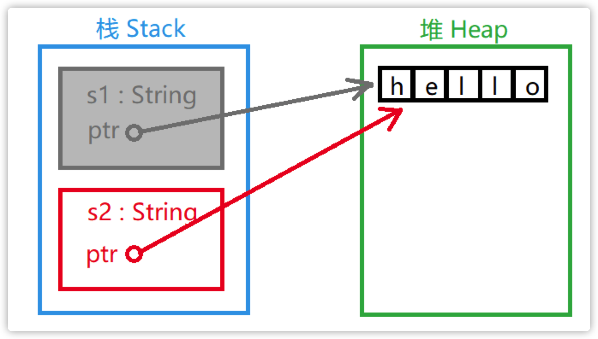
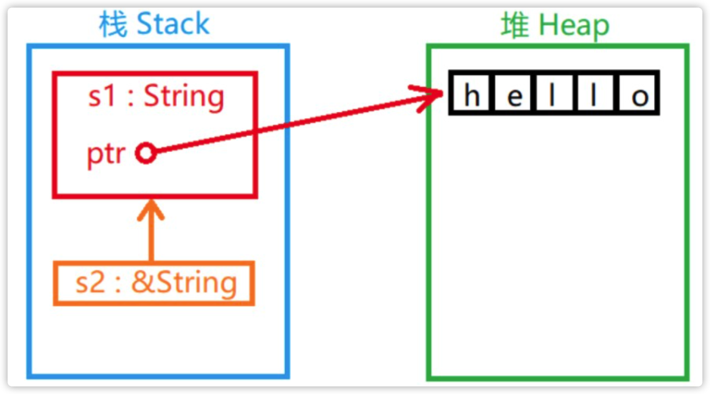

- [1. 简介](#1-简介)
    - [1.1. 初识 rust](#11-初识-rust)
    - [1.2. 变量](#12-变量)
        - [1.2.1. 不可变变量](#121-不可变变量)
        - [1.2.2. 可变变量](#122-可变变量)
        - [1.2.3. 重影](#123-重影)
    - [1.3. 数据类型](#13-数据类型)
        - [1.3.1. 基本数据类型](#131-基本数据类型)
        - [1.3.2. 布尔](#132-布尔)
        - [1.3.3. 字符](#133-字符)
        - [1.3.4. 元组](#134-元组)
        - [1.3.5. 数组](#135-数组)
    - [1.4. 函数](#14-函数)
    - [1.5. 条件语句](#15-条件语句)
        - [1.5.1. 三元运算](#151-三元运算)
    - [1.6. 循环](#16-循环)
    - [1.7. 所有权](#17-所有权)
        - [1.7.1. 内存和分配](#171-内存和分配)
        - [1.7.2. 变量数与数据交互的方式](#172-变量数与数据交互的方式)
        - [1.7.3. 涉及函数的所有权机制](#173-涉及函数的所有权机制)
        - [1.7.4. 引用与租借](#174-引用与租借)
            - [1.7.4.1. 垂悬引用（Dangling References）](#1741-垂悬引用dangling-references)
    - [1.8. 切片类型](#18-切片类型)
    - [1.9. 枚举类](#19-枚举类)
        - [1.9.1. 申明](#191-申明)
        - [1.9.2. match 语法](#192-match-语法)
        - [1.9.3. Option枚举类](#193-option枚举类)
        - [1.9.4. if let 语法](#194-if-let-语法)
    - [1.10. 结构体](#110-结构体)
        - [1.10.1. 元组结构体](#1101-元组结构体)
        - [1.10.2. 结构体所有权](#1102-结构体所有权)
        - [1.10.3. 输出结构体](#1103-输出结构体)
        - [1.10.4. 结构体方法](#1104-结构体方法)
        - [1.10.5. 结构体关联函数](#1105-结构体关联函数)
        - [1.10.6. 单元结构体](#1106-单元结构体)
    - [1.11. Rust 组织管理](#111-rust-组织管理)
        - [1.11.1. 箱（Crate）](#1111-箱crate)
        - [1.11.2. 包（Package）](#1112-包package)
        - [1.11.3. 模块（Module）](#1113-模块module)
            - [1.11.3.1. 访问权限](#11131-访问权限)
        - [1.11.4. use 关键字](#1114-use-关键字)
        - [1.11.5. 引用标准库](#1115-引用标准库)
    - [1.12. 错误处理](#112-错误处理)
        - [1.12.1. 可恢复的错误](#1121-可恢复的错误)
        - [1.12.2. 可恢复的错误的传递](#1122-可恢复的错误的传递)
        - [1.12.3. kind 方法](#1123-kind-方法)
    - [1.13. 泛型](#113-泛型)
        - [1.13.1. 函数中定义泛型](#1131-函数中定义泛型)
        - [1.13.2. 结构体与枚举类中的泛型](#1132-结构体与枚举类中的泛型)
    - [1.14. 特性](#114-特性)
        - [1.14.1. 默认特性](#1141-默认特性)
        - [1.14.2. 特性做参数](#1142-特性做参数)
        - [1.14.3. 特性做返回值](#1143-特性做返回值)
        - [1.14.4. 有条件实现方法](#1144-有条件实现方法)
    - [1.15. Rust 生命周期](#115-rust-生命周期)
        - [1.15.1. 生命函数注释](#1151-生命函数注释)
        - [1.15.2. 结构体中使用字符串切片引用](#1152-结构体中使用字符串切片引用)
        - [1.15.3. 需要生命周期的地方](#1153-需要生命周期的地方)
        - [1.15.4. 静态生命周期](#1154-静态生命周期)
- [使用 rust 遇到的问题](#使用-rust-遇到的问题)
    - [git 拉取第三方库失败](#git-拉取第三方库失败)
    - [Blocking waiting for file lock on package cache](#blocking-waiting-for-file-lock-on-package-cache)
    - [Blocking waiting for file lock on build directory](#blocking-waiting-for-file-lock-on-build-directory)
# 1. 简介
用于 rust 语法的学习
## 1.1. 初识 rust
- Rust 不支持 ++ 和 --，但支持 += 
- 64.0 将表示 64 位浮点数
- 数字间可以用 _ 连接， 98_222
- 注释方式与 golang c java 一样
## 1.2. 变量
1. Rust 是强类型语言，但具有自动判断变量类型的能力
2. 如果要声明变量，需要使用 let 关键字
    1. `let a = 123;`
    2. let [name] : [type] 比如：`let a: i32;`
3. Rust 语言不允许精度有损失的自动数据类型转换
4. 变量的值可以"重新绑定"，但在"重新绑定"以前不能私自被改变，这样可以确保在每一次"绑定"之后的区域里编译器可以充分的推理程序逻辑
### 1.2.1. 不可变变量
Rust 语言为了高并发安全而做的设计：在语言层面尽量少的让变量的值可以改变  
如果我们编写的程序的一部分在假设值永远不会改变的情况下运行，而我们代码的另一部分在改变该值，那么代码的第一部分可能就不会按照设计的意图去运转  
默认声明的变量是不可变的
```rust
let a = 123; // 没有声明类型，自动判断为有符号的32位整型变量
// a = 456; // 不合法
let a = 45; //合法 其实用到了【重影】

const a: i32 = 123; // a 是常量
let a = 456; // 不合法
```
### 1.2.2. 可变变量
```rust
let mut a = 123;
a = 456;
```
### 1.2.3. 重影
重影就是刚才讲述的所谓"重新绑定"，是指变量的名称可以被重新使用的机制。
1. 用同一个名字重新代表另一个变量实体，其类型、可变属性和值都可以变化
2. 与可变变量赋值的区别，可变变量赋值仅能发生值的变化  
```rust
fn main() {
    let x = 5;
    let x = "23333";
    println!("x is {}", x);
}
```
## 1.3. 数据类型
### 1.3.1. 基本数据类型
所有整数类型，例如 i32 、 u32 、 i64 等。  
布尔类型 bool，值为 true 或 false 。  
所有浮点类型，f32 和 f64。  
字符类型 char。  
仅包含以上类型数据的元组（Tuples）。  
### 1.3.2. 布尔
- 布尔型用 bool 表示，值只能为 true 或 false
### 1.3.3. 字符
- Rust 中字符串和字符都必须使用 UTF-8 编码，否则编译器会报错
- Rust的 char 类型大小为 4 个字节，代表 Unicode标量值
### 1.3.4. 元组
元组用一对 ( ) 包括的一组数据，**可以包含不同种类的数据**：
```rust
let  tup: (i32, f64, u8) = (500, 6.4, 1);
// tup.0 == 500
// tup.1 == 6.4
// tup.2 == 1
let (x, y, z) = tup; // y == 6.4
```
### 1.3.5. 数组
[ ] 包括的同类型数据
```rust
let a = [1, 2, 3, 4, 5];
let b = ["Jan", "Feb", "Mar"];
let c: [i32; 5] = [1, 2, 3, 4, 5];
let d = [3; 5] // equal to let d = [3, 3, 3, 3, 3];

let first = a[0]
let second = a[1]
// a[0] = 123; // error. 数组 a 不可变
let mut f = [1, 2, 3];
f[0] = 4; // 正确
```
## 1.4. 函数
- `fn <name> (<params>) <函数体>`
- Rust 函数的命名风格是小写字母以下划线分割； `hello_world`
- 需要具备参数必须声明参数名称和类型
- 函数体的语句和表达式
    - 语句 Statement 是执行某些操作且**没有返回值**的步骤，往往以`;`结尾，如`let a = 6;`
    - 表达式 Expression 有计算步骤且**有返回值**，不以`;`结尾，如`a = 7`  `b + 2` `c * (a + b)`
    - 表达式 加上`;`后就是语句
    - 可以用`{}`包括的块里编写一个较为复杂的表达式，其中 最后一行需要为表达式，而不是语句，即最后一行不能加`;`
        ```rust
        fn main() {
            let x = 5;
            let y = {
                let x = 3;
                x + 1 // 没有 ; 号结尾，是表达式
            }; // ; 号之前是一个复杂的表达式，加上 ; 是一个复杂的语句

            println!("x: {}", x); // 5
            println!("y: {}", y); // 4
        }
        ```
- 函数返回值
    - 使用`->`指明返回类型
    - Rust 不支持自动返回值类型判断！如果没有明确声明函数返回值的类型，函数将被认为是"纯过程"，不允许产生返回值
    - return 后面不能有返回值表达式
    - 可以不用return返回，而用 表达式返回
    ```rust
    fn add(a: i32, b: i32) -> i32 {
        return a + b;
    } 

    fn del(a: i32, b: i32) -> i32 {
        a - b
    }
    ```
- 函数定义可以嵌套
    ```rust
    fn main() {
        fn five() -> i32 {
            5
        }
        println!("five() 的值为：{}", five());
    }
    ```
## 1.5. 条件语句
- 与  golang 类似，且同样条件不需要 `()`括起来
- 条件 必须是 布尔类型，不用通过判空、判非0，来代替true or false
- if表达式的分支必须返回同一个类型的值才可以
```rust
fn main() {
    let a = 12;
    let b;
    let a > 0 {
        b = 1;
    }
    else if a < 0 {
        b = -1;
    }
    else {
        b = 0;
    }
    println!("b is {}", b);
}
```
### 1.5.1. 三元运算
```rust
fn main() {
    let a = 3;
    let number = if a > 0 {1} else {-1};
    println("number is {}", number);
}
```
## 1.6. 循环
- while
    ```rust
    fn main() {
        let mut n = 1;
        while n != 4 {
            println!("{}", n);
            n += 1;
        }
        println!("EXIT");
    }
    ```
- for in
    ```rust
    fn main() {
        let a = [1,2,3,4,5];
        for i in a.iter() {
            println!("i is {}", i);
        }

        for i in 0..3 { // 0 1 2
            println!("a[{}] = {}", i, a[i]);
        }
    }
    ```
- loop 
    - 无限循环
    - 通过 break 关键字类似于 return 一样使整个循环退出并给予外部一个返回值。
    ```rust
    fn main() {
        let s = ['R', 'U', 'N', 'O', 'O', 'B'];
        let mut i = 0;
        loop {
            let ch = s[i];
            if ch == 'O' {
                break;
            }
            println!("\'{}\'", ch);
            i += 1;
        }

        let location = loop {
            let ch = s[i];
            if ch == 'O' {
                break i; // 跳出循环，并返回一个值
            } 
            i += 1;
        };
    }
    ```
- `当需要使用无限循环的时候，请务必使用loop循环，避免使用while true循环`
## 1.7. 所有权
-  三大规则
    - Rust 中的每个值都有一个变量，称为其所有者
    - 一次只能有一个所有者
    - 当所有者不在程序运行范围时，该值将被删除
### 1.7.1. 内存和分配
Rust 之所以没有明示释放的步骤是因为在变量范围结束的时候，Rust 编译器自动添加了调用释放资源函数的步骤。
### 1.7.2. 变量数与数据交互的方式
- 移动 Move
    - 仅在栈中的数据的移动方式是直接复制
        ```rust
        let x = 5;
        let y = x; 
        // 此时 栈中有两个 5
        ```
    - 堆中的数据的移动方式，是把所有权移动给移动，如A移动给B，则移动后A没有所有权，失效了，不能再使用了
        ```rust
        let s1 = String::from("hello");
        let s2 = s1; // 此时 s1 把字符串 hello 的所有权给了 s2，自己却失去了所有权
        println!("{}, world", s1); // error s1 已经失效，名存实亡
        ```
        
- 克隆 Clone
    - 将数据单纯的复制一份以供他用
    ```rust
    fn main() {
        let s1 = String::from("hello");
        let s2 = s1.clone();
        println!("s1 = {}, s2 = {}", s1, s2);
    }
    ```
### 1.7.3. 涉及函数的所有权机制
- 如果把变量当做参数传入函数，那么它和移动的效果是一样的
- 函数返回值的所有权机制
```rust 
fn main() {
    let s1 = gives_ownership();
    // gives_ownership 移动它的返回值到 s1

    let s2 = String::from("hello");
    // s2 被声明有效

    let s3 = takes_and_gives_back(s2);
    // s2 被当作参数移动, s3 获得返回值所有权
} // s3 无效被释放, s2 被移动, s1 无效被释放.

fn gives_ownership() -> String {
    let some_string = String::from("hello");
    // some_string 被声明有效

    return some_string;
    // some_string 被当作返回值移动出函数
}

fn takes_and_gives_back(a_string: String) -> String { 
    // a_string 被声明有效

    a_string  // a_string 被当作返回值移出函数
}
```
### 1.7.4. 引用与租借
引用（Referrence）可以理解为变量的一个受限的别名，类似c++中的引用，引用就是租借引用对象的所有权.  
当一个变量的值被引用时，变量本身不会被认定无效。因为"引用"并没有在栈中复制变量的值：  

- 引用的方式:  
    - 不可变的引用 `let s2 = &s1;`
    - 可变的引用 `let s2 = &mut s1;`
- 需要注意的地方
    - 当被引用的对象失去值的所有权，引用也失效
    - 同时只能被租借一次
    - 被租借后，租借失效之前，不能被移动
    - 可以同时有多个读租借，同时只能有一个写租借
#### 1.7.4.1. 垂悬引用（Dangling References）
"垂悬引用"在 Rust 语言里不允许出现，如果有，编译器会发现它  
```rust
fn main() {
    let reference_to_nothing = dangle();
}

fn dangle() -> &String {
    let s = String::from("hello");

    &s
}
```
## 1.8. 切片类型
- 切片（Slice）是对数据值的部分引用
- `..`表示范围的语法, 
    - x..y 表示 [x, y) 的数学含义, 
    - ..y 等价于 0..y, 
    - x.. 等价于位置 x 到数据结束 
    - .. 等价于位置 0 到结束
- `被切片引用的字符串禁止更改其值`
```rust
fn main() {
    let arr = [1, 3, 5, 7, 9];
    let part = &arr[0..3];
    for i in part.iter() {
        println!("{}", i);
    }

    let s = String::from("broadcast");
    let part1 = &s[0..5];
    let part2 = &s[5..9];
}
```
## 1.9. 枚举类
### 1.9.1. 申明
```rust
// 普通枚举
enum Book {
    Papery, Electronic
}

let book = Book::Papery;

// 增加元组属性
enum Book1 {
    Papery(u32),
    Electronic(String),
}
let book = Book1::Papery(1001);
let ebook = Book1::Electronic(String::from("url://..."));

// 为属性命名
enum Book2 {
    Papery { index: u32}, // 结构体语法，用大括号
    Electronic { url: String},
}

let book = Book2::Paperty{index: 1001};
// 虽然可以如此命名，但请注意，并不能像访问结构体字段一样访问枚举类绑定的属性。访问的方法在 match 语法中。
```
### 1.9.2. match 语法
- switch 语法很经典，但在 Rust 中并不支持，很多语言摒弃 switch 的原因都是因为 switch 容易存在因忘记添加 break 而产生的串接运行问题
- Rust 通过 match 语句来实现分支结构
```rust 
fn main() {
    enum Book {
        Papery {index: u32},
        Electronic {url: String},
    }

    let book = Book::Papery{index: 1001};
    let ebook = Book::Electronic{url: String::from("www.yunify.com")};

    match book {
        Book::Papery {index } => {
            println!("Papery Book {}", index);
        },
        Book::Electronic{url} => {
            println!("E-book {}", url);
        }
    }
}
```
- match 块也可以当作函数表达式来对待，它也是可以有返回值的：但是所有返回值表达式的类型必须一样！
- 如果把枚举类附加属性定义成元组，在 match 块中需要临时指定一个名字
```rust
match 枚举类实例 {
    分类1 => 返回值表达式,
    分类2 => 返回值表达式,
    ...
}
```
- match 除了能够对枚举类进行分支选择以外，还可以对整数、浮点数、字符和字符串切片引用（&str）类型的数据进行分支选择。其中，`浮点数类型被分支选择虽然合法，但不推荐这样使用，因为精度问题可能会导致分支错误`。
### 1.9.3. Option枚举类
- Option 是 Rust 标准库中的枚举类，这个类用于填补 Rust 不支持 null 引用的空白。
```rust
enum Option<T> {
    Some(T),
    None,
}

let opt = Option::Some("Hello");
```
- 如果你想针对 opt 执行某些操作，你必须先判断它是否是 Option::None：
```rust 
let opt = Option::Some("Hello");
match opt {
    Option::Some(something) => {
        println!("{}", something);
    },
    Option::None => {
        println!("opt is nothing");
    }
}
```
- 由于 Option 是 Rust 编译器默认引入的，在使用时可以省略 Option:: 直接写 None 或者 Some()
```rust
fn main() {
    let t = Some(64);
    match t {
            Some(64) => println!("Yes"),
            _ => println!("No"),
    }
}
```
### 1.9.4. if let 语法
- 语法
```rust
if let 匹配值 = 源变量 {
    语句块
}
```
- 使用例子
```rust
fn main() {
    enum Book {
        Papery(u32),
        Electronic(String)
    }
    let book = Book::Electronic(String::from("url"));
    if let Book::Papery(index) = book {
        println!("Papery {}", index);
    } else {
        println!("Not papery book");
    }
}
```
- 需要注意的是，如果 if let 语句涉及到赋值成功，则对于非基础类型，需要小心所有权转移的问题
    - 但可以通过 引用的 方式来解决该问题
    ```rust
    let book = Book1::Electronic(String::from("url:www.yunify.com"));
    if let Book1::Electronic(url) = &book { // 能够匹配上，会涉及到赋值，使用&book引用的方式，避免book被移动
        println!("Papery {}", url);
    } else {
        println!("Not papery book");
    }
    println!("book: {:?}", book);
    ```
## 1.10. 结构体
- 声明
    ```rust
    struct Site {
        domain: String,
        name: String,
        nation: String,
        found: u32
    }
    ```
    - 不能定义时同时声明实例，结尾不需要 ; 
    - 每个字段定义之后用 , 分隔
- 实例
    - 实例化结构体的时候用 JSON 对象的 key: value 语法来实现定义
        ```rust
        let yunify = Site {
            domain: String::from("www.yunify.com"),
            name: String::from("yunify"),
            nation: String::from("China"),
            found: 2009
        };
        ```
    - 正在实例化的结构体有字段名称和现存变量名称一样的，可以简化书写：
        ```rust
        let domain = String::from("www.yunify.com");
        let y = Site {
            domain, // 等同于 domain : domain,
            name: String::from("yunify"),
            nation: String::from("China"),
            found: 2009
        }
        ```
    - 你想要新建一个结构体的实例，其中大部分属性需要被设置成与现存的一个结构体属性一样，仅需更改其中的一两个字段的值，可以使用结构体更新语法;
        ```rust
        let site = Site {
            domain: String::from("www.runoob.com"),
            name: String::from("RUNOOB"),
            ..runoob
        };
        ```
        - ..runoob 后面不可以有逗号
        - 这种语法不允许一成不变的复制另一个结构体实例，意思就是说至少重新设定一个字段的值才能引用其他实例的值
### 1.10.1. 元组结构体
元组的区别是它有名字和固定的类型格式。它存在的意义是为了处理那些需要定义类型（经常使用）又不想太复杂的简单数据：
```rust
struct Color(u8, u8, u8);
struct Point(f64, f64);

let black = Color(0, 0, 0);
let origin = Point(0.0, 0.0);
println!("black = ({}, {}, {})", black.0, black.1, black.2);
```
### 1.10.2. 结构体所有权
- 结构体失效的时候会释放所有字段
- 结构体中可以定义引用型字段，这需要通过"生命周期"机制来实现
### 1.10.3. 输出结构体
一定要导入调试库 #[derive(Debug)] ，之后在 println 和 print 宏中就可以用 {:?} 占位符输出一整个结构体
```rust
#[derive(Debug)]

struct Rectangle {
    width: u32,
    height: u32,
}

fn main() {
    let rect1 = Rectangle { width: 30, height: 50 };
    println!("rect1 is {:?}", rect1);
}
```
### 1.10.4. 结构体方法
方法（Method）和函数（Function）类似，只不过它是用来操作结构体实例的  
结构体方法的第一个参数必须是 &self，不需声明类型，因为 self 不是一种风格而是关键字  
- 先定义结构体，再通过 impl 关键字 定义结构体方法
- **结构体 impl 块可以写几次， 效果相当于他们内容的拼接**
```rust
struct Rectangle {
    width: u32,
    height: u32,
}

impl Rectangle {
    fn area(&self) -> u32 {
        self.width * self.height
    }
}
```
### 1.10.5. 结构体关联函数
- 在 impl 块中，却没有 &self 参数
- 这种函数不依赖实例，但使用时需要声明在哪个 impl 块中，类似于类方法，而不是实例方法
- 使用时 结构体::关联方法
```rust
#[derive(Debug)]
struct Rectangle {
    width: u32,
    height: u32,
}

impl Rectangle {
    fn create(width: u32, height: u32) -> Rectangle {
        Rectangle { width, height } // 没有以 ; 结尾，是表达式，可以最为返回值
    }
}

fn main() {
    let rect = Rectangle::create(30, 50);
    println!("{:?}", rect);
}
```
### 1.10.6. 单元结构体
结构体可以只作为一种象征而无需任何成员：`struct UnitStruct;`
## 1.11. Rust 组织管理
- Rust 中有三个重要的组织概念：箱、包、模块
### 1.11.1. 箱（Crate）
- "箱"是二进制程序文件或者库文件，存在于"包"中。
- "箱"是树状结构的，它的树根是编译器开始运行时编译的源文件所编译的程序。
### 1.11.2. 包（Package）
- 当我们使用 Cargo 执行 new 命令创建 Rust 工程时，工程目录下会建立一个 Cargo.toml 文件。工程的实质就是一个包，包必须由一个 Cargo.toml 文件来管理，该文件描述了包的基本信息以及依赖项。
- 一个包最多包含一个库"箱"，可以包含任意数量的二进制"箱"，但是至少包含一个"箱"（不管是库还是二进制"箱"）。
- 当使用 cargo new 命令创建完包之后，src 目录下会生成一个 main.rs 源文件，Cargo 默认这个文件为二进制箱的根，编译之后的二进制箱将与包名相同
### 1.11.3. 模块（Module）
- Rust 中的组织单位是模块（Module）
```rust
mod nation {
    mod government {
        fn govern() {}
    }
    mod congress {
        fn legislate() {}
    }
    mod court {
        fn judicial() {}
    }
}
// 我们可以把它转换成树状结构：
nation
 ├── government
 │ └── govern
 ├── congress
 │ └── legislate
 └── court
   └── judicial
```
- Rust 中的路径分隔符是 ::
#### 1.11.3.1. 访问权限
- Rust 中有两种简单的访问权：公共（public）和私有（private）。
- 默认情况下，如果不加修饰符，模块中的成员访问权将是私有的。
- 如果想使用公共权限，需要使用 pub 关键字
- 对于私有的模块，只有在与其平级的位置或下级的位置才能访问，不能从其外部访问。
```rust
mod nation { // priv
    pub mod government { // pub
        pub fn govern() { // pub
            println!("govern");
        }
    }

    mod congress { // priv
        pub fn legislate() { // pub
            println!("nation::congress::legislate")
        }
    }

    mod court { // priv
        fn judicail() { // priv
            super::congress::legislate(); //使用了 super, congress::legislate() 是pub，因此可以被使用
        }
    }

    mod test {
        fn test() {
            // super::court::judicail(); // 使用了 super, court::judicail() 是priv，因此不可以被使用
        }
    }

    fn test1() {
        // court::judicail(); // 调用了同级mod是ok的，但不能调用它的priv函数
    }
}

fn main() {
    nation::government::govern();
    // nation::congress::legislate(); // priv 不能被外部使用
    // nation::court::judicail(); // priv 不能被外部使用
}
```
- 枚举类枚举项可以内含字段，但不具备类似的性质:
- `每一级 mod 就如一个文件夹，嵌套的 mod 就是子文件夹; 同一文件夹下，是可以发现同一级的mod，不同文件夹下，能否发现，取决于是否有pub属性`
- 如果模块中定义了结构体，结构体除了其本身是私有的以外，其字段也默认是私有的
- 每一个 Rust 文件的内容都是一个"难以发现"的模块；即文件名本身是一个mod
```rust
// main.rs
mod second_module;

fn main() {
    println!("This is the main module.");
    println!("{}", second_module::message()); // 这里，使用文件名::方法进行调用，即文件本身是一层mod
}

// second_module.rs
pub fn message() -> String {
    String::from("This is the 2nd module.")
}
```
### 1.11.4. use 关键字
- use 关键字能够将模块标识符引入当前作用域，解决了局部模块路径过长的问题
- 有些情况下存在两个相同的名称，且同样需要导入，我们可以使用 as 关键字为标识符添加别名
- use 关键字可以与 pub 关键字配合使用：
```rust
mod nation {
    pub mod government {
        pub fn govern() {}
    }
    pub fn govern() {}
}
   
use crate::nation::government::govern;
use crate::nation::govern as nation_govern;

fn main() {
    nation_govern();
    govern();
}
```
### 1.11.5. 引用标准库
- `use std::`
    - use std::f64::consts::PI;
## 1.12. 错误处理
- Rust 有一套独特的处理异常情况的机制，它并不像其它语言中的 try 机制那样简单
- 程序中一般会出现两种错误：
    - 可恢复错误
        - 可恢复错误用 Result<T, E> 类来处理
    - 不可恢复错误
        - 不可恢复错误使用 panic! 宏来处理
### 1.12.1. 可恢复的错误
- 在 Rust 中通过 Result<T, E> 枚举类作返回值来进行异常表达：
```rust
enum Result<T, E> {
    Ok(T),
    Err(E),
}
```
- 如果想使一个可恢复错误按不可恢复错误处理，Result 类提供了两个办法
    - unwrap()
    - expect(message: &str) 
    ```rust
    use std::fs::File;

    fn main() {
        let f1 = File::open("hello.txt").unwrap();
        let f2 = File::open("hello.txt").expect("Failed to open.");
    }
    ```
    - 这段程序相当于在 Result 为 Err 时调用 panic! 宏。两者的区别在于 expect 能够向 panic! 宏发送一段指定的错误信息。
### 1.12.2. 可恢复的错误的传递
- Rust 中可以在 Result 对象后添加 ? 操作符将同类的 Err 直接传递出去(语法糖)
```rust
fn f(i: i32) -> Result<i32, bool> {
    if i >= 0 { Ok(i) }
    else { Err(false) }
}

fn g(i: i32) -> Result<i32, bool> {
    let t = f(i)?;
    Ok(t) // 因为确定 t 不是 Err, t 在这里已经是 i32 类型
}

fn main() {
    let r = g(10000);
    if let Ok(v) = r {
        println!("Ok: g(10000) = {}", v);
    } else {
        println!("Err");
    }
}
```
### 1.12.3. kind 方法
- 判断 Result 的 Err 类型，获取 Err 类型的函数是 kind()
```rust
use std::io;
use std::io::Read;
use std::fs::File;

fn read_text_from_file(path: &str) -> Result<String, io::Error> {
    let mut f = File::open(path)?;
    let mut s = String::new();
    f.read_to_string(&mut s)?;
    Ok(s)
}

fn main() {
    let str_file = read_text_from_file("hello.txt");
    match str_file {
    Ok(s) => println!("{}", s),
    Err(e) => {
        match e.kind() {
            io::ErrorKind::NotFound => {
                println!("No such file");
            },
            _ => {
                println!("Cannt read the file");
            }
        }
    }
    }
}
```
## 1.13. 泛型
- 泛型机制是编程语言用于表达类型抽象的机制，一般用于功能确定、数据类型待定的类，如链表、映射表等。
### 1.13.1. 函数中定义泛型
1. 需要在函数名申明泛型，fn_name<T1, T2>
2. 在使用到时候，用泛型类型
```rust
fn max<T>(array: &[T]) -> T {
    let mut max_index = 0;
    let mut i = 1;
    while i < array.len() {
        if array[i] > array[max_index] { // 泛型T 并不能进行 > 的比较，这里写时为了理解；实际实现，需要用到 特性 让T 能进行这样的比较
            max_index = i;
        }
        i += 1;
    }
    array[max_index]
}
```
### 1.13.2. 结构体与枚举类中的泛型
```rust
struct Point<T1, T2> {
    x: T1,
    y: T2,
}
```
- 方法也应该实现泛型的机制，否则泛型的类将无法被有效的方法操作
- impl 关键字的后方必须有 <T>，因为它后面的 T 是以之为榜样的。但我们也可以为其中的一种泛型添加方法：
```rust
impl Point<f64> { // 只添加一种方法时，impl 后不需要 <T>
    fn x(&self) -> f64 {
        self.x
    }
}
```
- impl 块本身的泛型并没有阻碍其内部方法具有泛型的能力：
```rust
impl<T, U> Point<T, U> {
    fn mixup<V, W>(self, other: Point<V, W>) -> Point<T, W> {
        Point {
            x: self.x,
            y: other.y,
        }
    }
}
```
- 使用泛型，要小心编译器不一定知道泛型支持哪些运算符和函数
## 1.14. 特性
- 特性（trait）概念接近于 Java 中的接口（Interface），但两者不完全相同。特性与接口相同的地方在于它们都是一种行为规范，可以用于标识哪些类有哪些方法。
- 声明
```rust
trait Descriptive {
    fn describe(&self) -> String;
}
```
- 实现 impl <特性名> for <所实现的类型名>
```rust
struct Person {
    name: String,
    age: u8
}

impl Descriptive for Person {
    fn describe(&self) -> String {
        format!("{} {}", self.name, self.age)
    }
}
```
- Rust 同一个类可以实现多个特性，每个 impl 块只能实现一个。
### 1.14.1. 默认特性
- 这是特性与接口的不同点：接口只能规范方法而不能定义方法，但特性可以定义方法作为默认方法，因为是"默认"，所以对象既可以重新定义方法，也可以不重新定义方法使用默认的方法
    - 声明的时候，实现一个方法
```rust
trait Descriptive {
    fn describe(&self) -> String {
        String::from("[Object]")
    }
}
```
### 1.14.2. 特性做参数
```rust
fn output(object: impl Descriptive) {
    println!("{}", object.describe());
}

fn output<T: Descriptive>(object: T) {
    println!("{}", object.describe());
}

// 特性作类型表示时如果涉及多个特性，可以用 + 符号表示，例如
fn notify(item: impl Summary + Display)
fn notify<T: Summary + Display>(item: T)
```
- 复杂的实现关系可以使用 where 关键字简化，例如：
```rust
fn some_function<T, U>(t: T, u: U) -> i32
    where T: Display + Clone,
          U: Clone + Debug
```
### 1.14.3. 特性做返回值
```rust
fn person() -> impl Descriptive {
    Person {
        name: String::from("Cali"),
        age: 24
    }
}
```
- 同一函数中，不能反回不通类型实现的特性
```rust
// error
fn some_function(bool bl) -> impl Descriptive {
    if bl {
        return A {};
    } else {
        return B {};
    }
}
```
### 1.14.4. 有条件实现方法
```rust
// 这段代码声明了 A<T> 类型必须在 T 已经实现 B 和 C 特性的前提下才能有效实现此 impl 块。
struct A<T> {}

impl<T: B + C> A<T> {
    fn d(&self) {}
}
```
## 1.15. Rust 生命周期
- 主要是应对复杂类型系统中资源管理的问题
- **引用**必须在值的生命周期以内才有效
### 1.15.1. 生命函数注释
- 能够改变引用的生命周期，但可以在合适的地方声明两个引用的生命周期一致
```rust
&i32        // 常规引用
&'a i32     // 含有生命周期注释的引用
&'a mut i32 // 可变型含有生命周期注释的引用

// 需要用泛型声明来规范生命周期的名称，随后函数返回值的生命周期将与两个参数的生命周期一致
fn longer<'a>(s1: &'a str, s2: &'a str) -> &'a str {
    if s2.len() > s1.len() {
        s2
    } else {
        s1
    }
}
```
### 1.15.2. 结构体中使用字符串切片引用
```rust
fn main() {
    struct Str<'a> {
        content: &'a str
    }
    let s = Str {
        content: "string_slice"
    };
    println!("s.content = {}", s.content);
}

impl<'a> Str<'a> {
    fn get_content(&self) -> &str { // 返回值也可以加上声明周期
        self.content
    }
}
```
### 1.15.3. 需要生命周期的地方
- 结构体 含有声明引用的字段，需要有声明周期
- 函数，参数和返回值 含有引用需要有声明周期
### 1.15.4. 静态生命周期
- `'static`
- 所有用双引号包括的字符串常量所代表的精确数据类型都是 &'static str 
- `'static` 所表示的生命周期从程序运行开始到程序运行结束。

# 使用 rust 遇到的问题
## git 拉取第三方库失败
- `vim ~/.cargo/config.toml`
```
[net]
git-fetch-with-cli = true
```
## Blocking waiting for file lock on package cache
- `rm ~/.cargo/.package-cache`
## Blocking waiting for file lock on build directory
- `cargo clean`